SLUSD89B –FEBRUARY 2019–REVISED NOVEMBER 2019

**BQ25887**

# **BQ25887 I2C Controlled 2-Cell, 2-A Boost-Mode Battery Charger With Cell Balancing For USB Input**

### **1 Features**

- 1• High-efficiency 2-A, 1.5-MHz switch mode boost charger
  - 93.4% Charge efficiency at 5-V adapter, 7.6-V battery, 1-A charge
  - Optimized for USB input and 2-cell Li-Ion battery
  - Selectable low power PFM mode for light load operation
- • Single input to support USB input adapters
  - Supports 3.9-V to 6.2-V input voltage range with 20-V absolute maximum input voltage rating
  - Input current limit (500 mA to 3.3 A with 100 mA resolution) to support USB2.0, USB3.0 standard adapters
  - Maximum power tracking by input voltage limit up-to 5.5 V
- • Cell balancing and I 2C control
  - Integrated FETs for balancing current up to 400 mA
  - Automatic cell balancing with default register setting
- • Input current optimizer (ICO) to maximize input power without overloading adapters
- Integrated 16-bit ADC for system monitoring (BUS voltage and current, each cell voltage, charge current, and NTC and die temperature)
- High integration includes all MOSFETs, current sensing and loop compensation

- High accuracy
  - ±0.5% Charge voltage regulation
  - ±5% Charge current regulation
  - ±7.5% Input current regulation
- Safety
  - Battery temperature sensing in charge
  - Thermal regulation and thermal shutdown

# **2 Applications**

- [Electronic](http://www.ti.com/solution/electronic-and-robotic-toys) and robotic toys
- Virtual reality [headset](http://www.ti.com/solution/virtual-reality-headset)
- IP [network](http://www.ti.com/solution/ip-network-camera) camera
- Drone [payload](http://www.ti.com/solution/drone-payload-control) control

### **3 Description**

The BQ25887 is a highly-integrated 2-A boost switchmode battery charge management device for 2-cell (2s) Li-Ion and Li-polymer battery. The BQ25887 has I2C control with cell balancing for USB input.

# **Device Information[\(1\)](#page-0-0)**

| PART NUMBER | PACKAGE   | BODY SIZE (NOM)   |  |
|-------------|-----------|-------------------|--|
| BQ25887     | VQFN (24) | 4.00 mm x 4.00 mm |  |

(1) For all available packages, see the orderable addendum at the end of the data sheet.

#### **Simplified Schematic**

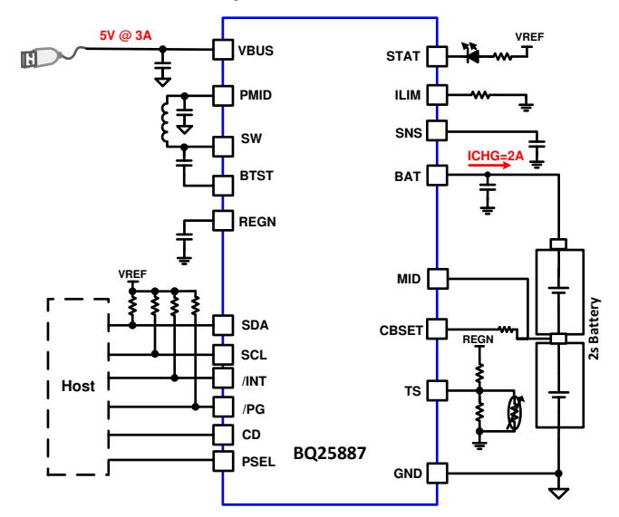

## **Table of Contents**

| 1 | Features 1                                | 8.4 Device Functional Modes 30                            |
|---|-------------------------------------------|--------------------------------------------------------------|
| 2 | Applications 1                            | 8.5 Register Maps 31                                      |
| 3 | Description 1                             | 9 Application and Implementation 69                       |
| 4 | Revision History 2                        | 9.1 Application Information 69                            |
| 5 | Device Comparison Table 3                 | 9.2 Typical Application 69                                |
| 6 | Pin Configuration and Functions 4         | 10 Power Supply Recommendations 74                        |
| 7 | Specifications 6                          | 11 Layout 74                                              |
|   | 7.1 Absolute Maximum Ratings 6         | 11.1 Layout Guidelines 74                                 |
|   | 7.2 ESD Ratings 6                      | 11.2 Layout Example 75                                    |
|   | 7.3 Recommended Operating Conditions 6 | 12 Device and Documentation Support 76                    |
|   | 7.4 Thermal Information 7              | 12.1 Device Support 76                                    |
|   | 7.5 Electrical Characteristics 7       | 12.2 Documentation Support 76                             |
|   | 7.6 Timing Requirements 11             | 12.3 Receiving Notification of Documentation Updates 76   |
|   | 7.7 Typical Characteristics 13         | 12.4 Support Resources 76                                 |
| 8 | Detailed Description 15                   | 12.5 Trademarks 76                                        |
|   | 8.1 Overview 15                        | 12.6 Electrostatic Discharge Caution 76                   |
|   | 8.2 Functional Block Diagram 15        | 12.7 Glossary 76                                          |
|   | 8.3 Feature Description 16             | 13 Mechanical, Packaging, and Orderable Information 77 |

# **4 Revision History**

NOTE: Page numbers for previous revisions may differ from page numbers in the current version.

|   | Changes from Revision A (May 2019) to Revision B Page |      |  |
|---|----------------------------------------------------------|------|--|
| • | Changed Applications section 1                           |      |  |
| • | Deleted no OTG and no power path from Description 1      |      |  |
| • | Added note to Absolute Maximum Ratings 7                 |      |  |
| • | Added Figure 79 72                                       |      |  |
| • | Added Figure 80 72                                       |      |  |
|   | Changes from Original (February 2019) to Revision A      | Page |  |
| • | Changed from Advance Information to Production Data 1    |      |  |

# **5 Device Comparison Table**

| PART NUMBER          | BQ25882         | BQ25883      | BQ25886      | BQ25887      |
|----------------------|-----------------|--------------|--------------|--------------|
| VBUS Operating Range | 3.9 to 6.2 V    | 3.9 to 6.2 V | 4.3 to 6.2 V | 3.9 to 6.2 V |
| USB Detection        | D+/D-           | D+/D-        | D+/D-        | PSEL         |
| Power path           | Yes             | Yes          | Yes          | No           |
| Cell Balancing       | No              | No           | No           | Yes          |
| OTG                  | Up to 2 A       | Up to 2 A    | Up to 2 A    | No OTG       |
| 16 bit ADC           | Yes             | Yes          | No           | Yes          |
| Control Interface    | I2C             | I2C          | Standalone   | I2C          |
| Status Pin           | /PG             | STAT, /PG    | STAT, /PG    | STAT, /PG    |
| Package              | 2.1x2.1 WCSP-25 | 4x4 QFN-24   | 4x4 QFN-24   | 4x4 QFN-24   |

# **6 Pin Configuration and Functions**

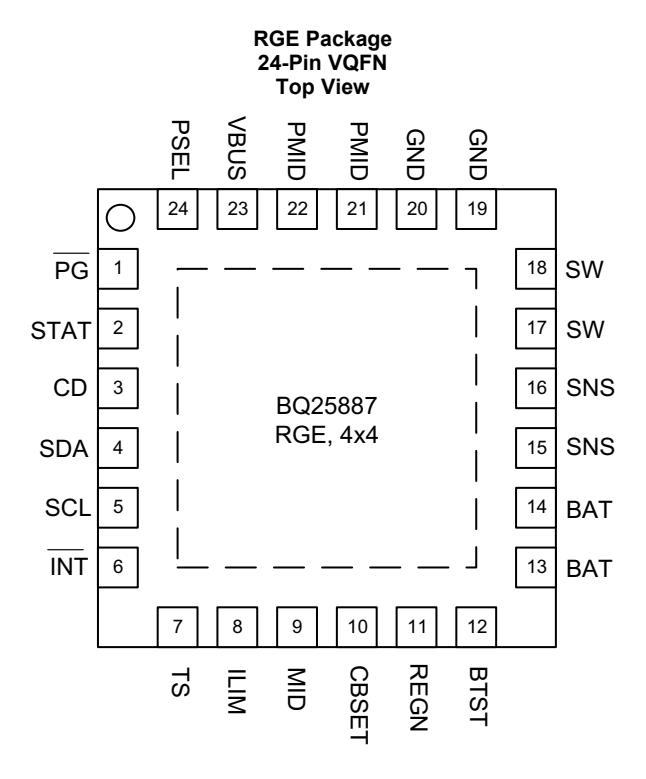

#### **Pin Functions**

| PIN  |     | 1/0 | DESCRIPTION                                                                                                                                                                                                                                                                                                                                                                                                                                                                                                                                                                                                                                                                                                                                                                                               |  |
|------|-----|-----|-----------------------------------------------------------------------------------------------------------------------------------------------------------------------------------------------------------------------------------------------------------------------------------------------------------------------------------------------------------------------------------------------------------------------------------------------------------------------------------------------------------------------------------------------------------------------------------------------------------------------------------------------------------------------------------------------------------------------------------------------------------------------------------------------------------|--|
| NAME | NO. | I/O | DESCRIPTION                                                                                                                                                                                                                                                                                                                                                                                                                                                                                                                                                                                                                                                                                                                                                                                               |  |
| PG   | 1   | DO  | <b>Open drain active low power good indicator –</b> Connect to the pull up rail via 10-k $\Omega$ resistor. LOW indicates a good input source if the input voltage is within VVBUS_OP, and can provide more than IPOORSRC (30mA).                                                                                                                                                                                                                                                                                                                                                                                                                                                                                                                                                                         |  |
| STAT | 2   | DO  | Open drain charge status indicator – Connect to the pull-up rail via 10-kΩ resistor. LOW indicates charge in progress. HIGH indicates charge complete or charge disabled. When any fault occurs, the STAT pin blinks at 1Hz. The STAT function can be disabled when the STAT_DIS bit is set.                                                                                                                                                                                                                                                                                                                                                                                                                                                                                                              |  |
| CD   | 3   | DI  | Active High Chip Disable Pin – Pull CD high to disable charge and place the device in HIZ mode. ADC operation and I2C is still allowed when CD is high. Converter is enabled when CD pin is LOW and EN_CHG bit is 1. CD pin is internally pulled low with 900- $k\Omega$ resistor.                                                                                                                                                                                                                                                                                                                                                                                                                                                                                                                        |  |
| SDA  | 4   | DIO | <b>I2C Interface Data –</b> Connect SDA to the pull up rail through a 10-kΩ resistor.                                                                                                                                                                                                                                                                                                                                                                                                                                                                                                                                                                                                                                                                                                                     |  |
| SCL  | 5   | DI  | <b>I2C Interface Clock –</b> Connect SCL to the pull up rail through a 10-kΩ resistor.                                                                                                                                                                                                                                                                                                                                                                                                                                                                                                                                                                                                                                                                                                                    |  |
| ĪNT  | 6   | DO  | Open drain active Interrupt Output – Connect $\overline{\text{INT}}$ to the pull up rail via a 10-kΩ resistor. The $\overline{\text{INT}}$ pin sends active low, 256-μs pulse to the host to report charger device status and fault.                                                                                                                                                                                                                                                                                                                                                                                                                                                                                                                                                                      |  |
| TS   | 7   | AI  | <b>Temperature Qualification Voltage –</b> Connect a negative temperature coefficient thermistor. Program temperature window with a resistor divider from REGN to TS to GND. Charge suspends when TS pin is out of range. Recommend 103AT-2 thermistor.                                                                                                                                                                                                                                                                                                                                                                                                                                                                                                                                                   |  |
| ILIM | 8   | AI  | Input Current Limit (IINDPM) – ILIM pin sets the maximum input current and can be used to monitor input current. IINDPM loop regulates ILIM pin voltage at 0.8V. When ILIM pin is less than 0.8V, the input current can be calculated by IIN = KILIM x VILIM / (RILIM x 0.8V). A resistor connected from ILIM pin to ground sets the input current limit as maximum (IINMAX = KILIM / RILIM). When ILIM pin is short to GND, the input current limit is set to maximum by ILIM. The actual input current limit is the lower limit set by ILIM pin (when EN_ILIM bit is HIGH) or IINDPM register bits. Input current limit less than 500mA is not supported on ILIM pin. The ILIM pin function can be disabled when EN_ILIM bit is 0. If ILIM pin is not used, pull this pin to GND.Do not float this pin. |  |
| MID  | 9   | AI  | Voltage Input for Mid Point Between Cells in 2S1P Configuration – Connect MID to the negative terminal of the top cell and the positive terminal of the bottom cell. This pin measures the voltage of the bottom cell for cell balancing and VMID ADC measurement. For protection of bottom cell reverse plug in, connect a 300 ohm resistor in series between MID pin and mid connection point of the two battery cell.                                                                                                                                                                                                                                                                                                                                                                                  |  |

#### **Pin Functions (continued)**

| PIN   |        |     |                                                                                                                                                                                                                                                                                                                        |  |
|-------|--------|-----|------------------------------------------------------------------------------------------------------------------------------------------------------------------------------------------------------------------------------------------------------------------------------------------------------------------------|--|
| NAME  | NO.    | I/O | DESCRIPTION                                                                                                                                                                                                                                                                                                            |  |
| CBSET | 10     | P   | Power pin for Cell Balancing – Connect CBSET to the mid point between the two batteries in 2S configuration with a current limit resistor. The resistor value determines the cell balancing current as calculated in Cell Balancing Section. The resistor chosen should not exceed 400 mA for cell balancing. |  |
| REGN  | 11     | P   | Gate Drive Supply – Bias supply for internal MOSFETs driver and IC. Bypass REGN to GND with a 4.7-µF ceramic capacitor. REGN current limit is 50 mA.                                                                                                                                                                |  |
| BTST  | 12     | P   | PWM High-side Driver Supply – Internally, BTST is connected to the cathode of the boot-strap diode. Connect a 47nF bootstrap capacitor from SW to BTST.                                                                                                                                                             |  |
| BAT   | 13, 14 | P   | Battery Power Connection – Connect minimum recommended 10-µF capacitance after derating closely to the BAT pin and GND.                                                                                                                                                                                             |  |
| SNS   | 15, 16 | AO  | Sense Output – Charge current sense pin. Place a 44-µF ceramic capacitor on this pin for stability of this output.                                                                                                                                                                                                  |  |
| SW    | 17, 18 | P   | Inductor Connection – Connect to the switched side of the external inductor.                                                                                                                                                                                                                                           |  |
| GND   | 19, 20 | –   | Ground Return                                                                                                                                                                                                                                                                                                          |  |
| PMID  | 21, 22 | P   | Blocking MOSFET Connection – The minimum recommended total input low-ESR capacitance on VBUS and PMID, after applied derating, is 10 uF. At least 1-uF is recommended at VBUS with the remainder at PMID. Typical value for PMID is 10 uF.                                                                       |  |
| VBUS  | 23     | P   | Input Supply – VBUS is connected to the external DC supply. Bypass VBUS to GND with at least 1- µF ceramic capacitor, placed as close to the IC as possible.                                                                                                                                                        |  |
| PSEL  | 24     | DI  | Power Source Selection – HIGH indicates USB host source (500mA) and LOW indicates adapter source (3.0A).                                                                                                                                                                                                            |  |

## **7 Specifications**

### **7.1 Absolute Maximum Ratings**

over operating free-air temperature range (unless otherwise noted) (1)

|                                                                   |                                                | MIN      | MAX | UNIT |
|-------------------------------------------------------------------|------------------------------------------------|----------|-----|------|
|                                                                   | VBUS (converter not switching)                 | -0.3     | 20  | V    |
|                                                                   | PMID (converter not switching)                 | -0.3     | 8.5 | V    |
|                                                                   | BAT, SNS, MID, CBSET (converter not switching) | -0.3     | 12  | V    |
|                                                                   | SW                                             | -0.3 (2) | 13  | V    |
| Voltage Range (with respect to GND unless otherwise specified) | BTST                                           | -0.3     | 19  | V    |
|                                                                   | REGN, STAT, /PG, TS                            | -0.3     | 6   | V    |
|                                                                   | ILIM                                           | -0.3     | 5   | V    |
|                                                                   | BTST to SW                                     | -0.3     | 6   | V    |
|                                                                   | SDA, SCL, /INT, CD, PSEL,                      | -0.3     | 6   | V    |
| Voltage Range (with respect to GND unless otherwise specified) | BAT to CBSET                                   | 0        | 12  | V    |
| Output Sink Current                                               | /INT, STAT, /PG                                |          | 6   | mA   |
| Junction Temperature, TJ                                          |                                                | –40      | 150 | °C   |
| Storage temperature, Tstg                                         |                                                | –40      | 150 | °C   |

(1) Stresses beyond those listed under *Absolute Maximum Ratings* may cause permanent damage to the device. Theseare stress ratings only, which do not imply functional operation of the device at these or anyother conditions beyond those indicated under *Recommended OperatingConditions*. Exposure to absolute-maximum-rated conditions for extended periods mayaffect device reliability.

# **7.2 ESD Ratings**

|        |                         | VALUE                                                                 | UNIT  |   |
|--------|-------------------------|-----------------------------------------------------------------------|-------|---|
|        |                         | Human body model (HBM), per ANSI/ESDA/JEDEC JS-001(1)              | ±2000 |   |
| V(ESD) | Electrostatic discharge | Charged device model (CDM), per JEDEC specification JESD22-C101(2) | ±250  | V |

(1) JEDEC document JEP155 states that 500-V HBM allows safe manufacturing with a standard ESD control process.

### **7.3 Recommended Operating Conditions**

over operating free-air temperature range (unless otherwise noted)

|          |                                               | MIN | NOM MAX       | UNIT |
|----------|-----------------------------------------------|-----|------------------|------|
| VVBUS    | Input Voltage                                 | 3.9 | 6.2              | V    |
| IVBUS    | Average input current (VBUS)                  |     | 3.3              | A    |
| IBAT     | Average charge current (IBAT)                 |     | 2.2              | A    |
| IBAT_RMS | RMS discharging current with internal MOSFET  |     | 5                | A    |
| IBAT_PK  | Peak discharging current with internal MOSFET |     | 9 (up to 1us) | A    |
| VBAT     | Battery Voltage                               |     | 9.2(1)           | V    |
| TA       | Operating free-air temperature range          | -40 | 85               | °C   |

(1) The inherent switching noise voltage spikes should not exceed the absolute maximum rating on SW pin. A tight layout minimizes switching noise.

(2) -2V for 50ns

(2) JEDEC document JEP157 states that 250-V CDM allows safe manufacturing with a standard ESD control process.

### **7.4 Thermal Information**

over operating free-air temperature range (unless otherwise noted)

| THERMAL METRIC(1) |                                                    | bq25887    |      |
|-------------------|----------------------------------------------------|------------|------|
|                   |                                                    | RGE (VQFN) | UNIT |
|                   |                                                    | 24-PIN     |      |
| RΘJA              | Junction-to-ambient thermal resistance (JEDEC (1)) | 32.4       | °C/W |
| RΘJC(top)         | Junction-to-case (top) thermal resistance          | 26.7       | °C/W |
| RΘJB              | Junction-to-board thermal resistance               | 10.7       | °C/W |
| ΨJT               | Junction-to-top characterization parameter         | 0.4        | °C/W |
| ΨJB               | Junction-to-board characterization parameter       | 10.6       | °C/W |
| RΘ JC(bot)        | Junction-to-case (bottom) thermal resistance       | 3.7        | °C/W |

(1) For more information about traditional and new thermal metrics, see the Semiconductor and IC Package Thermal Metrics application report, [SPRA953.](http://www.ti.com/lit/an/spra953c/spra953c.pdf)

### **7.5 Electrical Characteristics**

VVBUS\_UVLO\_RISING< VVBUS < VVBUS\_OV, TJ = -40°C to+125°C, and TJ = 25°C for typical values (unless otherwise noted)

|                    | PARAMETER                                  | TEST CONDITIONS                                                         | MIN   | TYP  | MAX   | UNIT |
|--------------------|--------------------------------------------|-------------------------------------------------------------------------|-------|------|-------|------|
| QUIESCENT CURRENTS |                                            |                                                                         |       |      |       |      |
| IBAT               | Battery discharge current (BAT)            | VBAT = 9 V, No VBUS, SCL, SDA = 0 V or 1.8 V, TJ=25C, ADC Disabled   |       | 12   | 14    | µA   |
|                    |                                            | VBAT = 9 V, No VBUS, SCL, SDA = 0 V or 1.8 V, TJ < 85C, ADC Disabled |       | 12   | 20    | µA   |
|                    | Input supply current (VBUS) in HIZ         | VBUS = 5 V, High-Z Mode, no battery, ADC Disabled, 25℃               |       | 30   | 38    | µA   |
| IVBUS_HIZ          |                                            | VBUS = 5 V, High-Z Mode, no battery, ADC Disabled, <85℃              |       | 30   | 48    | µA   |
|                    |                                            | VBUS = 5 V, VBAT = 7.6 V, converter not switching                    |       | 1.5  | 3     | mA   |
| IVBUS              | Input supply current (VBUS)                | VBUS = 5 V, VBAT = 7.6 V, converter switching                        |       | 3    |       | mA   |
| VBUS/VBAT POWER UP |                                            |                                                                         |       |      |       |      |
| VVBUS_OP           | VBUS operating range                       |                                                                         | 3.9   |      | 6.2   | V    |
| VVBUS_UVLO_RISING  | VBUS rising for active I2C, no battery     | VBUS rising                                                             |       | 3.3  | 3.68  | V    |
| VVBUS_OV           | VBUS over-voltage rising threshold         | VBUS rising                                                             | 6.2   |      | 6.6   | V    |
|                    | VBUS over-voltage falling threshold        | VBUS falling                                                            | 5.9   |      | 6.4   | V    |
| VBAT_UVLO_RISING   | Battery for active I2C                     | VBAT rising                                                             | 3.7   | 4    | 4.42  | V    |
| VPOORSRC_FALLING   | Bad adapter detection threshold            | VBUS falling below VPOORSRC_FALLING                                     |       | 3.7  |       | V    |
| IPOORSRC           | Bad adapter detection current source       |                                                                         |       | 15   |       | mA   |
| BATTERY CHARGER    |                                            |                                                                         |       |      |       |      |
| VCELLREG_RANGE     | Typical charge voltage regulation range |                                                                         | 3.4   |      | 4.6   | V    |
| VCELLREG_STEP      | Typical charge voltage step                |                                                                         |       | 5    |       | mV   |
| VCELLREG_ACC       | Charge voltage                             | VREG = 4.20 V, TJ = 0°C to 85°C,                                        | 4.179 | 4.2  | 4.221 | V    |
| VCELLREG_ACC       | Charge voltage                             | VREG = 4.35 V, TJ = 0°C to 85°C                                         | 4.328 | 4.35 | 4.372 | V    |
| ICHG_RANGE         | Charge current regulation range            |                                                                         | 100   |      | 2200  | mA   |
| ICHG_STEP          | Charge current regulation step             |                                                                         |       | 50   |       | mA   |
| ICHG_ACC           | Fast Charge current regulation accuracy | ICHG = 1000 mA, VBAT = 6.2 V or 7.6 V, TJ = 0°C to 85°C              | -7.5  |      | 7.5   | %    |
| ICHG_ACC           | Fast Charge current regulation accuracy | ICHG = 500mA, VBAT = 6.2 V or 7.6 V, TJ = 0°C to 85°C                | -15   |      | 15    | %    |
| ICHG_ACC           | Fast Charge current regulation accuracy | ICHG = 250 mA, VBAT = 6.2 V or 7.6 V, TJ = 0°C to 85°C               | -25   |      | 25    | %    |
| IPRECHG_RANGE      | Precharge current range                    |                                                                         | 50    |      | 800   | mA   |

VVBUS\_UVLO\_RISING< VVBUS < VVBUS\_OV, TJ = -40°C to+125°C, and TJ = 25°C for typical values (unless otherwise noted)

| IPRECHG_STEP IPRECHG_ACC ITERM_RANGE | Typical precharge current step Precharge current accuracy Termination current range Typical termination current step | VBAT = 5.2 V, IPRECHG = 200 mA, TJ = 25°C VBAT = 5.2 V, IPRECHG = 200 mA, TJ = 0°C to 85°C                                                           | 170   | 50   | 237   | mA       |
|--------------------------------------------|-------------------------------------------------------------------------------------------------------------------------------|---------------------------------------------------------------------------------------------------------------------------------------------------------------|-------|------|-------|----------|
|                                            |                                                                                                                               |                                                                                                                                                               |       |      |       |          |
|                                            |                                                                                                                               |                                                                                                                                                               |       |      |       | mA       |
|                                            |                                                                                                                               |                                                                                                                                                               | 150   |      | 245   | mA       |
|                                            |                                                                                                                               |                                                                                                                                                               | 50    |      | 800   | mA       |
| ITERM_STEP                                 |                                                                                                                               |                                                                                                                                                               |       | 50   |       | mA       |
|                                            |                                                                                                                               | ICHG = 1.5A, ITERM = 150 mA, TJ = 25°C                                                                                                                        | 143   |      | 157   | mA       |
|                                            |                                                                                                                               | ICHG = 1.5A, ITERM = 150 mA, TJ = 0°C to 85°C                                                                                                              | 120   |      | 180   | mA       |
| ITERM_ACC                                  | Termination current accuracy                                                                                                  | ICHG = 1.5A, ITERM = 50 mA, TJ = 25°C                                                                                                                         | 45    |      | 60    | mA       |
|                                            |                                                                                                                               | ICHG = 1.5A, ITERM = 50 mA, TJ = 0°C to 85°C                                                                                                               | 22    |      | 75    | mA       |
| VCELL_SHORT_RISING                         | Short Battery Voltage rising threshold to start pre-charging                                                               | VCELL rising                                                                                                                                                  | 2.05  | 2.2  | 2.35  | V        |
| VCELL_SHORT_FALLIN G                    | Short Battery Voltage falling threshold to stop pre-charging                                                               | VCELL falling                                                                                                                                                 | 1.85  | 2    | 2.15  | V        |
| IBAT_SHORT                                 | Low Battery Voltage trickle charging current                                                                               | VTOPCELL<2.2V, VBOTCELL <vreg VRCHG; Or VBOTCELL&lt;2.2V, VTOPCELL<vreg-vrchg< td=""><td></td><td>100</td><td></td><td>mA</td></vreg-vrchg<></vreg  |       | 100  |       | mA       |
|                                            | VCELL LOWV Rising threshold to start fast-charging                                                                         | VCELL rising, VBATLOW = 2.8 V                                                                                                                                 | 2.65  | 2.8  | 2.95  | V        |
| VCELL_LOWV_RISING                          |                                                                                                                               | VCELL rising, VBATLOWV = 3.0 V                                                                                                                                | 2.85  | 3    | 3.15  | V        |
| VCELL_LOWV_FALLIN                          | VCELL LOWV falling threshold to                                                                                               | VCELL falling, VBATLOW = 2.8 V                                                                                                                                | 2.45  | 2.6  | 2.75  | V        |
| G                                          | start fast-charging                                                                                                           | VCELL falling, VBATLOWV = 3.0 V                                                                                                                               | 2.65  | 2.8  | 2.95  | V        |
| VCELL_RECHG                                | Recharge threshold below VCELLREG                                                                                             | VCELL falling, VCELL_RECHG[1:0] = 01                                                                                                                          |       | 100  |       | mV       |
|                                            | High-side switching MOSFET on resistance between SW and SNS (Q2)                                                        | TJ = 25°C                                                                                                                                                     |       | 32   | 35    | mΩ       |
| RON_QHS (Q2)                               |                                                                                                                               | TJ = – 40°C to 125°C                                                                                                                                          |       | 32   | 47    | mΩ       |
|                                            | Low-side switching MOSFET on                                                                                                  | TJ = 25°C                                                                                                                                                     |       | 42   | 46    | mΩ       |
| RON_QLS (Q3)                               | resistance between SW and GND (Q3)                                                                                         | TJ = – 40°C to 125°C                                                                                                                                          |       | 42   | 63    | mΩ       |
| IBAT_DISCHG                                | BAT Discharge current source                                                                                                  | VBAT = 8V, EN_BAT_DISCHG = 1                                                                                                                                  | 8     | 11.5 | 16    | mA       |
|                                            | INPUT VOLTAGE / CURRENT REGULATION                                                                                            |                                                                                                                                                               |       |      |       |          |
| VINDPM_RANGE                               | Input voltage regulation range                                                                                                |                                                                                                                                                               | 3.9   |      | 5.5   | V        |
| VINDPM_STEP                                | Input voltage regulation step                                                                                                 |                                                                                                                                                               |       | 100  |       | mV       |
|                                            | Input voltage limit                                                                                                           | VINDPM = 3.9 V                                                                                                                                                | 3.783 | 3.9  | 4.017 | V        |
| VINDPM                                     |                                                                                                                               | VINDPM = 4.4 V                                                                                                                                                | 4.268 | 4.4  | 4.532 | V        |
| IINDPM_RANGE                               | Input current regulation range                                                                                                |                                                                                                                                                               | 500   |      | 3300  | mA       |
| IINDPM_STEP                                | Input current regulation step                                                                                                 |                                                                                                                                                               |       | 100  |       | mA       |
|                                            | Input current regulation limit                                                                                                | IINDPM = 500 mA                                                                                                                                               | 438   | 469  | 500   | mA       |
| IINDPM_ACC                                 |                                                                                                                               | IINDPM = 900 mA                                                                                                                                               | 765   | 832  | 900   | mA       |
|                                            |                                                                                                                               | IINDPM = 2500 mA                                                                                                                                              | 2125  | 2312 | 2500  | mA       |
|                                            |                                                                                                                               | IINDPM = 3000 mA                                                                                                                                              | 2550  | 2775 | 3000  | mA       |
| KILIM                                      | IINMAX = KILIM/RILIM                                                                                                          | Input Current regulation by ILIM pin                                                                                                                          |       | 1110 |       | A x Ω |
|                                            | Input current regulation limit, IINMAX = KILIM/RILIM                                                                       | Input Current regulation by ILIM pin = 0.5A                                                                                                                   | 457   | 505  | 553   | mA       |
| IINDPM                                     |                                                                                                                               | Input Current regulation by ILIM pin = 0.9A                                                                                                                   | 839   | 909  | 980   | mA       |
|                                            |                                                                                                                               | Input Current regulation by ILIM pin = 1.5A                                                                                                                   | 1413  | 1518 | 1624  | mA       |
|                                            | Blocking MOSFET on-resistance                                                                                                 | TJ = 25°C                                                                                                                                                     |       | 33   | 37    | mΩ       |
| RON_QBLK (Q1)                              | between VBUS and PMID (QBLK)                                                                                                  | TJ = – 40°C to 125°C                                                                                                                                          |       | 33   | 51    | mΩ       |

 $V_{VBUS~UVLO~RISING}$ <  $V_{VBUS~OV}$ ,  $T_J$  = -40°C to+125°C, and  $T_J$  = 25°C for typical values (unless otherwise noted)

|                            | PARAMETER                                                                                         | TEST CONDITIONS                                                                                                                                           | MIN    | TYP    | MAX    | UNIT |
|----------------------------|---------------------------------------------------------------------------------------------------|-----------------------------------------------------------------------------------------------------------------------------------------------------------|--------|--------|--------|------|
| THERMAL REGU               | LATION AND THERMAL SHUTDOWN                                                                       |                                                                                                                                                           |        |        |        |      |
| T REG           | Junction temperature regulation accuracy                                                          | TREG = 120°C                                                                                                                                              |        | 120    |        | °C   |
| т                          | Thermal Shutdown Rising threshold                                                                 | Temperature Increasing                                                                                                                                    |        | 150    |        | °C   |
| T SHUT_RISING   | Thermal Shutdown Falling threshold                                                                | Temperature Decreasing                                                                                                                                    |        | 120    |        | °C   |
| JEITA THERMIST             | OR COMPARATOR (BOOST MODE)                                                                        |                                                                                                                                                           | •      |        |        | •    |
| V T1            | TS pin voltage rising. T1 (0°C) threshold, Charge suspended below this temperature.               | As Percentage to REGN                                                                                                                                     | 72.75  | 73.25  | 73.75  | %    |
| V T1_HYS        | TS pin voltage falling. Charge re- enabled to ICHG/2 and VREG above this temperature        | As Percentage to REGN                                                                                                                                     |        | 1.3    |        | %    |
| V T2            | TS pin voltage rising. T2 (10°C) threshold, charge set to ICHG/2 and VREG below this temperature  | As Percentage to REGN                                                                                                                                     | 67.75  | 68.25  | 68.75  | %    |
| V T2_HYS        | TS pin voltage falling. Charge set to ICHG and VREG above this temperature                        | As Percentage to REGN                                                                                                                                     |        | 1.2    |        | %    |
| V T3            | TS pin voltage falling. T3 (45°C) threshold, charge set to ICHG and 8.1 V above this temperature. | As Percentage to REGN                                                                                                                                     | 44.25  | 44.75  | 45.25  | %    |
| V T3_HYS        | TS pin voltage rising. Charge set to ICHG and VREG below this temperature                         | As Percentage to REGN                                                                                                                                     |        | 1      |        | %    |
| V T5            | TS pin voltage falling. T5 (60°C) threshold, charge suspended above this temperature.             | As Percentage to REGN                                                                                                                                     | 33.875 | 34.375 | 34.875 | %    |
| V T5_HYS        | TS pin voltage rising. Charge set to ICHG and 8.1 V below this temperature                        | As Percentage to REGN                                                                                                                                     |        | 1.35   |        | %    |
| BOOST MODE CO              | ONVERTER                                                                                          |                                                                                                                                                           |        |        |        |      |
| F SW            | PWM switching frequency                                                                           | Oscillator frequency                                                                                                                                      | 1.35   | 1.5    | 1.65   | MHz  |
| CELL BALANCIN              | G                                                                                                 |                                                                                                                                                           |        |        |        |      |
| I CB_MAX        | Maximum recommended cell balancing current                                                        | VCELL = 4.2V, RCBSET = $9.5\Omega$ , RDSON_QCBX = $1\Omega$                                                                                            |        |        | 400    | mA   |
| R DSON_QCBH     | MOSFET on resistance between BAT and MID                                                          | Cell balance enabled (REG0x2A[0] = 1); $V_{CELL\_HS} > 3.7 \text{ V}, V_{CELL\_HS} > V_{CELL\_LS}, VBAT - VMID - VMID > 80 mV, ICB \leq 400 mA$           |        | 1      | 1.2    | Ω    |
| R DSON_QCBL     | MOSFET on resistance between MID and GND                                                          | Cell balance enabled (REG0x2A[0] = 1); $V_{CELL\_LS} > 3.7 \text{ V}$ , $V_{CELL\_LS} > V_{CELL\_HS}$ , $VMID$ - (VBAT - VMID) > 80 mV, ICB $\leq$ 400 mA |        | 1      | 1.2    | Ω    |
| V CBEN_RISING   | Cell balance function qualification threshold                                                     | Cell balance enabled rising threshold                                                                                                                     | 3.65   | 3.7    | 3.75   | ٧    |
| V CBEN_HYS      | Cell balance function qualification hysteresis                                                    | Cell balance enabled falling hysteresis                                                                                                                   |        | 200    |        | mV   |
| V QUAL_TH_RANGE | Cell balance pre-qualification mode to qualification mode threshold range                         | Cell balance enabled (REG0X2A[0]=1); VCELL_LS or VCELL_HS>3.7V, increase the voltage delta between the two cells                                    | 40     |        | 180    | mV   |
| V QUAL_TH_STEP  | Cell balance pre-qualification mode to qualification mode threshold step size                     | Cell balance enabled (REG0X2A[0]=1); VCELL_LS or VCELL_HS>3.7V, increase the voltage delta between the two cells                                    |        | 10     |        | mV   |
| $V_{QUAL\_TH}$             | Cell balance pre-qualification mode to qualification mode threshold.                              | Cell balance enabled (REG0X2A[0]=1); VCELL_LS or VCELL_HS>3.7V, increase the voltage delta between the two cells                                    |        | 80     |        | mV   |

VVBUS\_UVLO\_RISING< VVBUS < VVBUS\_OV, TJ = -40°C to+125°C, and TJ = 25°C for typical values (unless otherwise noted)

|                                   | PARAMETER                                                              | TEST CONDITIONS                                                                                                                                                           | MIN   | TYP | MAX   | UNIT |
|-----------------------------------|------------------------------------------------------------------------|---------------------------------------------------------------------------------------------------------------------------------------------------------------------------|-------|-----|-------|------|
| VDIFF_START_RANGE                 | Balance discharge start cell voltage difference threshold range     | Cell balance enabled (REG0x2A[0] = 1); Difference between the two cells to turn on cell balancing MOSFET                                                            | 40    |     | 190   | mV   |
| VDIFF_START_STEP                  | Balance discharge start cell voltage difference threshold step size | Cell balance enabled (REG0x2A[0] = 1); Difference between the two cells to turn on cell balancing MOSFET                                                            |       | 10  |       | mV   |
| VDIFF_START                       | Balance discharge start cell voltage difference threshold           | Cell balance enabled (REG0x2A[0] = 1); Difference between the two cells to turn on cell balancing MOSFET set to 120mV (REG0x29[3:0] = 1000)                      |       | 120 |       | mV   |
| VDIFF_START                       | Balance discharge start cell voltage difference threshold           | Cell balance enabled (REG0x2A[0] = 1); Difference between the two cells to turn on cell balancing MOSFET set to 80mV (REG0x29[3:0] = 0100)                       |       | 80  |       | mV   |
| VDIFF_END_RANGE                   | Balance discharge stop cell voltage difference threshold range      | Cell balance enabled (REG0x2A[0] = 1); Difference between the two cells to turn off cell balancing MOSFET                                                           | 30    |     | 100   | mV   |
| VDIFF_END_STEP                    | Balance discharge stop cell voltage difference threshold step size  | Cell balance enabled (REG0x2A[0] = 1); Difference between the two cells to turn off cell balancing MOSFET                                                           |       | 10  |       | mV   |
| VDIFF_END                         | Balance discharge stop cell voltage difference threshold            | Cell balance enabled (REG0x2A[0] = 1); Difference between the two cells to turn off cell balancing MOSFET set to (REG0x29[3:0] = 1000, REG0x28[7:5]=010)      |       | 70  |       | mV   |
| VDIFF_END                         | Balance discharge stop cell voltage difference threshold            | Cell balance enabled (REG0x28[7] = 1); Difference between the two cells to turn off cell balancing MOSFET set to 45mV (REG0x29[3:0] = 0100, REG0x28[7:5]=001) |       | 40  |       | mV   |
| VCELL_OVP_RISING                  | Cell over voltage rising threshold                                     | VCELL rising, as percentage of VCELLREG                                                                                                                                | 102.5 | 104 | 105   | %    |
| VCELL_OVP_FALLING                 | Cell over voltage falling threshold                                    | VCELL rising, as percentage of VCELLREG                                                                                                                                | 100.8 | 102 | 103.3 | %    |
| IQCBX_OC                          | Cell Balance MOSFET over-current protection                         | ICB > 500mA                                                                                                                                                               | 400   | 500 | 600   | mA   |
| IMID_BIAS                         | MID pin bias current                                                   | Voltage difference between the two battery cells ≤ 400mV                                                                                                               |       |     | 15    | µA   |
| REGN LDO                          |                                                                        |                                                                                                                                                                           |       |     |       |      |
| VREGN                             | REGN LDO output voltage                                                | VVBUS = 5 V, IREGN = 20 mA                                                                                                                                                | 4.7   | 4.8 | 5.15  | V    |
| IREGN                             | REGN LDO current limit                                                 | VVBUS = 5 V, VREGN = 3.8 V                                                                                                                                                | 50    |     |       | mA   |
| Analog-to-Digital Converter (ADC) |                                                                        |                                                                                                                                                                           |       |     |       |      |
|                                   |                                                                        | ADC_SAMPLE[1:0] = 11                                                                                                                                                      |       | 24  |       | ms   |
|                                   |                                                                        | ADC_SAMPLE[1:0] = 10                                                                                                                                                      |       | 12  |       | ms   |
| tADC_CONV                         | Conversion time, each measurement                                      | ADC_SAMPLE[1:0] = 01                                                                                                                                                      |       | 6   |       | ms   |
|                                   |                                                                        | ADC_SAMPLE[1:0] = 00                                                                                                                                                      |       | 3   |       | ms   |
|                                   |                                                                        | ADC_SAMPLE[1:0] = 11                                                                                                                                                      | 14    | 15  |       | bits |
|                                   |                                                                        | ADC_SAMPLE[1:0] = 10                                                                                                                                                      | 13    | 14  |       | bits |
| ADCRES                            | Effective resolution                                                   | ADC_SAMPLE[1:0] = 01                                                                                                                                                      | 12    | 13  |       | bits |
|                                   |                                                                        | ADC_SAMPLE[1:0] = 00                                                                                                                                                      | 10    | 12  |       | bits |
|                                   | ADC MEASUREMENT RANGES AND LSB                                         |                                                                                                                                                                           |       |     |       |      |
|                                   | ADC BUS current range                                                  |                                                                                                                                                                           | 0     |     | 4     | A    |
|                                   |                                                                        |                                                                                                                                                                           |       |     |       |      |
| IBUS_ADC_RANGE IBUS_ADC_LSB    | ADC BUS current LSB                                                    |                                                                                                                                                                           |       | 1   |       | mA   |

VVBUS\_UVLO\_RISING< VVBUS < VVBUS\_OV, TJ = -40°C to+125°C, and TJ = 25°C for typical values (unless otherwise noted)

| PARAMETER                     |                                            | TEST CONDITIONS     | MIN   | TYP | MAX | UNIT |
|-------------------------------|--------------------------------------------|---------------------|-------|-----|-----|------|
| IBAT_ADC_LSB                  | ADC BAT current LSB                        |                     |       | 1   |     | mA   |
| VBUS_ADC_RANGE                | ADC BUS voltage range                      |                     | 0     |     | 6.5 | V    |
| VBUS_ADC_LSB                  | ADC BUS voltage LSB                        |                     |       | 1   |     | mV   |
| VBAT_ADC_RANGE                | ADC BAT voltage range                      |                     | 0     |     | 10  | V    |
| VBAT_ADC_LSB                  | ADC BAT voltage LSB                        |                     |       | 1   |     | mV   |
| VCELLTOP_ADC_RAN GE        | ADC MID voltage range                      |                     | 0     |     | 5   | V    |
| VCELLTOP_ADC_LSB              | ADC MID voltage LSB                        |                     |       | 1   |     | mV   |
| VCELLBOT_ADC_RAN GE        | ADC MID voltage range                      |                     | 0     |     | 5   | V    |
| VCELLBOT_ADC_LSB              | ADC MID voltage LSB                        |                     |       | 1   |     | mV   |
| VTS_ADC_RANGE                 | ADC TS voltage range                       |                     | 20    |     | 80  | %    |
| VTS_ADC_LSB                   | ADC TS voltage LSB                         |                     | 0.098 |     |     | %    |
| VTDIE_ADC_RANGE               | ADC Die temperature range                  |                     | 0     |     | 150 | °C   |
| VTDIE_ADC_LSB                 | ADC Die temperature LSB                    |                     |       | 0.5 |     | °C   |
| I2C INTERFACE (SCL, SDA)      |                                            |                     |       |     |     |      |
| VIH                           | Input high threshold level, SDA and SCL | Pull-up rail 1.8 V  | 1.3   |     |     | V    |
| VIL                           | Input low threshold level                  | Pull-up rail 1.8 V  |       |     | 0.4 | V    |
| VOL                           | Output low threshold level                 | Sink current = 5 mA |       |     | 0.4 | V    |
| IBIAS                         | High level leakage current                 | Pull-up rail 1.8 V  |       |     | 1   | uA   |
| LOGIC I/O PIN (CD, PSEL)      |                                            |                     |       |     |     |      |
| VIH_CD                        | Input high threshold level, CD             |                     | 1.3   |     |     | V    |
| VIL_CD                        | Input low threshold level, CD              |                     |       |     | 0.4 | V    |
| IIN_BIAS_CD                   | High level leakage current, CD             | Pull-up rail 1.8 V  |       |     | 2.5 | uA   |
| VIH_PSEL                      | Input high threshold level, PSEL           |                     | 1.3   |     |     | V    |
| VIL_PSEL                      | Input low threshold level, PSEL            |                     |       |     | 0.4 | V    |
| IIN_BIAS_PSEL                 | High level leakage current, PSEL           | Pull-up rail 1.8 V  |       |     | 1   | uA   |
| LOGIC O PIN (/INT, /PG, STAT) |                                            |                     |       |     |     |      |
| VOL                           | Output low threshold level                 | Sink current = 5 mA |       |     | 0.4 | V    |
| IOUT_BIAS                     | High level leakage current                 | Pull-up rail 1.8 V  |       |     | 1   | µA   |

### **7.6 Timing Requirements**

| PARAMETER                                                   | TEST CONDITIONS                                              | MIN  | NOM | MAX  | UNIT |  |  |
|-------------------------------------------------------------|--------------------------------------------------------------|------|-----|------|------|--|--|
| VBUS/BAT POWER UP                                           |                                                              |      |     |      |      |  |  |
| VBUS OVP reaction time                                      | VBUS rising above VBUS_OV threshold to converter turn off |      | 200 |      | ns   |  |  |
| Bad adapter detection duration                              |                                                              |      | 30  |      | ms   |  |  |
| BATTERY CHARGER                                             |                                                              |      |     |      |      |  |  |
| Deglitch time for charge termination                        | Charge current falling below ITERM                           |      | 250 |      | ms   |  |  |
| Deglitch time for recharge threshold                        | BAT voltage falling below VRECHG = 100 mV                 |      | 250 |      | ms   |  |  |
| Deglitch time for battery over-voltage to disable charge |                                                              | 1    |     |      | µs   |  |  |
| Typical Top-Off Timer Accuracy                              | TOP_OFF_TIMER = 30 min                                       | 24   | 30  | 36   | min  |  |  |
| Charge Safety Timer Accuracy                                | CHG_TIMER = 12 hours                                         | 10.8 | 12  | 13.2 | hr   |  |  |
|                                                             |                                                              |      |     |      |      |  |  |
| SCL clock frequency                                         |                                                              |      |     | 1000 | kHZ  |  |  |
|                                                             |                                                              |      |     |      |      |  |  |

### **Timing Requirements (continued)**

|         | PARAMETER                        | TEST CONDITIONS                             | MIN  | NOM | MAX  | UNIT |  |  |
|---------|----------------------------------|---------------------------------------------|------|-----|------|------|--|--|
| tSU_STA | Data set-up time                 |                                             | 10   |     |      | ns   |  |  |
| tHD_DAT | Data hold time                   |                                             | 0    |     | 70   | ns   |  |  |
| trDA    | Rise time of SDA signal          |                                             | 10   |     | 80   | ns   |  |  |
| tfDA    | Fall time of SDA signal          |                                             | 10   |     | 80   | ns   |  |  |
|         | DIGITAL CLOCK AND WATCHDOG TIMER |                                             |      |     |      |      |  |  |
| fLPDIG  | Digital low power clock          | REGN LDO disabled                           | 18   | 30  | 45   | kHZ  |  |  |
| fDIG    | Digital clock                    | REGN LDO enabled                            | 1.35 | 1.5 | 1.65 | MHz  |  |  |
| tWDT    | Watchdog Reset time              | WATCHDOG[1:0] = 160 s, REGN LDO disabled | 100  | 160 |      | sec  |  |  |
| tWDT    | Watchdog Reset time              | WATCHDOG[1:0] = 160 s, REGN LDO enabled  | 136  | 160 |      | sec  |  |  |

## **7.7 Typical Characteristics**

CVBUS = 1µF, CPMID= 10µF, CSNS= 44µF, CBAT = 10µF, L = 1µH (DFE252012F-1R0) (unless otherwise specified)

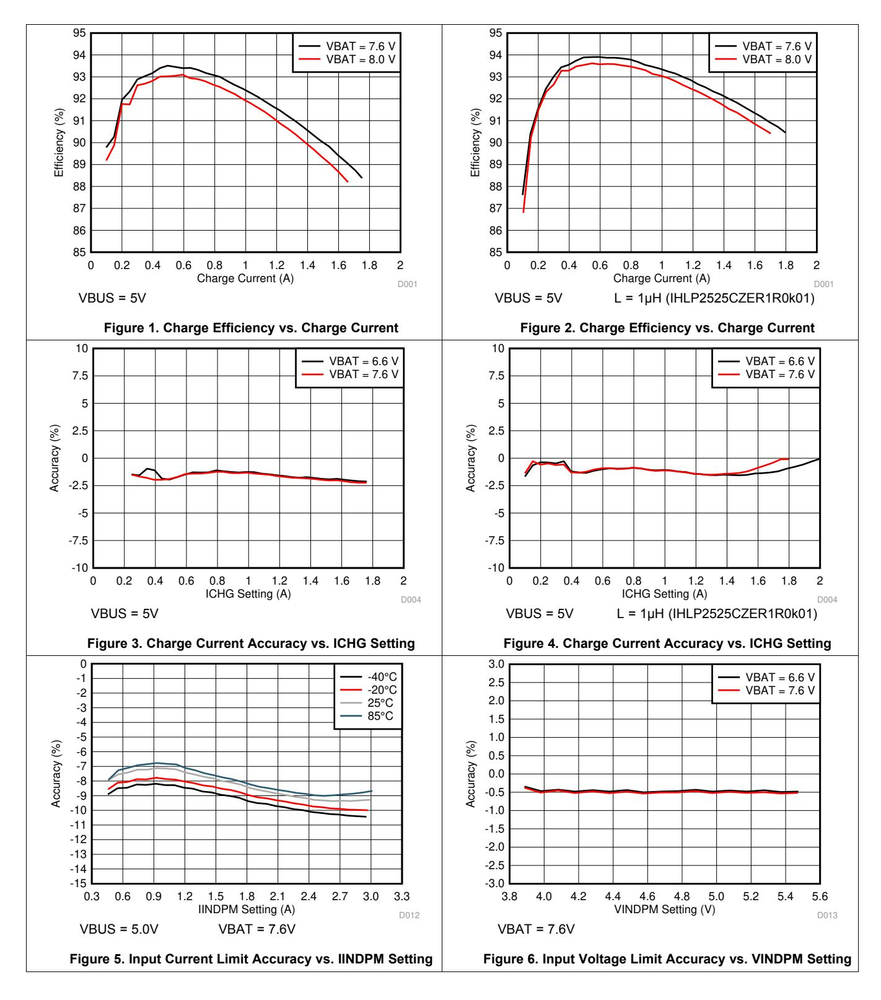

### **Typical Characteristics (continued)**

CVBUS = 1µF, CPMID= 10µF, CSNS= 44µF, CBAT = 10µF, L = 1µH (DFE252012F-1R0) (unless otherwise specified)

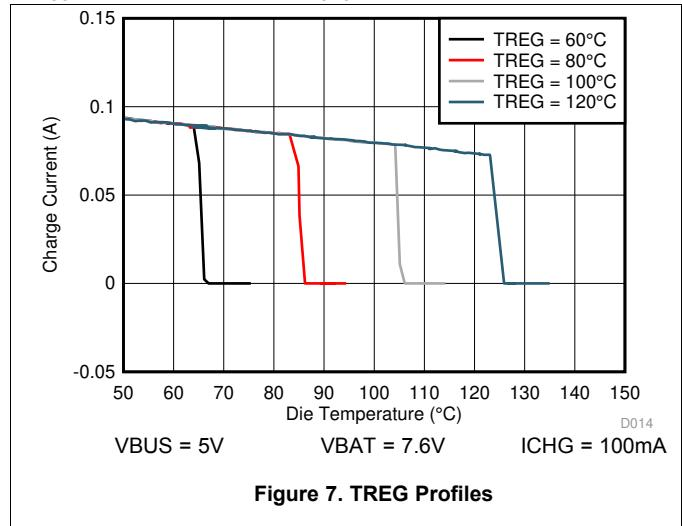

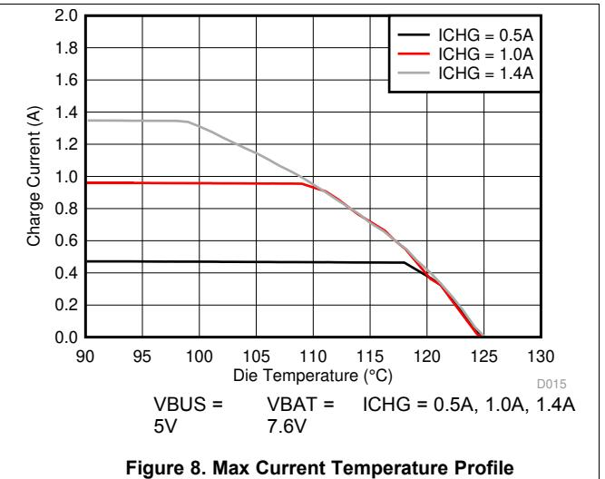

### 8 Detailed Description

#### 8.1 Overview

The BQ25887 device is a highly integrated 2-A switch-mode battery charger for 2s Li-lon and Li-Polymer battery. It integrates the input blocking FET (Q1, QBLK), high-side switching FET (Q2, QHS), and low-side switching FET (Q3, QLS). The device also integrates the boot-strap diode for high-side gate drive.

### 8.2 Functional Block Diagram

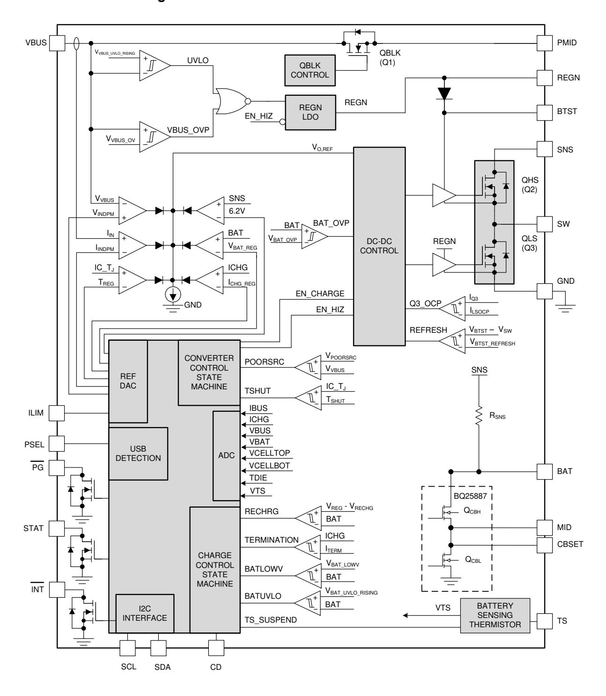

### 8.3 Feature Description

#### 8.3.1 Device Power-On-Reset

The internal bias circuits are powered from either VBAT or VBUS when it rises above  $V_{VBUS\_UVLO\_RISING}$  or  $V_{BAT\_UVLO\_RISING}$ . I2C interface is ready for communication and all the registers are reset to default value. The host can access all the registers after POR.

#### 8.3.2 Device Power Up from Input Source

When an input source is plugged in, the device checks the input source voltage to turn on REGN LDO and all the bias circuits. It detects and sets the input current limit before the boost converter is started. The power up sequence from input source is as listed:

- 1. Poor Source Qualification
- 2. Input Source Type Detection based on PSEL to set default Input Current Limit (IINDPM) register and input source type
- 3. Power Up REGN LDO
- 4. Converter Power-up

#### 8.3.2.1 Poor Source Qualification

After REGN LDO powers up, the device checks the current capability of the input source. The input source has to meet the following requirements in order to start the boost converter.

- VBUS voltage below VVBUS OVP
- 2. VBUS voltage above VPOORSRC when pulling IPOORSRC (typical 15mA)

If  $V_{BUS\_OVP}$  is detected (condition 1 above), the device automatically retries detection once the over-voltage fault goes away. If a poor source is detected (condition 2 above), the device repeats poor source qualification routine every 2 seconds. After 7 consecutive failures, the device sets VBUS\_STAT[2:0] = '0b100', EN\_HIZ = 1, and goes to HIZ mode. On BQ25887 adapter re-plugin and/or EN\_HIZ bit toggle is required to restart device operation. The EN\_HIZ bit is cleared automatically when the adapter is plugged in. If the fault is not removed, the part will enter HIZ mode again after the 7 consecutive failures.

#### 8.3.2.2 Input Source Type Detection

After the PG\_STAT bit is set and input source is qualified, the charger device runs input source type detection when AUTO INDET EN bit is set.

The BQ25887 sets input current limit through PSEL pin. After input source type detection, the following registers and pins are changed:

- 1. Input Current Limit (IINDPM) register is changed to set current limit
- 2. Input Voltage Limit (VINDPM) register is changed to set default limit (if EN\_VINDPM\_RST = 1, otherwise VINDPM value remains unchanged)
- 3. VBUS STAT bits change to reflect the detected source
- 4. INT pin pulses to notify the host
- 5. PG pin is pulled LOW, and PG STAT bit is set to '1'

After detection is completed, the host can over-write IINDPM or VINDPM registers to change the input current, or input voltage limit if needed. The charger input current is always limited by the lower of IINDPM register, ILIM pin, or Input Current Optimizer (ICO) setting when ICO is enabled.

When AUTO\_INDET\_EN is disabled, the Input Source Type Detection is bypassed, and the Input Current Limit (IINDPM) register remains unchanged from previous value. When EN\_VINDPM\_RST is disabled, the Input Voltage Limit (VINDPM) register remains unchanged from previous value.

#### 8.3.2.2.1 PSEL Sets Input Current Limit

The BQ25887 has PSEL pin for input current limit setting to interface with USB PHY. It directly takes the USB PHY device output to decide whether the input is USB host or charging port. PSEL HIGH sets the input current limit to 500 mA and PSEL LOW sets the input current limit to 3 A. Automatic start ICO is disabled when PSEL is HIGH. When no input source is connected, input current limit will not be updated by PSEL change.

### **Feature Description (continued)**

During default mode, after input source type detection is completed with an input source already plugged in, the PSEL pin is monitored. When the pin status changes, the input current limit is changed based on the pin status.

During host mode, after input source type detection is completed with an input source already plugged in, the PSEL pin is NOT monitored. The host needs to set the FORCE\_INDET bit to 1 in order to read the PSEL value. After the detection is completed, the input current limit (IINDPM), and the VBUS\_STAT bits can be changed due to the detection result.

### **8.3.2.2.2 Force Input Current Limit Detection**

In host mode, the host can force the device to run Input Current Limit Detection by setting FORCE\_INDET bit. After the detection is completed, FORCE\_INDET bit returns to 0 by itself and input result is updated.

#### *8.3.2.3 Power Up REGN Regulator (LDO)*

The REGN LDO supplies internal bias circuits as well as the QHS and QLS gate drive. The LDO also provides bias rail to TS external resistors. The pull-up rail of STAT and PG can be connected to REGN as well. The REGN is enabled when all the below conditions are valid.

- 1. VBUS above VVBUS\_UVLO\_RISING in boost mode or VBUS below VVBUS\_UVLO\_RISING in buck mode
- 2. Poor Source Qualification detects a valid input source
- 3. Input Source Type Detection completes and sets appropriate input current limit
- 4. After 220-ms delay is complete

If one of the above conditions is not valid, the device is in high impedance mode (HIZ) with REGN LDO off. The device draws less than IVBUS\_HIZ from VBUS during HIZ state. The battery powers up the system when the device is in HIZ.

### *8.3.2.4 Converter Power Up*

After the input current limit is set, the PG pin is pulled LOW, the PG\_STAT and VBUS\_STAT bits are changed, and the converter is enabled, allowing the QHS and QLS to start switching. Before charging begins, the battery discharge source (IBAT\_DISCHG) is enabled automatically to detect the presence of battery. The host can enable IBAT\_DISCHG via the EN\_BAT\_DISCHG bit at any point during operation, including in Battery Only or HIZ modes. The device provides soft-start when converter output voltage is ramped up.

As a battery charger, the device deploys a highly efficient 1.5-MHz boost switching regulator. The fixed frequency oscillator keeps tight control of the switching frequency under all conditions of input voltage, battery voltage, charge current and temperature, simplifying output filter design.

In order to improve light-load efficiency, the device switches to PFM (Pulse Frequency Modulation) control at light load when battery is below 6.4V or charging is disabled. During the PFM operation, the switching duty cycle is set by the ratio of SNS and VBUS.

#### **8.3.3 Input Current Optimizer (ICO)**

The device provides innovative Input Current Optimizer (ICO) to identify maximum power point without overloading the input source. The algorithm automatically identifies maximum input current limit of a power source without staying in VINDPM to avoid input source overload.

On BQ25887, this feature is enabled by default (EN\_ICO = 1) and can be disabled by setting EN\_ICO bit to 0. After DCP type input source is detected based on the procedures describe above (Input Source Type Detection). The algorithm runs automatically when EN\_ICO bit is set. The algorithm can also be forced to execute by setting FORCE\_ICO bit regardless of input source type detected .

### Feature Description (continued)

**Table 1. Input Current Optimizer Automatic Operation** 

| DEVICE INPUT SOURCE |            | INPUT CURRENT LIMIT (IINDPM) | AUTOMATIC START ICO ALGORITHM |  |
|---------------------|------------|---------------------------------|----------------------------------|--|
| DO25007             | PSEL = HI  | 500 mA                          | Disable                          |  |
| BQ25887             | PSEL = LOW | 3.0 A                           | Enable                           |  |

The actual input current limit used by the Dynamic Power Management is reported in ICO\_ILIM register while Input Current Optimizer is enabled (EN\_ICO = 1) or set by IINDPM register when the algorithm is disabled (EN\_ICO = 0). In addition, the current limit is clamped by ILIM pin unless EN\_ILIM bit is 0 to disable ILIM pin function.

When the algorithm is enabled, it runs continuously to adjust input current limit of Dynamic Power Management (IINDPM) using ICO\_ILIM register until ICO\_STAT[1:0] and ICO\_FLAG bits are set (the ICO\_FLAG bit indicates any change in ICO\_STAT[1:0] bits). The algorithm operates depending on battery voltage:

- 1. When voltage at BAT pin is below 6.2 V, the algorithm starts ICO\_ILIM register with IINDPM which is the maximum input current limit allowed by system
- 2. When voltage at BAT is above 6.2 V, the algorithm starts ICO\_ILIM register with 500mA which is the minimum input current limit to minimize adapter overload

When optimal input current is identified, the ICO\_STAT[1:0] and ICO\_FLAG bits are set to indicate input current limit in ICO\_ILIM register would not be changed until the algorithm is forced to run by the following event (these events also reset the ICO\_STAT[1:0] bits to '01'):

- 1. A new input source is plugged-in, or EN\_HIZ bit is toggled
- 2. IINDPM register is changed
- 3. VINDPM register is changed
- 4. FORCE ICO bit is set to 1
- 5. VBUS\_OVP event

#### 8.3.4 Battery Charging Management

The BQ25887 charges 2-cell Li-lon battery with up to 2.2-A charge current for high capacity battery.

#### 8.3.4.1 Autonomous Charging Cycle

When battery charging is enabled (EN\_CHG = 1 and CD pin is LOW;), the device autonomously completes a charging cycle without host involvement. The device default charging parameters are listed in Table 2 below. On BQ25887, the host can always control the charging operation and optimize the charging parameters by writing to the corresponding registers through  $I^2C$ .

**Table 2. Charging Parameter Default Settings** 

| DEFAULT MODE        | BQ25887   |
|---------------------|-----------|
| Charging Voltage    | 4.2V/Cell |
| Charging Current    | 1.50 A    |
| Pre-Charge Current  | 150 mA    |
| Termination Current | 150 mA    |
| Temperature Profile | JEITA     |
| Safety Timer        | 12 hours  |
| Topoff Timer        | Disabled  |

A new charge cycle starts when the following conditions are valid:

- 1. Converter starts
- 2. Battery charging is enabled by I2C register bit (EN\_CHG = 1 and CD pin is LOW and ICHG register is not 0 mA)
- 3. No thermistor fault on TS
- 4. No safety timer fault

The charger automatically terminates the charging cycle when the charging current is below termination threshold, charge voltage is above recharge threshold, and device is not in DPM mode or thermal regulation. When a full battery voltage is discharged below recharge threshold (threshold selectable via VCELL\_RECHG[1:0] bits on BQ25887), the device automatically starts a new charging cycle. After the charge is done, toggle CD pin or EN\_CHG bit can initiate a new charging cycle.

The STAT output indicates the charging status of: charging (LOW), charging complete or charge disable (HIGH) or charging fault (Blinking). If no battery is connected, the STAT pin blinks as capacitance connected at BAT charges, discharges, then recharges. The STAT output can be disabled by setting STAT\_DIS bit. In addition, the status register (CHRG\_STAT) indicates the different charging phases as:

- 000 Not Charging
- 001 Trickle Charge (VBAT < VBAT\_SHORT)
- 010 Pre-charge (VBAT\_SHORT < VBAT < VBAT\_LOWV)
- 011 Fast-charge (CC mode)
- 100 Taper Charge (CV mode)
- 101 Top-off Timer Charging
- 110 Charge Termination Done

When the charger transitions to any of these states, including when charge cycle is completed, an INT is asserted to notify the host.

### *8.3.4.2 Battery Charging Profile*

The device charges the battery in five phases: trickle charge, pre-charge, constant current, constant voltage, and top-off timer charging (optional). At the beginning of a charging cycle, the device checks the battery voltage and regulates current/voltage accordingly.

**Table 3. Default Charging Current Setting**

| VBAT                     | CHARGING CURRENT | REGISTER DEFAULT SETTING | CHRG_STAT |
|--------------------------|------------------|--------------------------|-----------|
| < VCELL_SHORT            | IBAT_SHORT       | 100 mA                   | 001       |
| VCELL_SHORT – VCELL_LOWV | IPRECHG          | 150 mA                   | 010       |
| > VCELL_LOWV             | ICHG             | 1500 mA                  | 011       |

If the charger device is in DPM regulation or thermal regulation during charging, the actual charging current will be less than the programmed value. In this case, termination is temporarily disabled and the charging safety timer is counted at half the clock rate, as explained in the Charging Safety Timer section.

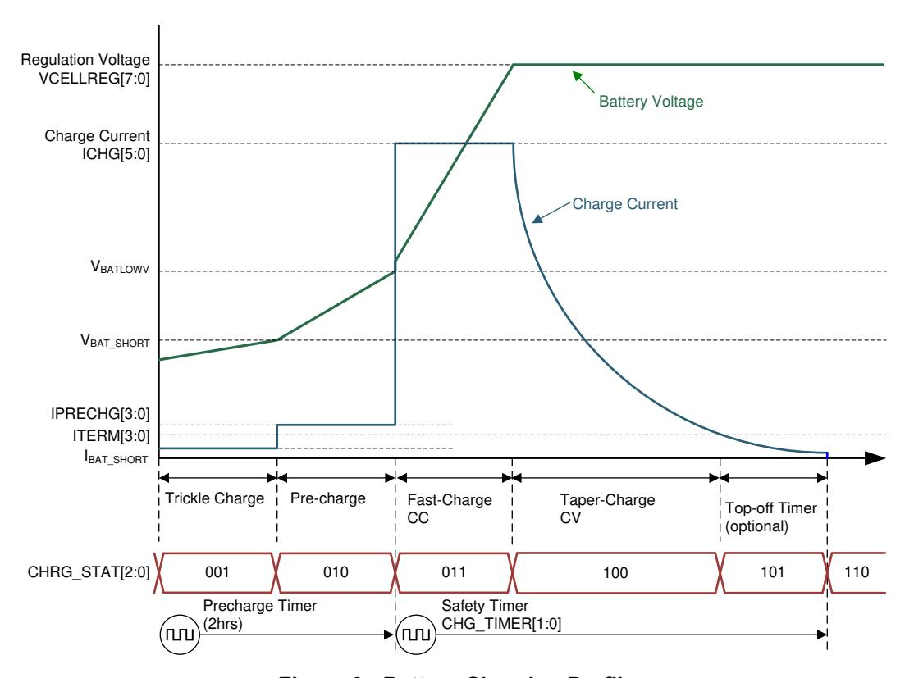

Figure 9. Battery Charging Profile

#### 8.3.4.3 Cell Balancing During Charging

Some applications require cell balancing when the user can replace one or both of the cells in the 2S1P configuration. When charging two batteries with different voltages, cell balancing is required, as the cell with the higher voltage is at risk of being overcharged. For extremely unbalanced cells, charging the lower voltage cell as well as fast cell balancing is desired.

The BQ25887 implements a passive cell balancing scheme with a recommended maximum discharge current of 400 mA. Balancing current is limited by external resistors placed between the CBSET pin and the mid-point of the two cells. Low side cell voltage is sensed at MID pin. Cell balancing can be enabled in the I2C registers.

The Cell Balancing current limit resistor, RCBSET, can be calculated as below.

 $I_{CB\_LIM} = V_{CELLREG} / (R_{CBSET} + R_{DSON\_QCBX})$ 

For example, the maximum recommended cell balancing current is 400 mA. For 4.2-V battery cell,  $R_{CBSET}$  can be calculated as 9.5  $\Omega$  (typical).

Cell balancing status register, CB\_STAT, HS\_CV\_STAT and LS\_CV\_STAT is active in both automatic cell balancing mode and manual cell balancing mode.

The default setting of the cell balancing parameters are below.

**Table 4. Cell Balancing Default Setting** 

| PARAMETER                                       | REGISTER    | DEFAULT VALUE |
|-------------------------------------------------|-------------|---------------|
| Enable Auto Cell Balancing Mode (CB_AUT0_EN) | REG0x2A [6] | 1 = Enable    |

| Table 4. Cell Balancing | Default Setting | (continued) |
|-------------------------|-----------------|-------------|
|-------------------------|-----------------|-------------|

| PARAMETER                                                                                              | REGISTER       | DEFAULT VALUE                                                |
|--------------------------------------------------------------------------------------------------------|----------------|--------------------------------------------------------------|
| Disable Charge for Accurate Cell Balancing Measurement (CB_CHG_DIS)                                    | REG0x2A [7]    | 1 = Charge Disable for Cell Balancing Voltage Measurement |
| Voltage Threshold Enter Cell Balancing Qualification Mode from Pre-Qualification Mode (VQUAL_TH) | REG0x29h [7:4] | 1111 = Disable Pre-Qualification Mode                        |
| Voltage Threshold Enter Cell Balancing Active Mode from Qualification Mode (VDIFF_START)         | REG0x29h [3:0] | 0100 = 80 mV                                                 |
| Voltage Threshold Exit Cell Balancing Offset from VDIFF_START (VDIFF_END_OFFSET)                       | REG0x28 [ 7:5] | 001 = 40 mV                                                  |
| Time Interval between Taking Measurements in Pre-Qualification Mode(TCB_QUAL_INTERVAL)                 | REG0x0x28 [4]  | 0 = 2 min                                                    |
| Time Interval between Taking Measurements in Cell Balancing Active Mode (TCB_ACTIVE)                   | REG0x28 [3:2]  | 10 = 2 min                                                   |
| Time Delay between Charge Disable and Cell Voltage Measurement (TSETTLE)                               | REG0x28 [1]    | 10 = 1 sec                                                   |

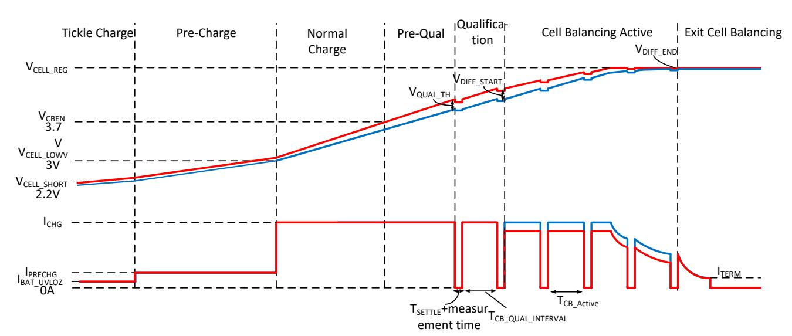

Figure 10. Cell Balancing Timing Diagram

#### 8.3.4.4 Charging Termination

The device terminates a charge cycle when the battery voltage is above recharge threshold, and the current is below termination current.

When termination occurs, the STAT pin goes HIGH (charge <u>current</u> will continue to taper if top-off timer is enabled), status register CHRG\_STAT is set to 110, and an <u>INT</u> pulse is asserted to the host. Termination is temporarily disabled when the charger device is in input current, voltage or thermal regulation. Termination can be permanently disabled by writing 0 to EN\_TERM bit prior to charge termination.

At low termination currents (50 mA - 100 mA), due to the comparator offset, the actual termination current may be up to 20% higher than the termination target. In order to compensate for comparator offset, a programmable top-off timer (default disabled) can be applied after termination is detected. The top-off timer will follow safety timer constraints, such that if safety timer is suspended, so will the top-off timer. Similarly, if safety timer is doubled, so will the top-off timer. CHRG\_STAT reports whether the top off timer is active via the 101 code. Once the Top-Off timer expires, the CHRG\_STAT register is set to 110 and an INT pulse is asserted to the host.

Top-off timer gets reset (set to 0 and counting resumes when appropriate) for any of the following conditions:

#### 1. Charge disable to enable

- 2. Termination status low to high
- 3. REG\_RST register bit is set (disables top-off timer)

The top-off timer settings are read in once termination is detected by the charger. Programming a top-off timer value after termination will have no effect unless a recharge cycle is initiated. An INT is asserted to the host when entering top-off timer segment as well as when top-off timer expires. All charge cycle related INT pulses (including top-off timer INT pulses) can be masked by CHRG\_MASK bit.

### *8.3.4.5 Thermistor Qualification*

The charger device provides a single thermistor input for battery temperature monitor.

#### **8.3.4.5.1 JEITA Guideline Compliance in Charge Mode**

To improve the safety of charging Li-ion batteries, JEITA guideline was released on April 20, 2007. The guideline emphasized the importance of avoiding a high charge current and high charge voltage at certain low and high temperature ranges.

To initiate a charge cycle, the voltage on TS pin must be within the VT1 to VT5 thresholds. If TS voltage exceeds the T1-T5 range, the controller suspends charging and waits until the battery temperature is within the T1 to T5 range. At cool temperature (T1-T2), JEITA recommends the charge current to be reduced to half of the charge current or lower. At warm temperature (T3-T5), JEITA recommends charge voltage less than 4.1 V / cell.

On BQ25887, the charger provides flexible voltage/current settings beyond JEITA requirement. The Voltage setting at warm temperature (T3-T5) can be VCELLREG, 4.0 V, 4.15 V, or charge suspended (configured by JEITA\_VSET [1:0]). The fast charge current setting at warm temperature (T3-T5) can be 100%, or 40% of fast charge current, ICHG (configured by JEITA\_ISETH). The fast charge current setting at cool temperature (T1-T2) can be 100%, 40%, or 20% of fast charge current, ICHG, or charge suspend (configured by JEITA\_ISETC[1:0]). Whenever the charger detects "warm" or "cool" temperature, termination is automatically disabled regardless of JEITA\_VSET, JEITA\_ISETH and JEITA\_ISETC register bit settings.

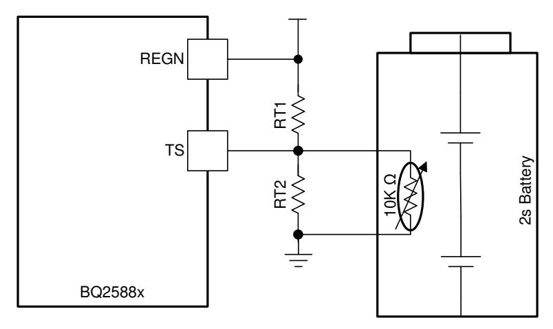

**Figure 11. TS Resistor Network**

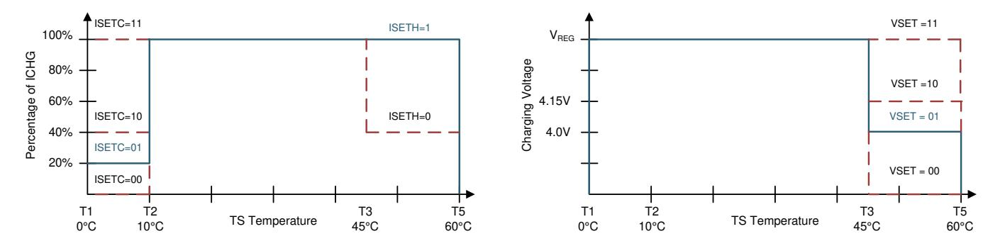

**Figure 12. TS Charging Values**

Assuming a 103AT NTC (Negative Temperature Coefficient) thermistor on the battery pack as shown above, the value of RT1 and RT2 can be determined by:

$$RT2 = \frac{R_{NTC,T1} \times R_{NTC,T5} \times \left(\frac{1}{V_{T5}} - \frac{1}{V_{T1}}\right)}{R_{NTC,T1} \times \left(\frac{1}{V_{T1}} - 1\right) - R_{NTC,T5} \times \left(\frac{1}{V_{T5}} - 1\right)}$$

$$RT1 = \frac{\frac{1}{V_{T1}} - 1}{\frac{1}{R_{T2}} + \frac{1}{R_{NTC,T1}}}$$
(1)

Select 0°C to 60°C range for Li-ion or Li-polymer battery:

 $R_{NTC,T1}$  = 27.28 k $\Omega$ 

 $R_{NTC,T5} = 3.02 \text{ k}\Omega$ 

RT1 = 5.24 k $\Omega$ 

 $RT2 = 30.31 \text{ k}\Omega$ 

#### 8.3.4.6 Charging Safety Timer

The device has built-in safety timer to prevent extended charging cycle due to abnormal battery conditions. The user can program fast charge safety timer through  $I^2C$  (CHG\_TIMER bits). When safety timer expires, the fault register TMR\_STAT bit is set to 1, and an  $\overline{INT}$  pulse is asserted to the host. The safety timer feature can be disabled by clearing EN\_TIMER bit.

During input voltage, current or thermal regulation or cell balancing active mode (cell balancing discharging), the safety timer counts at half clock rate as the actual charge current is likely to be below the register setting. For example, if the charger is in input current regulation (IINDPM\_STAT=1) throughout the whole charging cycle, and the safety timer is set to 12 hours, then the timer will expire in 24 hours. This half clock rate feature can be disabled by setting TMR2X\_EN = 0. Changing the TMR2X\_EN bit while the device is running has no effect on the safety timer count, other than forcing the timer to count at half the rate under the conditions dictated above.

During faults which disable charging, or supplement mode, timer is suspended. Since the timer is not counting in this state, the TMR2X\_EN bit has no effect. Once the fault goes away, safety timer resumes. If the charging cycle is stopped and started again, the timer gets reset.

The safety timer is reset for the following events:

- 1. Charging cycle stop and restart (toggle CD pin, EN\_CHG bit, or charged battery falls below recharge threshold).
- BAT voltage changes from pre-charge to fast-charge or vice versa (in host-mode or default mode).

The precharge safety timer (fixed 2hr counter that runs when VBAT <  $V_{BAT\_LOWV}$ ), follows the same rules as the fast-charge safety timer in terms of getting suspended, reset, and counting at half-rate when TMR2X\_EN is set.

#### 8.3.5 Integrated 16-Bit ADC for Monitoring

The device includes a 16-bit ADC to monitor critical system information based on the device's modes of operation. The control of the ADC is done through the *ADC Control Register (Address = 15h) [reset = 30h]*. The ADC\_EN bit provides the ability to enable and disable the ADC to conserve power. The ADC\_RATE bit allows continuous conversion or one-shot behavior. After a one-shot conversion finishes, the ADC\_EN bit is cleared, and must be re-asserted to start a new conversion.

To enable the ADC, the ADC\_EN bit must be set to '1'. The ADC is allowed to operate if either the  $V_{VBUS}$ > $V_{VBUS}$ \_UVLO\_RISING or  $V_{BAT}$ - $V_{BAT}$ \_UVLO\_RISING is valid. If no adapter is present, and the VBAT is less than  $V_{BAT}$ \_UVLO\_RISING, the device will not perform an ADC measurement, nor update the ADC read-back values in REG17 through REG24. Additionally, the device will immediately reset ADC\_EN bit without sending any interrupt. The same will happen if the ADC is enabled when all ADC channels are disabled. It is recommended to read

back ADC\_EN after setting it to '1' to ensure ADC is running a conversion. If the charger changes mode (for example, if adapter is connected, EN\_HIZ goes to '1', or CD goes high,) while an ADC conversion is running, the conversion is interrupted. Once the mode change is complete, the ADC resumes conversion, starting with the channel where it was interrupted. When device is in HIZ mode, ADC conversion can still be enabled through I 2C. In HIZ mode, device power up internally to start ADC convertion and turn back down when ADC conversion is completed.

When TS\_ADC conversion performs in battery only mode, the REGN is powered and extra battery current would be drawn. Battery current can be kept low by disabling the TS\_ADC conversion in battery only mode.

The integrated ADC has two rate conversion options: a one-shot mode and a continuous conversion mode set by the ADC\_RATE bit. By default, all ADC parameters will be converted in one-shot or continuous conversion mode unless disabled in the *ADC Function Disable Register [\(Address](#page-54-0) = 16h) [reset = 00h]*. If an ADC parameter is disabled by setting the corresponding bit in REG16, then the read-back value in the corresponding register will be from the last valid ADC conversion or the default POR value (all zeros if no conversions have taken place). If an ADC parameter is disabled in the middle of an ADC measurement cycle, the device will finish the conversion of that parameter, but will not convert the parameter starting the next conversion cycle. Even though no conversion takes place when all ADC measurement parameters are disabled, the ADC circuitry is active and ready to begin conversion as soon as one of the bits in the ADC Function Disable register is set to '0'. If all channels are disabled in one-shot conversion mode, the ADC\_EN bit is cleared.

The ADC\_DONE\_STAT and ADC\_DONE\_FLAG bits signal when a conversion is completed in one-shot mode only. This event produces an INT pulse, which can be masked with ADC\_DONE\_MASK. During continuous conversion mode, the ADC\_DONE\_STAT bit has no meaning and will be '0'. The ADC\_DONE\_FLAG bit will remain unchanged in continuous conversion mode.

ADC conversion operates independently of the faults present in the device. ADC conversion will continue even after a fault has occurred (such as one that causes the power stage to be disabled), and the host must set ADC\_EN = '0' to disable the ADC. ADC conversion is interrupted upon adapter plug-in, and will only resume until after Input Source Type Detection is complete. ADC readings are only valid for DC states and not for transients. When host writes ADC\_EN = 0, the ADC stops immediately, and ADC measurement values correspond to last valid ADC reading.

A recommended method to exit ADC conversion is described below:

- 1. Write ADC\_RATE to one-shot, and the ADC will stop at the end of a complete cycle of conversions, or
- 2. Disable all ADC conversion channels, and the ADC will stop at the end of the current measurement.

#### **8.3.6 Status Outputs**

#### *8.3.6.1 Power Good Indicator (PG)*

The PG\_STAT bit goes HIGH and open drain PG pin goes low to indicate a good input source when:

- 1. VBUS above VVBUS\_UVLO\_RISING
- 2. VBUS below VVBUS\_OV threshold
- 3. VBUS above VPOORSRC (typ. 3.7 V) when IPOORSRC (typ. 30 mA) current is applied (not a poor source)
- 4. Input Source Type Detection is completed
- 5. CD pin is LOW

#### *8.3.6.2 Charging Status Indicator (STAT)*

The device indicates charging state on the open drain STAT pin. The STAT pin can drive LED. The STAT pin function can be disabled via the STAT\_DIS bit.When CD is high, the device is in HIZ mode and STAT will not reflect charging state.

**Table 5. STAT Pin State**

| CHARGING STATE                                                                        | STAT INDICATOR |
|---------------------------------------------------------------------------------------|----------------|
| Charging in progress (including trickle charge, pre-charge, fast charge, recharge) | LOW            |
| Charging complete (including top-off)                                                 | HIGH           |
| Sleep mode, charge disable                                                            | HIGH           |

#### **Table 5. STAT Pin State (continued)**

| CHARGING STATE                                                                        | STAT INDICATOR  |  |
|---------------------------------------------------------------------------------------|-----------------|--|
| Charge suspend (Input over-voltage, TS fault, timer fault or battery over-voltage) | Blinking at 1Hz |  |

### *8.3.6.3 Interrupt to Host*

In some applications, the host does not always monitor the charger operation. The INT pin notifies the system host on the device operation. By default, the following events will generate an active-low, 256-µs INT pulse.

- 1. Good input source detected
  - VVBUS < VVBUS\_OV threshold
  - VVBUS > VPOORSRC (typ. 3.7 V) when IPOORSRC (typ. 30 mA) current is applied (not a poor source)
- 2. VBUS\_STAT changes state (VBUS\_STAT any bit change)
- 3. Good input source removed
- 4. Entering IINDPM regulation
- 5. Entering VINDPM regulation
- 6. Entering IC junction temperature regulation (TREG)
- 7. I2C Watchdog timer expired
  - At initial power up, this INT gets asserted to signal I 2C is ready for communication
- 8. Charger status changes state (CHRG\_STAT value change), including Charge Complete
- 9. TS\_STAT changes state (TS\_STAT any bit change)
- 10. VBUS over-voltage detected (VBUS\_OVP)
- 11. Junction temperature shutdown (TSHUT)
- 12. Cell over-voltage detected (CELLOVP)
- 13. Cell over-voltage detected (HS\_OV or LS\_OV)
- 14. Charge safety timer expired
- 15. A rising edge on any of the \*\_STAT bits

Each one of these INT sources can be masked off to prevent INT pulses from being sent out when they occur. Three bits exist for each one of these events:

- The STAT bit holds the *current status* of each INT source
- The FLAG bit holds information on which source produced an INT, regardless of the current status
- The MASK bit is used to prevent the device from sending out INT for each particular event

When one of the above conditions occurs (a rising edge on any of the \*\_STAT bits), the device sends out an INT pulse and keeps track of which source generated the INT via the FLAG registers. The FLAG register bits are automatically reset to zero after the host reads them, and a new edge on STAT bit is required to re-assert the FLAG.

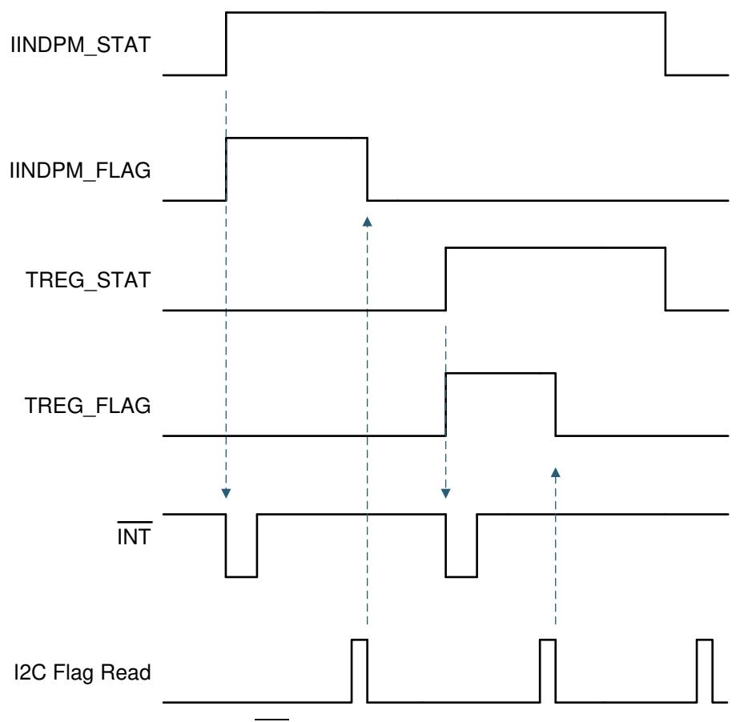

Figure 13. INT Generation Behavior Example

#### 8.3.7 Input Current Limit on ILIM Pin

For safe operation, the BQ2588x has an additional hardware pin on ILIM to limit maximum input current. The maximum input current is set by a resistor from ILIM pin to ground as:

$$I_{INMAX} = \frac{K_{ILIM}}{R_{ILIM}} \tag{3}$$

The actual input current limit is the lower value between ILIM pin setting and register setting (IINDPM). For example, if the register setting is 3.3 A (0x1C), and ILIM has a  $820\text{-}\Omega$  resistor (KILIM = 1276 max) to ground for 1.55 A, the input current limit is 1.55 A. ILIM pin can be used to set the input current limit rather than the register settings when EN\_ILIM bit is set. The device regulates ILIM pin at 0.8 V. If ILIM voltage exceeds 0.8 V, the device enters input current regulation (refer to section). Entering IINDPM through ILIM pin sets the IINDPM\_STAT and FLAG bits, and produces and interrupt to host. The interrupt can be masked via the IINDPM MASK bit.

The ILIM pin can also be used to monitor input current when EN\_ILIM is set. The voltage on ILIM pin is proportional to the input current. ILIM can be used to monitor input current with the following relationship:

$$I_{IN} = \frac{K_{ILIM} \times V_{ILIM}}{R_{ILIM} \times 0.8V} \tag{4}$$

For example, if ILIM pin is set with  $820-\Omega$  resistor, and the ILIM voltage 0.5V, the actual input current is 0.795 A to 0.973 A. If ILIM pin is open, the input current is limited to zero since ILIM voltage floats above 0.8 V. If ILIM pin is shorted, the input current limit is set by the register.

The ILIM pin function can be disabled by setting the EN\_ILIM bit to 0. When the pin is disabled, both input current limit function and monitoring function are not available.

#### 8.3.8 Voltage and Current Monitoring

The device closely monitors the input voltage, as well as internal FET currents for safe boost and buck mode operation.

#### 8.3.8.1 Voltage and Current Monitoring in Boost Mode

#### 8.3.8.1.1 Input Over-Voltage Protection

The valid input voltage range for boost mode operation is  $V_{VBUS\_OP}$ . If VBUS voltage exceeds  $V_{VBUS\_OV}$ , the device stops switching immediately to protect the power FETs. During input over-voltage, an INT pulse is asserted to signal the host, and the VBUS\_OVP\_STAT and VBUS\_OVP\_FLAG fault registers get set. The device automatically starts switching again when the over-voltage condition goes away.

#### 8.3.8.1.2 Input Under-Voltage Protection

The valid input voltage range for boost mode operation is  $V_{VBUS\_OP}$ . If VBUS voltage falls below  $V_{POORSRC}$  during operation, the device stops switching. During input under-voltage, an INT pulse is asserted to signal the host, and the PG\_STAT bit gets cleared. The PG\_FLAG bit will get set to signal this event. The device automatically attempts to restart switching when the under-voltage condition goes away.

#### 8.3.9 Thermal Regulation and Thermal Shutdown

#### 8.3.9.1 Thermal Protection in Boost Mode

The device monitors internal junction temperature,  $T_J$ , to avoid overheating and limits the IC surface temperature in boost mode. When the internal junction temperature exceeds the preset thermal regulation limit (TREG bits), the device reduces charge current. A wide thermal regulation range from  $60^{\circ}$ C to  $120^{\circ}$ C allows optimization for the system thermal performance.

During thermal regulation, the actual charging current is usually below the programmed value in ICHG registers. Therefore, termination is disabled, the safety timer runs at half the clock rate, the status register TREG\_STAT bit goes high, and an INT is asserted to the host.

Additionally, the device has thermal shutdown to turn off the converter when  $\underline{IC}$  surface temperature exceeds  $T_{SHUT}$ . The fault register bits TSHUT\_STAT and TSHUT\_FLAG are set and an INT pulse is asserted to the host. The converter turns back on when IC temperature is below  $T_{SHUT-HYS}$ .

### 8.3.10 Battery Protection

#### 8.3.11 Serial Interface

The device uses I2C compatible interface for flexible charging parameter programming and instantaneous device status reporting. I2C is a bi-directional 2-wire serial interface. Only two open-drain bus lines are required: a serial data line (SDA), and a serial clock line (SCL). Devices can be considered as masters or slaves when performing data transfers. A master is a device which initiates a data transfer on the bus and generates the clock signals to permit that transfer. At that time, any device addressed is considered a slave.

The device operates as a slave device with address 0x6A, receiving control inputs from the master device like micro-controller or digital signal processor through REG00 – REG2C. Register read beyond REG2C (0x2C), returns 0xFF. The  $I^2C$  interface supports both standard mode (up to 100kbits/s), and fast mode (up to 400kbits/s). When the bus is free, both lines are HIGH. The SDA and SCL pins are open drain and must be connected to the positive supply voltage via a current source or pull-up resistor.

#### 8.3.11.1 Data Validity

The data on the SDA line must be stable during the HIGH period of the clock. The HIGH or LOW state of the data line can only change when the clock signal on SCL line is LOW. One clock pulse is generated for each data bit transferred.

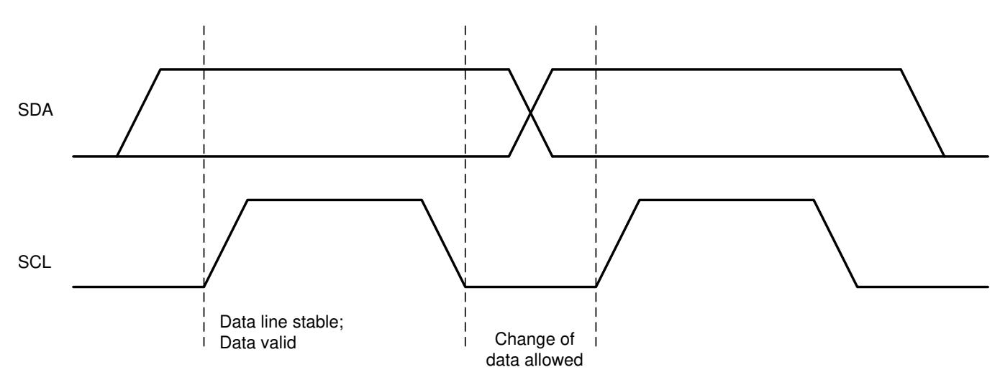

Figure 14. Bit Transfers on the I2C bus

#### 8.3.11.2 START and STOP Conditions

All transactions begin with a START (S) and are terminated with a STOP (P). A HIGH to LOW transition on the SDA line while SCL is HIGH defines a START condition. A LOW to HIGH transition on the SDA line when the SCL is HIGH defines a STOP condition.

START and STOP conditions are always generated by the master. The bus is considered busy after the START condition, and free after the STOP condition.

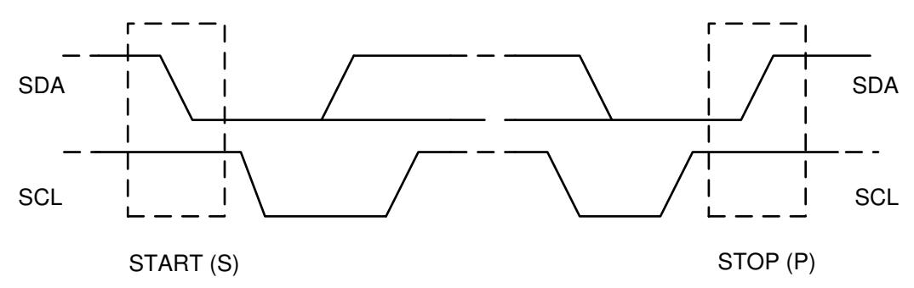

Figure 15. START and STOP conditions on the I2C bus

#### 8.3.11.3 Byte Format

Every byte on the SDA line must be 8 bits long. The number of bytes to be transmitted per transfer is unrestricted. Each byte has to be followed by an ACKNOWLEDGE (ACK) bit. Data is transferred with the Most Significant Bit (MSB) first. If a slave cannot receive or transmit another complete byte of data until it has performed some other function, it can hold the SCL line low to force the master into a wait state (clock stretching). Data transfer then continues when the slave is ready for another byte of data and releases the SCL line.

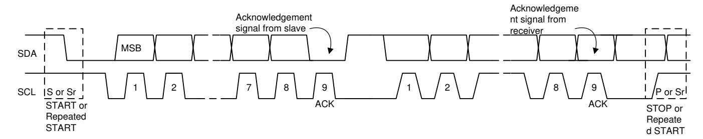

Figure 16. Data Transfer on the I2C Bus

### 8.3.11.4 Acknowledge (ACK) and Not Acknowledge (NACK)

The ACK signaling takes place after byte. The ACK bit allows the receiver to signal the transmitter that the byte was successfully received and another byte may be sent. All clock pulses, including the acknowledge 9th clock pulse, are generated by the master.

The transmitter releases the SDA line during the acknowledge clock pulse so the receiver can pull the SDA line LOW and it remains stable LOW during the HIGH period of this 9th clock pulse.

A NACK is signaled when the SDA line remains HIGH during the 9th clock pulse. The master can then generate either a STOP to abort the transfer or a repeated START to start a new transfer.

#### 8.3.11.5 Slave Address and Data Direction Bit

After the START signal, a slave address is sent. This address is 7 bits long, followed by the 8 bit as a data direction bit (bit R/W). A zero indicates a transmission (WRITE) and a one indicates a request for data (READ). The device 7-bit address is defined as 1101 011' (0x6B) by default. The address bit arrangement is shown below.

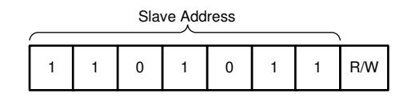

Figure 17. 7-Bit Addressing (0x6B)

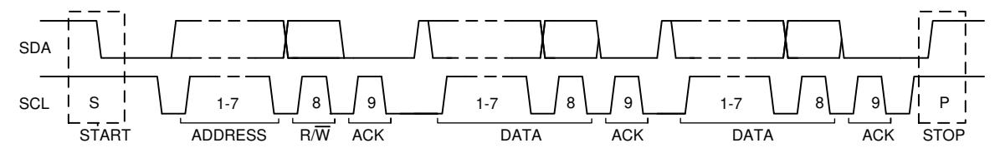

Figure 18. Complete Data Transfer on the I2C Bus

### 8.3.11.6 Single Write and Read

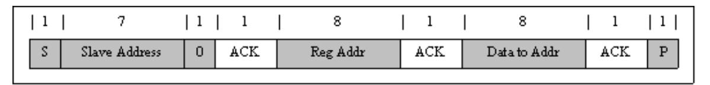

Figure 19. Single Write

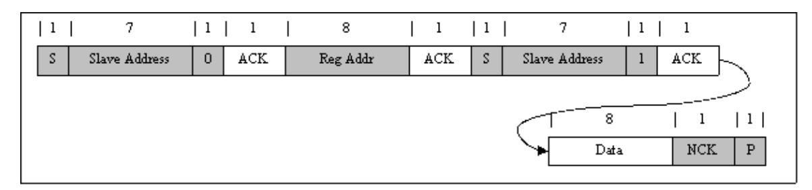

**Figure 20. Single Read**

If the register address is not defined, the charger IC sends back NACK and returns to the idle state.

#### *8.3.11.7 Multi-Write and Multi-Read*

The charger device supports multi-read and multi-write of all registers.

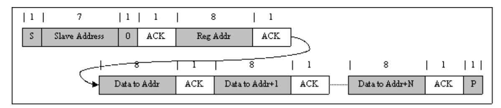

**Figure 21. Multi-Write**

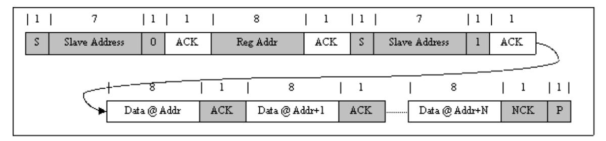

**Figure 22. Multi-Read**

### **8.4 Device Functional Modes**

### **8.4.1 Host Mode and Default Mode**

The BQ2588x is a host controlled charger, but it can operate in default mode without host management. In default mode, the device can be used as an autonomous charger with no host or while host is in sleep mode. When the charger is in default mode, WD\_STAT bit is HIGH. When the charger is in host mode, WD\_STAT bit is LOW.

After power-on-reset, the device starts in default mode with watchdog timer expired, or default mode. All the registers are in the default settings. During default mode, any change on PSEL pin will make real time internal reference change.

In default mode, the device keeps charging the battery with default 12-hour fast charging safety timer.

A I2C write to the registers transitions the charger from default mode to host mode and watchdog timer is reset. All the device parameters can be programmed by the host. To keep the device in host mode, the host has to reset the watchdog timer by writing 1 to WD\_RST bit before the watchdog timer expires (WD\_STAT bit is set), or disable watchdog timer by setting WATCHDOG bits = 00.

### **Device Functional Modes (continued)**

When the watchdog timer (WD\_STAT bit = 1) is expired, the device returns to default mode and all registers are reset to default values except as detailed in the *[Register](#page-30-0) Maps* section. The Watchdog timer will be reset on any write if the watchdog timer has expired.

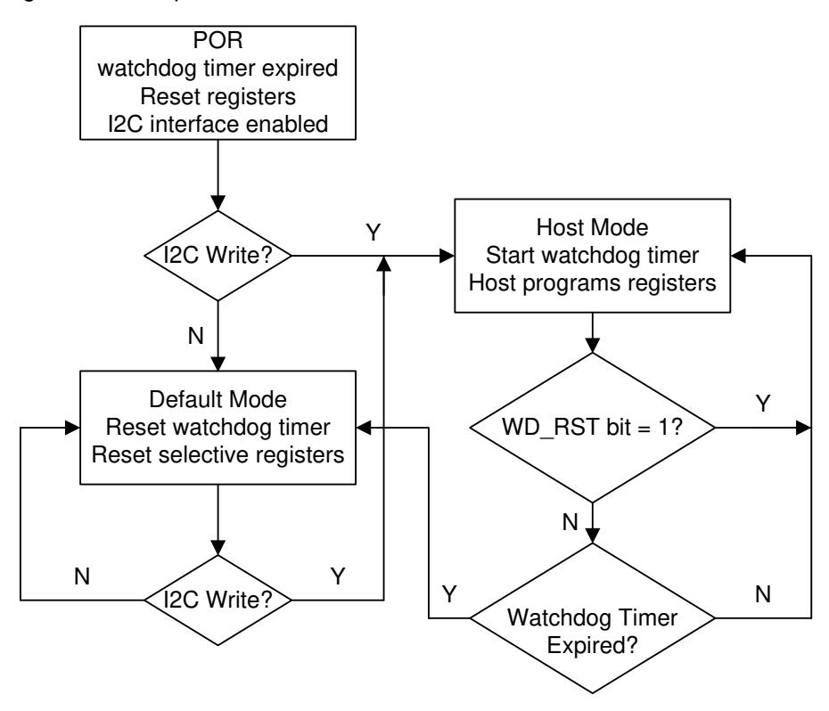

**Figure 23. Watchdog Timer Flow Chart**

### **8.5 Register Maps**

Default I 2C Slave Address: 0x6B (1101 011B + R/W)

**Table 6. I 2C Registers**

| Address | Access Type | Acronym | Register Name                     | Section |
|---------|-------------|---------|-----------------------------------|---------|
| 00h     | R/W         | REG00   | Cell Voltage Limit                | Go      |
| 01h     | R/W         | REG01   | Charge Current Limit              | Go      |
| 02h     | R/W         | REG02   | Input Voltage Limit               | Go      |
| 03h     | R/W         | REG03   | Input Current Limit               | Go      |
| 04h     | R/W         | REG04   | Precharge and Termination Control | Go      |
| 05h     | R/W         | REG05   | Charger Control 1                 | Go      |
| 06h     | R/W         | REG06   | Charger Control 2                 | Go      |
| 07h     | R/W         | REG07   | Charger Control 3                 | Go      |
| 08h     | R/W         | REG08   | Charger Control 4                 | Go      |
| 09h     | R/W         | REG09   | Reserved                          | Go      |
| 0Ah     | R           | REG0A   | ICO Current Limit                 | Go      |
| 0Bh     | R           | REG0B   | Charger Status 1                  | Go      |
| 0Ch     | R           | REG0C   | Charger Status 2                  | Go      |
| 0Dh     | R           | REG0D   | NTC Status                        | Go      |
| 0Eh     | R           | REG0E   | FAULT Status                      | Go      |

#### **Table 6. I 2C Registers (continued)**

| Address    | Access Type | Acronym        | Register Name                     | Section  |
|------------|-------------|----------------|-----------------------------------|----------|
|            |             |                |                                   |          |
| 0Fh 10h | R R      | REG0F REG10 | Charger Flag 1 Charger Flag 2  | Go Go |
|            |             |                |                                   |          |
| 11h        | R           | REG11          | Fault Flag                        | Go       |
| 12h        | R/W         | REG12          | Charger Mask 1                    | Go       |
| 13h        | R/W         | REG13          | Charger Mask 2                    | Go       |
| 14h        | R/W         | REG14          | Fault Mask                        | Go       |
| 15h        | R/W         | REG15          | ADC Control                       | Go       |
| 16h        | R/W         | REG16          | ADC Function Disable              | Go       |
| 17h        | R           | REG17          | IBUS ADC1                         | Go       |
| 18h        | R           | REG18          | IBUS ADC0                         | Go       |
| 19h        | R           | REG19          | ICHG ADC1                         | Go       |
| 1Ah        | R           | REG1A          | ICHG ADC0                         | Go       |
| 1Bh        | R           | REG1B          | VBUS ADC1                         | Go       |
| 1Ch        | R           | REG1C          | VBUS ADC0                         | Go       |
| 1Dh        | R           | REG1D          | VBAT ADC1                         | Go       |
| 1Eh        | R           | REG1E          | VBAT ADC0                         | Go       |
| 1Fh        | R           | REG1F          | VCELLTOP ADC1                     | Go       |
| 20h        | R           | REG20          | VCELLTOP ADC0                     | Go       |
| 21h        | R           | REG21          | TS ADC1                           | Go       |
| 22h        | R           | REG22          | TS ADC0                           | Go       |
| 23h        | R           | REG23          | TDIE ADC1                         | Go       |
| 24h        | R           | REG24          | TDIE ADC0                         | Go       |
| 25h        | R/W         | REG25          | Part Information                  | Go       |
| 26h        | R           | REG26          | VCELLBOT ADC1                     | Go       |
| 27h        | R           | REG27          | VCELLBOT ADC0                     | Go       |
| 28h        | R/W         | REG28          | Cell Balancing Control 1          | Go       |
| 29h        | R/W         | REG29          | Cell Balancing Control 2          | Go       |
| 2Ah        | R/W         | REG2A          | Cell Balancing Status and Control | Go       |
| 2Bh        | R           | REG2B          | Cell Balancing Flag               | Go       |
| 2Ch        | R/W         | REG2C          | Cell Balancing Mask               | Go       |
|            |             |                |                                   |          |

Complex bit access types are encoded to fit into small table cells. [Table](#page-31-0) 7 shows the codes that are used for access types in this section.

**Table 7. I 2C Access Type Codes**

| Access Type | Code | Description       |  |  |  |  |  |
|-------------|------|-------------------|--|--|--|--|--|
| Read Type   |      |                   |  |  |  |  |  |
| R           | R    | Read              |  |  |  |  |  |
| Write Type  |      |                   |  |  |  |  |  |
| W           | W    | Write             |  |  |  |  |  |
| Reset Value |      |                   |  |  |  |  |  |
| -n          |      | Value after reset |  |  |  |  |  |
| -X          |      | Undefined value   |  |  |  |  |  |

#### **8.5.1 Cell Voltage Regulation Limit Register (Address = 00h) [reset = A0h]**

REG00 is shown in [Figure](#page-32-1) 24 and described in .

Return to [Summary](#page-30-1) Table.

#### **Figure 24. REG00 Register**

#### **Table 8. REG00 Register Field Descriptions**

| Bit | Field       | Type | Reset by REG_RST | Reset by WATCHDOG | Description |                                           |
|-----|-------------|------|---------------------|----------------------|-------------|-------------------------------------------|
| 7   | VCELLREG[7] | R/W  | Yes                 | Yes                  | 640 mV      | Cell Charge voltage limit                 |
| 6   | VCELLREG[6] | R/W  | Yes                 | Yes                  | 320 mV      | Offset: 3.40 V                            |
| 5   | VCELLREG[5] | R/W  | Yes                 | Yes                  | 160 mV      | Range: 3.40 V to 4.60 V Default 4.20 V |
| 4   | VCELLREG[4] | R/W  | Yes                 | Yes                  | 80 mV       |                                           |
| 3   | VCELLREG[3] | R/W  | Yes                 | Yes                  | 40 mV       |                                           |
| 2   | VCELLREG[2] | R/W  | Yes                 | Yes                  | 20 mV       |                                           |
| 1   | VCELLREG[1] | R/W  | Yes                 | Yes                  | 10 mV       |                                           |
| 0   | VCELLREG[0] | R/W  | Yes                 | Yes                  | 5 mV        |                                           |

#### **8.5.2 Charger Current Limit Register (Address = 01h) [reset = 5Eh]**

REG01 is shown in [Figure](#page-33-1) 25 and described in [Table](#page-33-2) 9.

Return to [Summary](#page-30-1) Table.

#### **Figure 25. REG01 Register**

### **Table 9. REG01 Register Field Descriptions**

| Bit | Field   | Type | Reset by REG_RST | Reset by WATCHDOG | Description                                                      |                                                                |
|-----|---------|------|---------------------|----------------------|------------------------------------------------------------------|----------------------------------------------------------------|
| 7   | EN_HIZ  | R/W  | Yes                 | Yes                  | Enable HIZ Mode: 0 – Disable (default) 1 – Enable          |                                                                |
| 6   | EN_ILIM | R/W  | Yes                 | Yes                  | Enable ILIM Pin Function: 0 – Disable 1 – Enable (default) |                                                                |
| 5   | ICHG[5] | R/W  | Yes                 | Yes                  | 1600 mA                                                          | Fast Charge Current Limit                                      |
| 4   | ICHG[4] | R/W  | Yes                 | Yes                  | 800 mA                                                           | Offset: 0 mA                                                   |
| 3   | ICHG[3] | R/W  | Yes                 | Yes                  | 400 mA                                                           | Range: 100 mA – 2200 mA Default 1500 mA                     |
| 2   | ICHG[2] | R/W  | Yes                 | Yes                  | 200 mA                                                           | Note: ICHG > 2.2 A (2Ch) clamped to 2.2 A. ICHG < 100 mA (01h) |
| 1   | ICHG[1] | R/W  | Yes                 | Yes                  | 100 mA                                                           | clamped at 100 mA                                              |
| 0   | ICHG[0] | R/W  | Yes                 | Yes                  | 50 mA                                                            |                                                                |

#### **8.5.3 Input Voltage Limit Register (Address = 02h) [reset = 84h]**

REG02 is shown in [Figure](#page-34-1) 26 and described in [Table](#page-34-2) 10.

Return to [Summary](#page-30-1) Table.

#### **Figure 26. REG02 Register**

| Bit   | 7                 | 6                 | 5           | 4 3 2 |  |             | 1 | 0 |
|-------|-------------------|-------------------|-------------|-------------|--|-------------|---|---|
| Reset | 1h                | 0h                | 0h          |             |  | 04h         |   |   |
| Field | EN_VINDPM_R ST | EN_BAT_DISC HG | PFM_OOA_DIS |             |  | VINDPM[4:0] |   |   |

### **Table 10. REG02 Register Field Descriptions**

| Bit | Field         | Type | Reset by REG_RST | Reset by WATCHDOG | Description                                                                                                                                                                                                                                     |                                                                 |
|-----|---------------|------|---------------------|----------------------|-------------------------------------------------------------------------------------------------------------------------------------------------------------------------------------------------------------------------------------------------|-----------------------------------------------------------------|
| 7   | EN_VINDPM_RST | R/W  | Yes                 | Yes                  | Enable VINDPM automatic reset upon adapter plugin: 0 – Disable VINDPM reset when adapter is plugged in 1 – Enable VINDPM reset when adapter is plugged in (VINDPM resets to default value after Input Source Type Detection) (Default) |                                                                 |
| 6   | EN_BAT_DISCHG | R/W  | Yes                 | Yes                  | Enable BAT pin discharge load (IBAT_DISCHG): 0 – Disable load (Default) 1 – Enable BAT discharge load                                                                                                                                     |                                                                 |
| 5   | PFM_OOA_DIS   | R/W  | Yes                 | No                   | PFM Out-of-Audio (OOA) Mode Disable: 0 – Out-of-audio mode enabled while converter is in PFM (Default) 1 – Out-of-audio mode disabled while converter is in PFM                                                                           |                                                                 |
| 4   | VINDPM[4]     | R/W  | Yes                 | No                   | 1600 mV                                                                                                                                                                                                                                         | Absolute Input Voltage Limit:                                   |
| 3   | VINDPM[3]     | R/W  | Yes                 | No                   | 800 mV                                                                                                                                                                                                                                          | Offset: 3.9 V                                                   |
| 2   | VINDPM[2]     | R/W  | Yes                 | No                   | 400 mV                                                                                                                                                                                                                                          | Range: 3.9 V – 5.5 V Default: 4.3 V                          |
| 1   | VINDPM[1]     | R/W  | Yes                 | No                   | 200 mV                                                                                                                                                                                                                                          | Note: VINDPM > 5.5 V (10h) clamped to 5.5 V. VINDPM register is |
| 0   | VINDPM[0]     | R/W  | Yes                 | No                   | 100 mV                                                                                                                                                                                                                                          | reset upon adapter plug-in if EN_VINDPM_RST = 1.                |

#### **8.5.4 Input Current Limit Register (Address = 03h) [reset = 39h ]**

REG03 is shown in [Figure](#page-35-1) 27 and described in [Table](#page-35-2) 11.

Return to [Summary](#page-30-1) Table.

#### **Figure 27. REG03 Register**

### **Table 11. REG03 Register Field Descriptions**

| Bit | Field       | Type | Reset by REG_RST | Reset by WATCHDOG | Description                                                                                                                                                                                                          |                                                               |
|-----|-------------|------|---------------------|----------------------|----------------------------------------------------------------------------------------------------------------------------------------------------------------------------------------------------------------------|---------------------------------------------------------------|
| 7   | FORCE_ICO   | R/W  | Yes                 | Yes                  | Force Start Input Current Optimizer (ICO): 0 – Do not force ICO (default) 1 – Force ICO start Note: This bit can only be set and always returns 0 after ICO starts. This bit only valid when EN_ICO = 1. |                                                               |
| 6   | FORCE_INDET | R/W  | Yes                 | Yes                  | Force PSEL Detection: 0 – Not in PSEL detection (default) 1 – Force PSEL detection                                                                                                                             |                                                               |
| 5   | EN_ICO      | R/W  | Yes                 | No                   | Input Current Optimization (ICO) Algorithm Control: 0 – Disable ICO 1 – Enable ICO (default)                                                                                                                   |                                                               |
| 4   | IINDPM[4]   | R/W  | Yes                 | No                   | 1600 mA                                                                                                                                                                                                              | Input Current Limit:                                          |
| 3   | IINDPM[3]   | R/W  | Yes                 | No                   | 800 mA                                                                                                                                                                                                               | Offset: 500 mA                                                |
| 2   | IINDPM[2]   | R/W  | Yes                 | No                   | 400 mA                                                                                                                                                                                                               | Range: 500 mA – 3300 mA Default: 3000 mA                   |
| 1   | IINDPM[1]   | R/W  | Yes                 | No                   | 200 mA                                                                                                                                                                                                               | Note: IINDPM > 3300 mA (1Ch) clamped to 3300 mA. Actual input |
| 0   | IINDPM[0]   | R/W  | Yes                 | No                   | 100 mA                                                                                                                                                                                                               | 2C, ICO_ILIM,ILIM pin or PSEL. current limit is lower of I |

### **8.5.5 Precharge and Termination Current Limit Register (Address = 04h) [reset = 22h]**

REG04 is shown in [Figure](#page-36-1) 28 and described in [Table](#page-36-2) 12.

Return to [Summary](#page-30-1) Table.

#### **Figure 28. REG04 Register**

### **Table 12. REG04 Register Field Descriptions**

| Bit | Field      | Type | Reset by REG_RST | Reset by WATCHDOG | Description |                                          |
|-----|------------|------|---------------------|----------------------|-------------|------------------------------------------|
| 7   | IPRECHG[3] | R/W  | Yes                 | Yes                  | 400 mA      | Precharge Current Limit:                 |
| 6   | IPRECHG[2] | R/W  | Yes                 | Yes                  | 200 mA      | Offset: 50 mA                            |
| 5   | IPRECHG[1] | R/W  | Yes                 | Yes                  | 100 mA      | Range: 50 mA – 800 mA Default: 150 mA |
| 4   | IPRECHG[0] | R/W  | Yes                 | Yes                  | 50 mA       |                                          |
| 3   | ITERM[3]   | R/W  | Yes                 | Yes                  | 400 mA      | Termination Current Limit:               |
| 2   | ITERM[2]   | R/W  | Yes                 | Yes                  | 200 mA      | Offset: 50 mA                            |
| 1   | ITERM[1]   | R/W  | Yes                 | Yes                  | 100 mA      | Range: 50 mA – 800 mA Default: 150 mA |
| 0   | ITERM[0]   | R/W  | Yes                 | Yes                  | 50 mA       |                                          |

#### **8.5.6 Charger Control 1 Register (Address = 05h) [reset = 9Dh]**

REG05 is shown in [Figure](#page-37-1) 29 and described in [Table](#page-37-2) 13.

Return to [Summary](#page-30-1) Table.

#### **Figure 29. REG05 Register**

### **Table 13. REG05 Register Field Descriptions**

| Bit | Field        | Type | Reset by REG_RST | Reset by WATCHDOG | Description                                                                                                                                   |  |
|-----|--------------|------|---------------------|----------------------|-----------------------------------------------------------------------------------------------------------------------------------------------|--|
| 7   | EN_TERM      | R/W  | Yes                 | Yes                  | Termination Control: 0 – Disable termination 1 – Enable termination (default)                                                           |  |
| 6   | STAT_DIS     | R/W  | Yes                 | Yes                  | STAT Pin Disable: 0 – Enable STAT pin function (default) 1 – Disable STAT pin function                                                  |  |
| 5   | WATCHDOG[1]  | R/W  | Yes                 | Yes                  | I2C Watchdog Timer Settings:                                                                                                                  |  |
| 4   | WATCHDOG[0]  | R/W  | Yes                 | Yes                  | 00 – Disable WD Timer 01 – 40 s (default) 10 – 80 s 11 – 160 s                                                                       |  |
| 3   | EN_TIMER     | R/W  | Yes                 | Yes                  | Charging Safety Timer Enable 0 – Disable 1 – Enable (Default)                                                                           |  |
| 2   | CHG_TIMER[1] | R/W  | Yes                 | Yes                  | Fast Charge Timer Setting                                                                                                                     |  |
| 1   | CHG_TIMER[0] | R/W  | Yes                 | Yes                  | 00 – 5 hrs 01 – 8 hrs 10 – 12 hrs (Default) 11 – 20 hrs                                                                              |  |
| 0   | TMR2X_EN     | R/W  | Yes                 | Yes                  | Safety Timer during DPM or TREG 0 – Safety timer always count normally 1 – Safety timer slowed by 2X during input DPM or TREG (Default) |  |

#### **8.5.7 Charger Control 2 Register (Address = 06h) [reset = 7Dh]**

REG06 is shown in [Figure](#page-38-1) 30 and described in [Table](#page-38-2) 14.

Return to [Summary](#page-30-1) Table.

#### **Figure 30. REG06 Register**

### **Table 14. REG06 Register Field Descriptions**

| Bit | Field          | Type | Reset by REG_RST | Reset by WATCHDOG | Description                                                                                                                                                   |  |
|-----|----------------|------|---------------------|----------------------|---------------------------------------------------------------------------------------------------------------------------------------------------------------|--|
| 7   | Reserved       | R/W  | Yes                 | Yes                  | Reserved bit always reads 0.                                                                                                                                  |  |
| 6   | AUTO_INDET_EN  | R/W  | Yes                 | Yes                  | Automatic PSEL Detection Enable: 0 – Disable PSELL detection when VBUS plugs in 1 – Enable PSEL detection when VBUS plugs in (default)                  |  |
| 5   | TREG[1]        | R/W  | Yes                 | Yes                  | Thermal Regulation Threshold 00 – 60°C 01 – 80°C 10 – 100°C 11 – 120°C (Default)                                                                  |  |
| 4   | TREG[0]        | R/W  | Yes                 | Yes                  |                                                                                                                                                               |  |
| 3   | EN_CHG         | R/W  | Yes                 | Yes                  | Charger Enable Configuration 0 – Charge Disable 1 – Charge Enable (default) Note: If EN_OTG and EN_CHG are set simultaneously, EN_CHG takes priority |  |
| 2   | CELLLOWV       | R/W  | Yes                 | Yes                  | Battery precharge to fast-charge threshold: 0 – 2.8 V 1 – 3.0 V (default)                                                                               |  |
| 1   | VCELL_RECHG[1] | R/W  | Yes                 | No                   | 100 mV Cell Recharge Threshold Offset (below VCELLREG)                                                                                                     |  |
| 0   | VCELL_RECHG[0] | R/W  | Yes                 | No                   | Offset: 50 mV 50 mV Range: 50 mV – 200 mV Default: 100 mV                                                                                            |  |

### **8.5.8 Charger Control 3 Register (Address = 07h) [reset = 00h]**

REG07 is shown in [Figure](#page-39-1) 31 and described in [Table](#page-39-2) 15.

Return to [Summary](#page-30-1) Table.

#### **Figure 31. REG07 Register**

| Bit   | 7       | 6      | 5                 | 4 | 3        | 2 | 1 | 0 |
|-------|---------|--------|-------------------|---|----------|---|---|---|
| Reset | 0h      | 0h     | 0h                |   | 0h       |   |   |   |
| Field | PFM_DIS | WD_RST | TOPOFF_TIMER[1:0] |   | Reserved |   |   |   |

### **Table 15. REG07 Register Field Descriptions**

| Bit | Field           | Type | Reset by REG_RST | Reset by WATCHDOG | Description                                                                                  |
|-----|-----------------|------|---------------------|----------------------|----------------------------------------------------------------------------------------------|
| 7   | PFM_DIS         | R/W  | Yes                 | No                   | PFM Mode Disable control: 0 – Enable PFM operation (default) 1 – Disable PFM operation |
| 6   | WD_RST          | R/W  | Yes                 | Yes                  | I2C Watchdog Timer Reset: 0 – Normal 1 – Reset (Bit goes back to 0 after timer reset)  |
| 5   | TOPOFF_TIMER[1] | R/W  | Yes                 | Yes                  | Top-off Timer Control :                                                                      |
| 4   | TOPOFF_TIMER[0] | R/W  | Yes                 | Yes                  | 00 – Disabled (default) 01 – 15 mins 10 – 30 mins 11 – 45 mins                      |
| 3   | RESERVED        | R    | No                  | No                   | Reserved bit always reads 0                                                                  |
| 2   | RESERVED        | R    | No                  | No                   | Reserved bit always reads 0                                                                  |
| 1   | RESERVED        | R    | No                  | No                   | This bit reads back 1.                                                                       |
| 0   | RESERVED        | R    | No                  | No                   | Reserved bit always reads 0                                                                  |

#### **8.5.9 Charger Control 4 Register (Address = 08h) [reset = 0Dh]**

REG08 is shown in [Figure](#page-40-1) 32 and described in [Table](#page-40-2) 16.

Return to [Summary](#page-30-1) Table.

### **Figure 32. REG08 Register**

| Bit   | 7             | 6 5 |  | 4 | 3               |             | 1 0 |                  |
|-------|---------------|--------|--|---|-----------------|-------------|--------|------------------|
| Reset |               | 0h     |  |   | 1h              | 1h          | 1h     |                  |
| Field | Reserved[2:0] |        |  |   | JEITA_VSET[1:0] | JEITA_ISETH |        | JEITA_ISETC[1:0] |

### **Table 16. REG08 Register Field Descriptions**

| Bit | Field          | Type | Reset by REG_RST | Reset by WATCHDOG | Description                                                                                                                                    |
|-----|----------------|------|---------------------|----------------------|------------------------------------------------------------------------------------------------------------------------------------------------|
| 7   | RESERVED       | R    | No                  | No                   | Reserved bit always reads 0                                                                                                                    |
| 6   | RESERVED       | R    | No                  | No                   | Reserved bit always reads 0                                                                                                                    |
| 5   | RESERVED       | R    | No                  | No                   | Reserved bit always reads 0                                                                                                                    |
| 4   | JEITA_VSET[1]  | R/W  | Yes                 | Yes                  | JEITA High Temp. (45C – 60C) Voltage Setting:                                                                                                  |
| 3   | JEITA_VSET[0]  | R/W  | Yes                 | Yes                  | 00 – Charge Suspend 01 – Set VREG to 8.0V (default) 10 – Set VREG to 8.3V 11 – VREG unchanged                                         |
| 2   | JEITA_ISETH    | R/W  | Yes                 | Yes                  | JEITA High Temp. (45C – 60C) Current Setting (percentage with respect to ICHG REG01[5:0]): 0 – 40% of ICHG 1 – 100% of ICHG (default) |
| 1   | JEITA_ISETC[1] | R/W  | Yes                 | Yes                  | JEITA Low Temp. (0C – 10C) Current Setting (percentage with respect to ICHG                                                                    |
| 0   | JEITA_ISETC[0] | R/W  | Yes                 | Yes                  | REG01[5:0]): 00 – Charge Suspend 01 – 20% of ICHG (default) 10 – 40% of ICHG 11 – 100% of ICHG                                     |

#### **8.5.10 Reserved Register (Address = 09h) [reset = 00h]**

REG09 is shown in [Figure](#page-41-1) 33 and described in [Table](#page-41-2) 17.

Return to [Summary](#page-30-1) Table.

#### **Figure 33. REG09 Register**

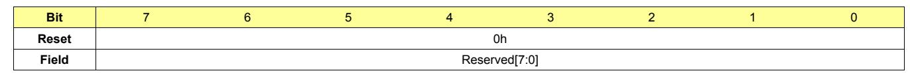

### **Table 17. REG09 Register Field Descriptions**

| Bit | Field    | Type | Reset by REG_RST | Reset by WATCHDOG | Description                  |
|-----|----------|------|---------------------|----------------------|------------------------------|
| 7:0 | RESERVED | R    | No                  | No                   | Reserved bit always reads 0h |

#### **8.5.11 ICO Current Limit in Use Register (Address = 0Ah) [reset = XXh]**

REG0A is shown in [Figure](#page-42-1) 34 and described in [Table](#page-42-2) 18.

Return to [Summary](#page-30-1) Table.

#### **Figure 34. REG0A Register**

| Bit   | 7        | 6        |          | 4             | 3 | 2 | 1 | 0 |  |  |
|-------|----------|----------|----------|---------------|---|---|---|---|--|--|
| Reset | 0        | 0        | 0        | X             | X | X | X | X |  |  |
| Field | RESERVED | RESERVED | RESERVED | ICO_ILIM[4:0] |   |   |   |   |  |  |

### **Table 18. REG0A Register Field Descriptions**

| Bit | Field       | Type | Reset by REG_RST | Reset by WATCHDOG | Description                 |                                                 |  |  |  |
|-----|-------------|------|---------------------|----------------------|-----------------------------|-------------------------------------------------|--|--|--|
| 7   | RESERVED    | R    | No                  | No                   | Reserved bit always reads 0 |                                                 |  |  |  |
| 6   | RESERVED    | R    | No                  | No                   | Reserved bit always reads 0 |                                                 |  |  |  |
| 5   | RESERVED    | R    | No                  | No                   | Reserved bit always reads 0 |                                                 |  |  |  |
| 4   | ICO_ILIM[4] | R    | No                  | No                   | 1600 mA                     | Input Current Limit in use when ICO is enabled: |  |  |  |
| 3   | ICO_ILIM[3] | R    | No                  | No                   | 800 mA                      | Offset: 500 mA Range: 500 mA – 3300 mA       |  |  |  |
| 2   | ICO_ILIM[2] | R    | No                  | No                   | 400 mA                      |                                                 |  |  |  |
| 1   | ICO_ILIM[1] | R    | No                  | No                   | 200 mA                      |                                                 |  |  |  |
| 0   | ICO_ILIM[0] | R    | No                  | No                   | 100 mA                      |                                                 |  |  |  |

#### **8.5.12 Charger Status 1 Register (Address = 0Bh) [reset = XXh]**

REG0B is shown in [Figure](#page-43-1) 35 and described in [Table](#page-43-2) 19.

Return to [Summary](#page-30-1) Table.

#### **Figure 35. REG0B Register**

| Bit   | 7 6   |             | 5           | 4         | 3       | 2              | 1 | 0 |
|-------|----------|-------------|-------------|-----------|---------|----------------|---|---|
| Reset | X        | X           | X           | X         | X       | X              | X | X |
| Field | Reserved | IINDPM_STAT | VINDPM_STAT | TREG_STAT | WD_STAT | CHRG_STAT[2:0] |   |   |

### **Table 19. REG0B Register Field Descriptions**

| Bit | Field        | Type | Reset by REG_RST | Reset by WATCHDOG | Description                                                                                                                                                                                              |  |  |  |
|-----|--------------|------|---------------------|----------------------|----------------------------------------------------------------------------------------------------------------------------------------------------------------------------------------------------------|--|--|--|
| 7   | Reserved     | R    | No                  | No                   | Reserved bit always reads 0                                                                                                                                                                              |  |  |  |
| 6   | IINDPM_STAT  | R    | No                  | No                   | IINDPM Status: 0 – Normal 1 – In IINDPM Regulation (ILIM pin or IINDPM register)                                                                                                                   |  |  |  |
| 5   | VINDPM_STAT  | R    | No                  | No                   | VINDPM Status: 0 – Normal 1 – In VINDPM Regulation                                                                                                                                                 |  |  |  |
| 4   | TREG_STAT    | R    | No                  | No                   | IC Thermal regulation Status: 0 – Normal 1 – In Thermal Regulation                                                                                                                                 |  |  |  |
| 3   | WD_STAT      | R    | No                  | No                   | I2C Watchdog Timer Status bit: 0 – Normal 1 – WD Timer expired                                                                                                                                     |  |  |  |
| 2   | CHRG_STAT[2] | R    | No                  | No                   | Charge Status bits:                                                                                                                                                                                      |  |  |  |
| 1   | CHRG_STAT[1] | R    | No                  | No                   | 000 – Not Charging 001 – Trickle Charge (VBAT < VBAT_SHORT)                                                                                                                                           |  |  |  |
| 0   | CHRG_STAT[0] | R    | No                  | No                   | 010 – Pre-charge (VBAT_UVLO_RISING < VBAT < VBAT_LOWV) 011 – Fast-charge (CC mode) 100 – Taper Charge (CV mode) 101 – Top-off Timer Charging 110 – Charge Termination Done 111 – Reserved |  |  |  |

#### **8.5.13 Charger Status 2 Register (Address = 0Ch) [reset = XXh]**

REG0C is shown in [Figure](#page-44-1) 36 and described in [Table](#page-44-2) 20.

Return to [Summary](#page-30-1) Table.

#### **Figure 36. REG0C Register**

| Bit   | 7       | 6 | 5              | 4 | 3        | 2           | 1           | 0        |
|-------|---------|---|----------------|---|----------|-------------|-------------|----------|
| Reset | X       | X | X              | X | 0        | X           | X           | X        |
| Field | PG_STAT |   | VBUS_STAT[2:0] |   | RESERVED | ICO_STAT[1] | ICO_STAT[0] | Reserved |

### **Table 20. REG0C Register Field Descriptions**

| Bit | Field        | Type | Reset by REG_RST | Reset by WATCHDOG | Description                                                                                                                                                                                  |
|-----|--------------|------|---------------------|----------------------|----------------------------------------------------------------------------------------------------------------------------------------------------------------------------------------------|
| 7   | PG_STAT      | R    | No                  | No                   | Power Good Status: 0 – Not Power Good 1 – Power Good                                                                                                                                   |
| 6   | VBUS_STAT[2] | R    | No                  | No                   | VBUS Detection Status                                                                                                                                                                        |
| 5   | VBUS_STAT[1] | R    | No                  | No                   | 000 – No Input 001 – USB Host SDP> PSEL High                                                                                                                                              |
| 4   | VBUS_STAT[0] | R    | No                  | No                   | 010 - USB CDP (1.5 A) 011 – Adapter (3.0 A)> PSEL low 100 – POORSRC detected 7 consecutive times 101 - Unknown Adapter (500 mA) 110 - Non-standard Adapter (1 A/2 A/2.1 A/2.4 A) |
| 3   | RESERVED     | R    | No                  | No                   | Reserved bit always reads 0h                                                                                                                                                                 |
| 2   | ICO_STAT[1]  | R    | No                  | No                   | Input Current Optimizer (ICO) Status:                                                                                                                                                        |
| 1   | ICO_STAT[0]  | R    | No                  | No                   | 00 – ICO Disabled 01 – ICO Optimization is in progress 10 – Maximum input current detected 11 – Reserved                                                                            |
| 0   | Reserved     | R    | No                  | No                   | Reserved bit always reads 0h                                                                                                                                                                 |

#### **8.5.14 NTC Status Register (Address = 0Dh) [reset = 0Xh]**

REG0D is shown in [Figure](#page-45-1) 37 and described in [Table](#page-45-2) 21.

Return to [Summary](#page-30-1) Table.

#### **Figure 37. REG0D Register**

| Bit   | 7 6 |          | 5        | 4        | 3        | 2            | 1 | 0 |
|-------|--------|----------|----------|----------|----------|--------------|---|---|
| Reset | 0      | 0        | 0        | 0        | 0        | X            | X | X |
| Field |        | RESERVED | RESERVED | RESERVED | RESERVED | TS_STAT[2:0] |   |   |

### **Table 21. REG0D Register Field Descriptions**

| Bit | Field      | Type | Reset by REG_RST | Reset by WATCHDOG | Description                                    |
|-----|------------|------|---------------------|----------------------|------------------------------------------------|
| 7   | RESERVED   | R    | Yes                 | No                   | Reserved bit always reads 0h                   |
| 6   | RESERVED   | R    | Yes                 | No                   | Reserved bit always reads 0h                   |
| 5   | RESERVED   | R    | Yes                 | No                   | Reserved bit always reads 0h                   |
| 4   | RESERVED   | R    | Yes                 | No                   | Reserved bit always reads 0h                   |
| 3   | RESERVED   | R    | Yes                 | No                   | Reserved bit always reads 0h                   |
| 2   | TS_STAT[2] | R    | No                  | No                   | NTC (TS) Status:                               |
| 1   | TS_STAT[1] | R    | No                  | No                   | 000 – Normal 010 – TS Warm                  |
| 0   | TS_STAT[0] | R    | No                  | No                   | 011 – TS Cool 101 – TS Cold 110 – TS Hot |

#### **8.5.15 FAULT Status Register (Address = 0Eh) [reset = XXh]**

REG0E is shown in [Figure](#page-46-1) 38 and described in [Table](#page-46-2) 22.

Return to [Summary](#page-30-1) Table.

#### **Figure 38. REG0E Register**

| Bit   | 7                 | 6          | 5        | 4        | 3        | 2        | 1        | 0        |
|-------|-------------------|------------|----------|----------|----------|----------|----------|----------|
| Reset | X                 | X          | 0        | X        | 0        | 0        | 0        | X        |
| Field | VBUS_OVP_ST AT | TSHUT_STAT | Reserved | TMR_STAT | RESERVED | RESERVED | RESERVED | Reserved |

### **Table 22. REG0E Register Field Descriptions**

| Bit | Field         | Type | Reset by REG_RST | Reset by WATCHDOG | Description                                                                                |
|-----|---------------|------|---------------------|----------------------|--------------------------------------------------------------------------------------------|
| 7   | VBUS_OVP_STAT | R    | No                  | No                   | Input over-voltage Status: 0 – Normal 1 – Device in over-voltage protection          |
| 6   | TSHUT_STAT    | R    | No                  | No                   | IC Temperature shutdown Status: 0 – Normal 1 – Device in thermal shutdown protection |
| 5   | RESERVED      | R    | No                  | No                   | Reserved bit always reads 0h                                                               |
| 4   | TMR_STAT      | R    | No                  | No                   | Charge Safety timer Status: 0 – Normal 1 – Charge Safety timer expired               |
| 3   | RESERVED      | R    | No                  | No                   | Reserved bit always reads 0h                                                               |
| 2   | RESERVED      | R    | No                  | No                   | Reserved bit always reads 0h                                                               |
| 1   | RESERVED      | R    | No                  | No                   | Reserved bit always reads 0h                                                               |
| 0   | RESERVED      | R    | No                  | No                   | Reserved bit always reads 0h                                                               |

#### **8.5.16 Charger Flag 1 Register (Address = 0Fh) [reset = 00h]**

REG0F is shown in [Figure](#page-47-1) 39 and described in [Table](#page-47-2) 23.

Return to [Summary](#page-30-1) Table.

### **Figure 39. REG0F Register**

| Bit   | 7        | 6           | 5           | 4         | 3       | 2        | 1        | 0         |
|-------|----------|-------------|-------------|-----------|---------|----------|----------|-----------|
| Reset | 0        | 0           | 0           | 0         | 0       | 0        | 0        | 0         |
| Field | Reserved | IINDPM_FLAG | VINDPM_FLAG | TREG_FLAG | WD_FLAG | RESERVED | RESERVED | CHRG_FLAG |

### **Table 23. REG0F Register Field Descriptions**

| Bit | Field       | Type | Reset by REG_RST | Reset by WATCHDOG | Description                                                                                        |
|-----|-------------|------|---------------------|----------------------|----------------------------------------------------------------------------------------------------|
| 7   | Reserved    | R    | Yes                 | No                   | Reserved bit always reads 0                                                                        |
| 6   | IINDPM_FLAG | R    | Yes                 | No                   | IINDPM Regulation INT Flag: 0 – Normal 1 – IINDPM signal rising edge detected                |
| 5   | VINDPM_FLAG | R    | Yes                 | No                   | VINDPM regulation INT Flag: 0 – Normal 1 – VINDPM signal rising edge detected                |
| 4   | TREG_FLAG   | R    | Yes                 | No                   | IC Temperature Regulation INT Flag: 0 – Normal 1 – TREG signal rising edge detected          |
| 3   | WD_FLAG     | R    | Yes                 | No                   | I2C Watchdog INT Flag: 0 – Normal 1 – WD_STAT signal rising edge detected                    |
| 2   | RESERVED    | R    | Yes                 | No                   | Reserved bit always reads 0h                                                                       |
| 1   | RESERVED    | R    | Yes                 | No                   | Reserved bit always reads 0h                                                                       |
| 0   | CHRG_FLAG   | R    | Yes                 | No                   | Charge Status INT Flag: 0 – Normal 1 – CHRG_STAT[2:0] bits changed (transition to any state) |

#### **8.5.17 Charger Flag 2 Register (Address = 10h) [reset = 00h]**

REG10 is shown in [Figure](#page-48-1) 40 and described in [Table](#page-48-2) 24.

Return to [Summary](#page-30-1) Table.

### **Figure 40. REG10 Register**

| Bit   | 7       | 6        | 5        | 4         | 3        | 2       | 1        | 0        |
|-------|---------|----------|----------|-----------|----------|---------|----------|----------|
| Reset | 0       | 0        | 0        | 0         | 0        | 0       | 0        | 0        |
| Field | PG_FLAG | RESERVED | RESERVED | VBUS_FLAG | RESERVED | TS_FLAG | ICO_FLAG | Reserved |

### **Table 24. REG10 Register Field Descriptions**

| Bit | Field     | Type | Reset by REG_RST | Reset by WATCHDOG | Description                                                                                                  |
|-----|-----------|------|---------------------|----------------------|--------------------------------------------------------------------------------------------------------------|
| 7   | PG_FLAG   | R    | Yes                 | No                   | Power Good INT Flag: 0 – Normal 1 – PG signal toggle detected                                          |
| 6   | RESERVED  | R    | Yes                 | No                   | Reserved bit always reads 0h                                                                                 |
| 5   | RESERVED  | R    | Yes                 | No                   | Reserved bit always reads 0h                                                                                 |
| 4   | VBUS_FLAG | R    | Yes                 | No                   | VBUS Status INT Flag: 0 – Normal 1 – VBUS_STAT[2:0] bits changed (transition to any state)             |
| 3   | RESERVED  | R    | Yes                 | No                   | Reserved bit always reads 0h                                                                                 |
| 2   | TS_FLAG   | R    | Yes                 | No                   | TS Status INT Flag: 0 – Normal 1 – TS_STAT[2:0] bits changed (transition to any state)                 |
| 1   | ICO_FLAG  | R    | Yes                 | No                   | Input Current Optimizer (ICO) INT Flag: 0 – Normal 1 – ICO_STAT[1:0] changed (transition to any state) |
| 0   | RESERVED  | R    | Yes                 | No                   | Reserved bit always reads 0h                                                                                 |

#### **8.5.18 FAULT Flag Register (Address = 11h) [reset = 00h]**

REG11 is shown in [Figure](#page-49-1) 41 and described in [Table](#page-49-2) 25.

Return to [Summary](#page-30-1) Table.

#### **Figure 41. REG11 Register**

| Bit   | 7                 | 6          | 5        | 4        | 3        | 2        | 1        | 0        |
|-------|-------------------|------------|----------|----------|----------|----------|----------|----------|
| Reset | 0                 | 0          | 0        | 0        | 0        | 0        | 0        | 0        |
| Field | VBUS_OVP_FL AG | TSHUT_FLAG | Reserved | TMR_FLAG | RESERVED | RESERVED | RESERVED | Reserved |

### **Table 25. REG11 Register Field Descriptions**

| Bit | Field         | Type | Reset by REG_RST | Reset by WATCHDOG | Description                                                                                               |  |  |  |
|-----|---------------|------|---------------------|----------------------|-----------------------------------------------------------------------------------------------------------|--|--|--|
| 7   | VBUS_OVP_FLAG | R    | Yes                 | No                   | Input over-voltage INT Flag: 0 – Normal 1 – Entered VBUS_OVP Fault                                  |  |  |  |
| 6   | TSHUT_FLAG    | R    | Yes                 | No                   | IC Temperature shutdown INT Flag: 0 – Normal 1 – Entered TSHUT Fault                                |  |  |  |
| 5   | RESERVED      | R    | Yes                 | No                   | Reserved bit always reads 0h                                                                              |  |  |  |
| 4   | TMR_FLAG      | R    | Yes                 | No                   | Charge Safety timer Fault INT Flag: 0 – Normal 1 – Charge Safety timer expired rising edge detected |  |  |  |
| 3   | RESERVED      | R    | Yes                 | No                   | Reserved bit always reads 0                                                                               |  |  |  |
| 2   | RESERVED      | R    | Yes                 | No                   | Reserved bit always reads 0h                                                                              |  |  |  |
| 1   | RESERVED      | R    | Yes                 | No                   | Reserved bit always reads 0h                                                                              |  |  |  |
| 0   | RESERVED      | R    | Yes                 | No                   | Reserved bit always reads 0h                                                                              |  |  |  |

#### **8.5.19 Charger Mask 1 Register (Address = 12h) [reset = 00h]**

REG12 is shown in [Figure](#page-50-1) 42 and described in [Table](#page-50-2) 26.

Return to [Summary](#page-30-1) Table.

#### **Figure 42. REG12 Register**

| Bit   | 7                 | 6           | 5           | 4         | 3       | 2        | 1        | 0         |
|-------|-------------------|-------------|-------------|-----------|---------|----------|----------|-----------|
| Reset | 0                 | 1           | 1           | 1         | 0       | 0        | 0        | 0         |
| Field | ADC_DONE_M ASK | IINDPM_MASK | VINDPM_MASK | TREG_MASK | WD_MASK | RESERVED | RESERVED | CHRG_MASK |

### **Table 26. REG12 Register Field Descriptions**

| Bit | Field         | Type | Reset by REG_RST | Reset by WATCHDOG | Description                                                                                                                                                    |  |  |  |
|-----|---------------|------|---------------------|----------------------|----------------------------------------------------------------------------------------------------------------------------------------------------------------|--|--|--|
| 7   | ADC_DONE_MASK | R/W  | Yes                 | No                   | ADC Conversion INT Mask Flag (only one-shot mode) 0 – ADC_DONE does produce INT pulse 1 – ADC_DONE does produce not INT pulseReserved bit always reads 0 |  |  |  |
| 6   | IINDPM_MASK   | R/W  | Yes                 | No                   | IINDPM Regulation INT Mask 0 – IINDPM entry produces INT pulse 1 – IINDPM entry does not produce INT pulse                                               |  |  |  |
| 5   | VINDPM_MASK   | R/W  | Yes                 | No                   | VINDPM Regulation INT Mask 0 – VINDPM entry produces INT pulse 1 – VINDPM entry not produce INT pulse                                                    |  |  |  |
| 4   | TREG_MASK     | R/W  | Yes                 | No                   | IC Temperature Regulation INT Mask 0 – TREG entry produces INT pulse 1 – TREG entry produce INT pulse                                                    |  |  |  |
| 3   | WD_MASK       | R/W  | Yes                 | No                   | I2C Watchdog Timer INT Mask 0 – WD_STAT rising edge produces INT pulse 1 – WD_STAT rising edge does not produce INT                                      |  |  |  |
| 2   | RESERVED      | R    | Yes                 | No                   | Reserved bit always reads 0h                                                                                                                                   |  |  |  |
| 1   | RESERVED      | R    | Yes                 | No                   | Reserved bit always reads 0h                                                                                                                                   |  |  |  |
| 0   | CHRG_MASK     | R/W  | Yes                 | No                   | Charge Status INT Mask 0 – CHRG_STAT[2:0] bit change produces INT 1 – CHRG_STAT[2:0] bit change does not produce INT pulse                               |  |  |  |

#### **8.5.20 Charger Mask 2 Register (Address = 13h) [reset = 00h]**

REG13 is shown in [Figure](#page-51-1) 43 and described in [Table](#page-51-2) 27.

Return to [Summary](#page-30-1) Table.

### **Figure 43. REG13 Register**

| Bit   | 7       | 6        |          | 4         | 3        | 2       | 1        | 0        |
|-------|---------|----------|----------|-----------|----------|---------|----------|----------|
| Reset | 0       | 0        | 0        | 0         | 0        | 0       | 0        | 0        |
| Field | PG_MASK | RESERVED | RESERVED | VBUS_MASK | RESERVED | TS_MASK | ICO_MASK | Reserved |

### **Table 27. REG13 Register Field Descriptions**

| Bit | Field     | Type | Reset by REG_RST | Reset by WATCHDOG | Description                                                                                                                       |
|-----|-----------|------|---------------------|----------------------|-----------------------------------------------------------------------------------------------------------------------------------|
| 7   | PG_MASK   | R/W  | Yes                 | No                   | Power Good INT Mask: 0 – PG toggle produces INT pulse 1 – PG toggle does not produce INT pulse                              |
| 6   | RESERVED  | R    | Yes                 | No                   | Reserved bit always reads 0h                                                                                                      |
| 5   | RESERVED  | R    | Yes                 | No                   | Reserved bit always reads 0h                                                                                                      |
| 4   | VBUS_MASK | R/W  | Yes                 | No                   | VBUS Status INT Mask: 0 – VBUS_STAT[2:0] bit change produces INT 1 – VBUS_STAT[2:0] bit change does not produces INT        |
| 3   | RESERVED  | R    | Yes                 | No                   | Reserved bit always reads 0h                                                                                                      |
| 2   | TS_MASK   | R/W  | Yes                 | No                   | TS Status INT Mask: 0 – TS_STAT[2:0] bit change produces INT 1 – TS_STAT[2:0] bit change does not produces INT pulse        |
| 1   | ICO_MASK  | R/W  | Yes                 | No                   | Input Current Optimizer (ICO) INT Mask: 0 – ICO_STAT rising edge produces INT 1 – ICO_STAT rising edge does not produce INT |
| 0   | RESERVED  | R    | Yes                 | No                   | Reserved bit always reads 0h                                                                                                      |

#### **8.5.21 FAULT Mask Register (Address = 14h) [reset = 00h]**

REG14 is shown in [Figure](#page-52-1) 44 and described in [Table](#page-52-2) 28.

Return to [Summary](#page-30-1) Table.

#### **Figure 44. REG14 Register**

| Bit   | 7                 | 6          | 5        | 4        | 3                  | 2        | 1        | 0        |
|-------|-------------------|------------|----------|----------|--------------------|----------|----------|----------|
| Reset | 0                 | 0          | 0        | 0        | 0                  | 0        | 0        | 0        |
| Field | VBUS_OVP_M ASK | TSHUT_MASK | Reserved | TMR_MASK | SNS_SHORT_ MASK | RESERVED | RESERVED | Reserved |

### **Table 28. REG14 Register Field Descriptions**

| Bit | Field          | Type | Reset by REG_RST | Reset by WATCHDOG | Description                                                                                                                                         |
|-----|----------------|------|---------------------|----------------------|-----------------------------------------------------------------------------------------------------------------------------------------------------|
| 7   | VBUS_OVP_MASK  | R/W  | Yes                 | No                   | Input over-voltage INT Mask: 0 – VBUS_OVP rising edge produces INT pulse 1 – VBUS_OVP rising edge does not produce INT pulse                  |
| 6   | TSHUT_MASK     | R/W  | Yes                 | No                   | Thermal Shutdown INT Mask: 0 – TSHUT rising edge produces INT pulse 1 – TSHUT rising edge does not produce INT pulse                          |
| 5   | RESERVED       | R    | Yes                 | No                   | Reserved bit always reads 0h                                                                                                                        |
| 4   | TMR_MASK       | R/W  | Yes                 | No                   | Charge Safety Timer Fault INT Mask: 0 – Timer expired rising edge produces INT pulse 1 – Timer expired rising edge does not produce INT pulse |
| 3   | SNS_SHORT_MASK | R/W  | Yes                 | No                   | SNS Short Fault INT Mask: 0 – SNS short rising edge produces INT pulse 1 – SNS short rising edge does not produce INT pulse                   |
| 2   | RESERVED       | R    | Yes                 | No                   | Reserved bit always reads 0h                                                                                                                        |
| 1   | RESERVED       | R    | Yes                 | No                   | Reserved bit always reads 0h                                                                                                                        |
| 0   | RESERVED       | R    | Yes                 | No                   | Reserved bit always reads 0h                                                                                                                        |

### **8.5.22 ADC Control Register (Address = 15h) [reset = 30h]**

REG15 is shown in [Figure](#page-53-1) 45 and described in [Table](#page-53-2) 29.

Return to [Summary](#page-30-1) Table.

#### **Figure 45. REG15 Register**

| Bit   | 7      | 6        | 5               | 4 | 3        | 2        | 1        | 0        |
|-------|--------|----------|-----------------|---|----------|----------|----------|----------|
| Reset | 0      | 0        | 1               | 1 | 0        | 0        | 0        | 0        |
| Field | ADC_EN | ADC_RATE | ADC_SAMPLE[1:0] |   | RESERVED | RESERVED | RESERVED | RESERVED |

### **Table 29. REG15 Register Field Descriptions**

| Bit | Field         | Type | Reset by REG_RST | Reset by WATCHDOG | Description                                                                                                                                  |
|-----|---------------|------|---------------------|----------------------|----------------------------------------------------------------------------------------------------------------------------------------------|
| 7   | ADC_EN        | R/W  | Yes                 | Yes                  | ADC Control: 0 – Disable ADC 1 – Enable ADC                                                                                            |
| 6   | ADC_RATE      | R/W  | Yes                 | No                   | 0 – Continuous conversion 1 – One-shot conversion                                                                                         |
| 5   | ADC_SAMPLE[1] | R/W  | Yes                 | No                   | Sample Speed of ADC:                                                                                                                         |
| 4   | ADC_SAMPLE[0] | R/W  | Yes                 | No                   | 00 – 15 bit effective resolution 01 – 14 bit effective resolution 10 – 13 bit effective resolution 11 – 12 bit effective resolution |
| 3   | RESERVED      | R    | Yes                 | No                   | Reserved bit always reads 0h                                                                                                                 |
| 2   | RESERVED      | R    | Yes                 | No                   | Reserved bit always reads 0h                                                                                                                 |
| 1   | RESERVED      | R    | Yes                 | No                   | Reserved bit always reads 0h                                                                                                                 |
| 0   | RESERVED      | R    | Yes                 | No                   | Reserved bit always reads 0h                                                                                                                 |

#### **8.5.23 ADC Function Disable Register (Address = 16h) [reset = 00h]**

REG16 is shown in [Figure](#page-54-1) 46 and described in [Table](#page-54-2) 30.

Return to [Summary](#page-30-1) Table.

#### **Figure 46. REG16 Register**

| Bit   | 7            | 6                | 5                | 4                | 3        | 2          | 1                 | 0            |
|-------|--------------|------------------|------------------|------------------|----------|------------|-------------------|--------------|
| Reset | 0            | 0                | 0                | 0                | 0        | 0          | 0                 | 0            |
| Field | IBUS_ADC_DIS | ICHG_ADC_DI S | VBUS_ADC_DI S | VBAT_ADC_DI S | Reserved | TS_ADC_DIS | VCELL_ADC_D IS | TDIE_ADC_DIS |

### **Table 30. REG16 Register Field Descriptions**

| Bit | Field         | Type | Reset by REG_RST | Reset by WATCHDOG | Description                                     |
|-----|---------------|------|---------------------|----------------------|-------------------------------------------------|
| 7   | IBUS_ADC_DIS  | R/W  | Yes                 | No                   | 0 – Enable conversion 1 – Disable conversion |
| 6   | ICHG_ADC_DIS  | R/W  | Yes                 | No                   | 0 – Enable conversion 1 – Disable conversion |
| 5   | VBUS_ADC_DIS  | R/W  | Yes                 | No                   | 0 – Enable conversion 1 – Disable conversion |
| 4   | VBAT_ADC_DIS  | R    | Yes                 | No                   | 0 – Enable conversion 1 – Disable conversion |
| 3   | RESERVED      | R    | Yes                 | No                   | Reserved bit always reads 0h                    |
| 2   | TS_ADC_DIS    | R/W  | Yes                 | No                   | 0 – Enable conversion 1 – Disable conversion |
| 1   | VCELL_ADC_DIS | R/W  | Yes                 | No                   | 0 – Enable conversion 1 – Disable conversion |
| 0   | TDIE_ADC_DIS  | R/W  | Yes                 | No                   | 0 – Enable conversion 1 – Disable conversion |

### **8.5.24 IBUS ADC 1 Register (Address = 17h) [reset = 00h]**

REG17 is shown in [Figure](#page-55-2) 47 and described in [Table](#page-55-3) 31.

Return to [Summary](#page-30-1) Table.

#### **Figure 47. REG17 Register**

| Bit   | 7              | 6 | 5 | 4 | 3 | 2 | 1 | 0 |  |  |
|-------|----------------|---|---|---|---|---|---|---|--|--|
| Reset | 0              | 0 | 0 | 0 | 0 | 0 | 0 | 0 |  |  |
| Field | IBUS_ADC[15:8] |   |   |   |   |   |   |   |  |  |

### **Table 31. REG17 Register Field Descriptions**

| Bit | Field        | Type | Reset by REG_RST | Reset by WATCHDOG | Description                                             |                                                              |  |  |  |
|-----|--------------|------|---------------------|----------------------|---------------------------------------------------------|--------------------------------------------------------------|--|--|--|
| 7   | IBUS_ADC[15] | R    | Yes                 | No                   | Sign bit: overall results reported in two's complement. |                                                              |  |  |  |
| 6   | IBUS_ADC[14] | R    | Yes                 | No                   | 16384 mA                                                |                                                              |  |  |  |
| 5   | IBUS_ADC[13] | R    | Yes                 | No                   | 8192 mA                                                 |                                                              |  |  |  |
| 4   | IBUS_ADC[12] | R    | Yes                 | No                   | 4096 mA                                                 |                                                              |  |  |  |
| 3   | IBUS_ADC[11] | R    | Yes                 | No                   | 2048 mA                                                 | VBUS Current Reading (positive current flows into VBUS pin,  |  |  |  |
| 2   | IBUS_ADC[10] | R    | Yes                 | No                   | 1024 mA                                                 | negative current flows out ot VBUS pin): Range: 0 A – 4 A |  |  |  |
| 1   | IBUS_ADC[9]  | R    | Yes                 | No                   | 512 mA                                                  |                                                              |  |  |  |
| 0   | IBUS_ADC[8]  | R    | Yes                 | No                   | 256 mA                                                  |                                                              |  |  |  |

#### **8.5.25 IBUS ADC 0 Register (Address = 18h) [reset = 00h]**

REG18 is shown in [Figure](#page-55-4) 48 and described in [Table](#page-55-5) 32.

Return to [Summary](#page-30-1) Table.

#### **Figure 48. REG18 Register**

| Bit   | 7             | 6 | 5 | 4 | 3 | 2 | 1 | 0 |  |  |
|-------|---------------|---|---|---|---|---|---|---|--|--|
| Reset | 0             | 0 | 0 | 0 | 0 | 0 | 0 | 0 |  |  |
| Field | IBUS_ADC[7:0] |   |   |   |   |   |   |   |  |  |

#### **Table 32. REG18 Register Field Descriptions**

| Bit | Field       | Type | Reset by REG_RST | Reset by WATCHDOG | Description |                                                              |
|-----|-------------|------|---------------------|----------------------|-------------|--------------------------------------------------------------|
| 7   | IBUS_ADC[7] | R    | Yes                 | No                   | 128 mA      | VBUS Current Reading (positive current flows into VBUS pin,  |
| 6   | IBUS_ADC[6] | R    | Yes                 | No                   | 64 mA       | negative current flows out ot VBUS pin): Range: 0 A – 4 A |
| 5   | IBUS_ADC[5] | R    | Yes                 | No                   | 32 mA       |                                                              |
| 4   | IBUS_ADC[4] | R    | Yes                 | No                   | 16 mA       |                                                              |
| 3   | IBUS_ADC[3] | R    | Yes                 | No                   | 8 mA        |                                                              |
| 2   | IBUS_ADC[2] | R    | Yes                 | No                   | 4 mA        |                                                              |
| 1   | IBUS_ADC[1] | R    | Yes                 | No                   | 2 mA        |                                                              |
| 0   | IBUS_ADC[0] | R    | Yes                 | No                   | 1 mA        |                                                              |

56

#### **8.5.26 ICHG ADC 1 Register (Address = 19h) [reset = 00h]**

REG19 is shown in [Figure](#page-56-2) 49 and described in [Table](#page-56-3) 33.

Return to [Summary](#page-30-1) Table.

#### **Figure 49. REG19 Register**

| Bit   | 7        | 6              | 5 | 4 | 3 | 2 | 1 | 0 |  |  |
|-------|----------|----------------|---|---|---|---|---|---|--|--|
| Reset | 0        | 0              | 0 | 0 | 0 | 0 | 0 | 0 |  |  |
| Field | RESERVED | ICHG_ADC[14:8] |   |   |   |   |   |   |  |  |

### **Table 33. REG19 Register Field Descriptions**

| Bit | Field        | Type | Reset by REG_RST | Reset by WATCHDOG | Description |                                    |  |  |  |
|-----|--------------|------|---------------------|----------------------|-------------|------------------------------------|--|--|--|
| 7   | Reserved     | R    | Yes                 | No                   |             | Reserved register always reads 0h. |  |  |  |
| 6   | ICHG_ADC[14] | R    | Yes                 | No                   | 16384 mA    |                                    |  |  |  |
| 5   | ICHG_ADC[13] | R    | Yes                 | No                   | 8192 mA     |                                    |  |  |  |
| 4   | ICHG_ADC[12] | R    | Yes                 | No                   | 4096 mA     |                                    |  |  |  |
| 3   | ICHG_ADC[11] | R    | Yes                 | No                   | 2048 mA     | Charge Current Reading:            |  |  |  |
| 2   | ICHG_ADC[10] | R    | Yes                 | No                   | 1024 mA     | Range: 0 A – 4 A                   |  |  |  |
| 1   | ICHG_ADC[9]  | R    | Yes                 | No                   | 512 mA      |                                    |  |  |  |
| 0   | ICHG_ADC[8]  | R    | Yes                 | No                   | 256 mA      |                                    |  |  |  |

#### **8.5.27 ICHG ADC 0 Register (Address = 1Ah) [reset = 00h]**

REG1A is shown in [Figure](#page-56-4) 50 and described in [Table](#page-56-5) 34.

Return to [Summary](#page-30-1) Table.

#### **Figure 50. REG1A Register**

| Bit   | 7             | 6 | 5 | 4 | 3 | 2 | 1 | 0 |  |  |
|-------|---------------|---|---|---|---|---|---|---|--|--|
| Reset | 0             | 0 | 0 | 0 | 0 | 0 | 0 | 0 |  |  |
| Field | ICHG_ADC[7:0] |   |   |   |   |   |   |   |  |  |

#### **Table 34. REG1A Register Field Descriptions**

| Bit | Field       | Type | Reset by REG_RST | Reset by WATCHDOG | Description |                         |
|-----|-------------|------|---------------------|----------------------|-------------|-------------------------|
| 7   | ICHG_ADC[7] | R    | Yes                 | No                   | 128 mA      | Charge Current Reading: |
| 6   | ICHG_ADC[6] | R    | Yes                 | No                   | 64 mA       | Range: 0 A – 4 A        |
| 5   | ICHG_ADC[5] | R    | Yes                 | No                   | 32 mA       |                         |
| 4   | ICHG_ADC[4] | R    | Yes                 | No                   | 16 mA       |                         |
| 3   | ICHG_ADC[3] | R    | Yes                 | No                   | 8 mA        |                         |
| 2   | ICHG_ADC[2] | R    | Yes                 | No                   | 4 mA        |                         |
| 1   | ICHG_ADC[1] | R    | Yes                 | No                   | 2 mA        |                         |
| 0   | ICHG_ADC[0] | R    | Yes                 | No                   | 1 mA        |                         |

#### **8.5.28 VBUS ADC 1 Register (Address = 1Bh) [reset = 00h]**

REG1B is shown in [Figure](#page-57-2) 51 and described in [Table](#page-57-3) 35.

Return to [Summary](#page-30-1) Table.

#### **Figure 51. REG1B Register**

| Bit   | 7              | 6 | 5 | 4 | 3 | 2 | 1 | 0 |  |  |
|-------|----------------|---|---|---|---|---|---|---|--|--|
| Reset | 0              | 0 | 0 | 0 | 0 | 0 | 0 | 0 |  |  |
| Field | VBUS_ADC[15:8] |   |   |   |   |   |   |   |  |  |

### **Table 35. REG1B Register Field Descriptions**

| Bit | Field        | Type | Reset by REG_RST | Reset by WATCHDOG | Description                                             |                      |  |  |  |
|-----|--------------|------|---------------------|----------------------|---------------------------------------------------------|----------------------|--|--|--|
| 7   | VBUS_ADC[15] | R    | Yes                 | No                   | Sign bit: overall results reported in two's complement. |                      |  |  |  |
| 6   | VBUS_ADC[14] | R    | Yes                 | No                   | 16384 mV                                                |                      |  |  |  |
| 5   | VBUS_ADC[13] | R    | Yes                 | No                   | 8192 mV                                                 | VBUS Voltage reading |  |  |  |
| 4   | VBUS_ADC[12] | R    | Yes                 | No                   | 4096 mV                                                 | Range: 0 V – 10 V    |  |  |  |
| 3   | VBUS_ADC[11] | R    | Yes                 | No                   | 2048 mV                                                 |                      |  |  |  |
| 2   | VBUS_ADC[10] | R    | Yes                 | No                   | 1024 mV                                                 |                      |  |  |  |
| 1   | VBUS_ADC[9]  | R    | Yes                 | No                   | 512 mV                                                  |                      |  |  |  |
| 0   | VBUS_ADC[8]  | R    | Yes                 | No                   | 256 mV                                                  |                      |  |  |  |

#### **8.5.29 VBUS ADC 0 Register (Address = 1Ch) [reset = 00h]**

REG1C is shown in [Figure](#page-57-4) 52 and described in [Table](#page-57-5) 36.

Return to [Summary](#page-30-1) Table.

#### **Figure 52. REG1C Register**

| Bit   | 7             | 6 | 5 | 4 | 3 | 2 | 1 | 0 |  |  |
|-------|---------------|---|---|---|---|---|---|---|--|--|
| Reset | 0             | 0 | 0 | 0 | 0 | 0 | 0 | 0 |  |  |
| Field | VBUS_ADC[7:0] |   |   |   |   |   |   |   |  |  |

#### **Table 36. REG1C Register Field Descriptions**

| Bit | Field       | Type | Reset by REG_RST | Reset by WATCHDOG | Description |                       |
|-----|-------------|------|---------------------|----------------------|-------------|-----------------------|
| 7   | VBUS_ADC[7] | R    | Yes                 | No                   | 128 mV      | VBUS Voltage Reading: |
| 6   | VBUS_ADC[6] | R    | Yes                 | No                   | 64 mV       | Range: 0 V – 10 V     |
| 5   | VBUS_ADC[5] | R    | Yes                 | No                   | 32 mV       |                       |
| 4   | VBUS_ADC[4] | R    | Yes                 | No                   | 16 mV       |                       |
| 3   | VBUS_ADC[3] | R    | Yes                 | No                   | 8 mV        |                       |
| 2   | VBUS_ADC[2] | R    | Yes                 | No                   | 4 mV        |                       |
| 1   | VBUS_ADC[1] | R    | Yes                 | No                   | 2 mV        |                       |
| 0   | VBUS_ADC[0] | R    | Yes                 | No                   | 1 mV        |                       |

#### **8.5.30 VBAT ADC 1 Register (Address = 1Dh) [reset = 00h]**

REG1D is shown in [Figure](#page-58-2) 53 and described in [Table](#page-58-3) 37.

Return to [Summary](#page-30-1) Table.

#### **Figure 53. REG1D Register**

| Bit   | 7              | 6 | 5 | 4 | 3 | 2 | 1 | 0 |  |  |
|-------|----------------|---|---|---|---|---|---|---|--|--|
| Reset | 0              | 0 | 0 | 0 | 0 | 0 | 0 | 0 |  |  |
| Field | VBAT_ADC[15:8] |   |   |   |   |   |   |   |  |  |

### **Table 37. REG1D Register Field Descriptions**

| Bit | Field        | Type | Reset by REG_RST | Reset by WATCHDOG | Description                                             |                       |  |  |  |
|-----|--------------|------|---------------------|----------------------|---------------------------------------------------------|-----------------------|--|--|--|
| 7   | VBAT_ADC[15] | R    | Yes                 | No                   | Sign bit: overall results reported in two's complement. |                       |  |  |  |
| 6   | VBAT_ADC[14] | R    | Yes                 | No                   | 16384 mV                                                |                       |  |  |  |
| 5   | VBAT_ADC[13] | R    | Yes                 | No                   | 8192 mV                                                 | VBAT Voltage reading: |  |  |  |
| 4   | VBAT_ADC[12] | R    | Yes                 | No                   | 4096 mV                                                 | Range: 0 V – 10 V     |  |  |  |
| 3   | VBAT_ADC[11] | R    | Yes                 | No                   | 2048 mV                                                 |                       |  |  |  |
| 2   | VBAT_ADC[10] | R    | Yes                 | No                   | 1024 mV                                                 |                       |  |  |  |
| 1   | VBAT_ADC[9]  | R    | Yes                 | No                   | 512 mV                                                  |                       |  |  |  |
| 0   | VBAT_ADC[8]  | R    | Yes                 | No                   | 256 mV                                                  |                       |  |  |  |

#### **8.5.31 VBAT ADC 0 Register (Address = 1Eh) [reset = 00h]**

REG1E is shown in [Figure](#page-58-4) 54 and described in [Table](#page-58-5) 38.

Return to [Summary](#page-30-1) Table.

#### **Figure 54. REG1E Register**

| Bit   | 7             | 6 | 5 | 4 | 3 | 2 | 1 | 0 |  |  |
|-------|---------------|---|---|---|---|---|---|---|--|--|
| Reset | 0             | 0 | 0 | 0 | 0 | 0 | 0 | 0 |  |  |
| Field | VBAT_ADC[7:0] |   |   |   |   |   |   |   |  |  |

#### **Table 38. REG1E Register Field Descriptions**

| Bit | Field       | Type | Reset by REG_RST | Reset by WATCHDOG | Description |                       |
|-----|-------------|------|---------------------|----------------------|-------------|-----------------------|
| 7   | VBAT_ADC[7] | R    | Yes                 | No                   | 128 mV      | VBAT Voltage reading: |
| 6   | VBAT_ADC[6] | R    | Yes                 | No                   | 64 mV       | Range: 0 V – 10 V     |
| 5   | VBAT_ADC[5] | R    | Yes                 | No                   | 32 mV       |                       |
| 4   | VBAT_ADC[4] | R    | Yes                 | No                   | 16 mV       |                       |
| 3   | VBAT_ADC[3] | R    | Yes                 | No                   | 8 mV        |                       |
| 2   | VBAT_ADC[2] | R    | Yes                 | No                   | 4 mV        |                       |
| 1   | VBAT_ADC[1] | R    | Yes                 | No                   | 2 mV        |                       |
| 0   | VBAT_ADC[0] | R    | Yes                 | No                   | 1 mV        |                       |

#### **8.5.32 VCELLTOP ADC 1 Register (Address = 1Fh) [reset = 00h]**

REG1F is shown in [Figure](#page-59-2) 55 and described in [Table](#page-59-3) 39.

Return to [Summary](#page-30-1) Table.

#### **Figure 55. REG1F Register**

| Bit   | 7                  | 6 | 5 | 4 | 3 | 2 | 1 | 0 |  |  |
|-------|--------------------|---|---|---|---|---|---|---|--|--|
| Reset | 0                  | 0 | 0 | 0 | 0 | 0 | 0 | 0 |  |  |
| Field | VCELLTOP_ADC[15:8] |   |   |   |   |   |   |   |  |  |

### **Table 39. REG1F Register Field Descriptions**

| Bit | Field            | Type | Reset by REG_RST | Reset by WATCHDOG | Description                                             |                                                                                  |  |  |  |
|-----|------------------|------|---------------------|----------------------|---------------------------------------------------------|----------------------------------------------------------------------------------|--|--|--|
| 7   | VCELLTOP_ADC[15] | R    | Yes                 | No                   | Sign bit: overall results reported in two's complement. |                                                                                  |  |  |  |
| 6   | VCELLTOP_ADC[14] | R    | Yes                 | No                   | 16384 mV                                                | VCELLTOP Voltage reading:                                                        |  |  |  |
| 5   | VCELLTOP_ADC[13] | R    | Yes                 | No                   | 8192 mV                                                 | Range: 0 V – 5 V Note: cell balancing voltage measurement is measured through |  |  |  |
| 4   | VCELLTOP_ADC[12] | R    | Yes                 | No                   | 4096 mV                                                 | internal comparator. ADC reading may not reflect the actual cell                 |  |  |  |
| 3   | VCELLTOP_ADC[11] | R    | Yes                 | No                   | 2048 mV                                                 | balancing voltage measurement.                                                   |  |  |  |
| 2   | VCELLTOP_ADC[10] | R    | Yes                 | No                   | 1024 mV                                                 |                                                                                  |  |  |  |
| 1   | VCELLTOP_ADC[9]  | R    | Yes                 | No                   | 512 mV                                                  |                                                                                  |  |  |  |
| 0   | VCELLTOP_ADC[8]  | R    | Yes                 | No                   | 256 mV                                                  |                                                                                  |  |  |  |

#### **8.5.33 VCELLTOP ADC 0 Register (Address = 20h) [reset = 00h]**

REG20 is shown in [Figure](#page-59-4) 56 and described in [Table](#page-59-5) 40.

Return to [Summary](#page-30-1) Table.

#### **Figure 56. REG20 Register**

| Bit   | 7                 | 6 | 5 | 4 | 3 | 2 | 1 | 0 |  |  |
|-------|-------------------|---|---|---|---|---|---|---|--|--|
| Reset | 0                 | 0 | 0 | 0 | 0 | 0 | 0 | 0 |  |  |
| Field | VCELLTOP_ADC[7:0] |   |   |   |   |   |   |   |  |  |

#### **Table 40. REG20 Register Field Descriptions**

| Bit | Field           | Type | Reset by REG_RST | Reset by WATCHDOG | Description |                                                                                  |
|-----|-----------------|------|---------------------|----------------------|-------------|----------------------------------------------------------------------------------|
| 7   | VCELLTOP_ADC[7] | R    | Yes                 | No                   | 128 mV      | VCELLTOP Voltage reading:                                                        |
| 6   | VCELLTOP_ADC[6] | R    | Yes                 | No                   | 64 mV       | Range: 0 V – 5 V Note: cell balancing voltage measurement is measured through |
| 5   | VCELLTOP_ADC[5] | R    | Yes                 | No                   | 32 mV       | internal comparator. ADC reading may not reflect the actual cell                 |
| 4   | VCELLTOP_ADC[4] | R    | Yes                 | No                   | 16 mV       | balancing voltage measurement.                                                   |
| 3   | VCELLTOP_ADC[3] | R    | Yes                 | No                   | 8 mV        |                                                                                  |
| 2   | VCELLTOP_ADC[2] | R    | Yes                 | No                   | 4 mV        |                                                                                  |
| 1   | VCELLTOP_ADC[1] | R    | Yes                 | No                   | 2 mV        |                                                                                  |
| 0   | VCELLTOP_ADC[0] | R    | Yes                 | No                   | 1 mV        |                                                                                  |

#### **8.5.34 TS ADC 1 Register (Address = 21h) [reset = 00h]**

REG21 is shown in [Figure](#page-60-2) 57 and described in [Table](#page-60-3) 41.

Return to [Summary](#page-30-1) Table.

#### **Figure 57. REG21 Register**

| Bit   | 7            | 6 | 5 | 4 | 3 | 2 | 1 | 0 |  |  |
|-------|--------------|---|---|---|---|---|---|---|--|--|
| Reset | 0            | 0 | 0 | 0 | 0 | 0 | 0 | 0 |  |  |
| Field | TS_ADC[15:8] |   |   |   |   |   |   |   |  |  |

### **Table 41. REG21 Register Field Descriptions**

| Bit | Field      | Type | Reset by REG_RST | Reset by WATCHDOG | Description |                                                         |  |
|-----|------------|------|---------------------|----------------------|-------------|---------------------------------------------------------|--|
| 7   | TS_ADC[15] | R    | Yes                 | No                   |             | Sign bit: overall results reported in two's complement. |  |
| 6   | TS_ADC[14] | R    | Yes                 | No                   |             |                                                         |  |
| 5   | TS_ADC[13] | R    | Yes                 | No                   |             |                                                         |  |
| 4   | TS_ADC[12] | R    | Yes                 | No                   |             |                                                         |  |
| 3   | TS_ADC[11] | R    | Yes                 | No                   |             |                                                         |  |
| 2   | TS_ADC[10] | R    | Yes                 | No                   |             |                                                         |  |
| 1   | TS_ADC[9]  | R    | Yes                 | No                   | 50.0 %      | TS as percentage of REGN reading:                       |  |
| 0   | TS_ADC[8]  | R    | Yes                 | No                   | 25.0 %      | Range: 0% – 94.9%                                       |  |

#### **8.5.35 TS ADC 0 Register (Address = 22h) [reset = 00h]**

REG22 is shown in [Figure](#page-60-4) 58 and described in [Table](#page-60-5) 42.

Return to [Summary](#page-30-1) Table.

#### **Figure 58. REG22 Register**

| Bit   | 7           | 6 | 5 | 4 | 3 | 2 | 1 | 0 |  |  |
|-------|-------------|---|---|---|---|---|---|---|--|--|
| Reset | 0           | 0 | 0 | 0 | 0 | 0 | 0 | 0 |  |  |
| Field | TS_ADC[7:0] |   |   |   |   |   |   |   |  |  |

#### **Table 42. REG22 Register Field Descriptions**

| Bit | Field     | Type | Reset by REG_RST | Reset by WATCHDOG | Description |                                   |
|-----|-----------|------|---------------------|----------------------|-------------|-----------------------------------|
| 7   | TS_ADC[7] | R    | Yes                 | No                   | 12.50 %     | TS as percentage of REGN reading: |
| 6   | TS_ADC[6] | R    | Yes                 | No                   | 6.25 %      | Range: 0% – 94.9%                 |
| 5   | TS_ADC[5] | R    | Yes                 | No                   | 3.125 %     |                                   |
| 4   | TS_ADC[4] | R    | Yes                 | No                   | 1.563 %     |                                   |
| 3   | TS_ADC[3] | R    | Yes                 | No                   | 0.781 %     |                                   |
| 2   | TS_ADC[2] | R    | Yes                 | No                   | 0.391 %     |                                   |
| 1   | TS_ADC[1] | R    | Yes                 | No                   | 0.195 %     |                                   |
| 0   | TS_ADC[0] | R    | Yes                 | No                   | 0.098 %     |                                   |

#### **8.5.36 TDIE ADC 1 Register (Address = 23h) [reset = 00h]**

REG23 is shown in [Figure](#page-61-2) 59 and described in [Table](#page-61-3) 43.

Return to [Summary](#page-30-1) Table.

#### **Figure 59. REG23 Register**

| Bit   | 7              | 6 | 5 | 4 | 3 | 2 | 1 | 0 |  |
|-------|----------------|---|---|---|---|---|---|---|--|
| Reset | 0              | 0 | 0 | 0 | 0 | 0 | 0 | 0 |  |
| Field | TDIE_ADC[15:8] |   |   |   |   |   |   |   |  |

### **Table 43. REG23 Register Field Descriptions**

| Bit | Field        | Type | Reset by REG_RST | Reset by WATCHDOG | Description                                             |                                                      |  |
|-----|--------------|------|---------------------|----------------------|---------------------------------------------------------|------------------------------------------------------|--|
| 7   | TDIE_ADC[15] | R    | Yes                 | No                   | Sign bit: overall results reported in two's complement. |                                                      |  |
| 6   | TDIE_ADC[14] | R    | Yes                 | No                   |                                                         |                                                      |  |
| 5   | TDIE_ADC[13] | R    | Yes                 | No                   |                                                         |                                                      |  |
| 4   | TDIE_ADC[12] | R    | Yes                 | No                   |                                                         |                                                      |  |
| 3   | TDIE_ADC[11] | R    | Yes                 | No                   |                                                         |                                                      |  |
| 2   | TDIE_ADC[10] | R    | Yes                 | No                   |                                                         |                                                      |  |
| 1   | TDIE_ADC[9]  | R    | Yes                 | No                   |                                                         |                                                      |  |
| 0   | TDIE_ADC[8]  | R    | Yes                 | No                   | 128 °C                                                  | TDIE (IC Temperature) reading: Range: 0°C – 128°C |  |

#### **8.5.37 TDIE ADC 0 Register (Address = 24h) [reset = 00h]**

REG24 is shown in [Figure](#page-61-4) 60 and described in [Table](#page-61-5) 44.

Return to [Summary](#page-30-1) Table.

### **Figure 60. REG24 Register**

| Bit   | 7             | 6 | 5 | 4 | 3 | 2 | 1 | 0 |  |
|-------|---------------|---|---|---|---|---|---|---|--|
| Reset | 0             | 0 | 0 | 0 | 0 | 0 | 0 | 0 |  |
| Field | TDIE_ADC[7:0] |   |   |   |   |   |   |   |  |

### **Table 44. REG24 Register Field Descriptions**

| Bit | Field       | Type | Reset by REG_RST | Reset by WATCHDOG | Description |                                |  |  |
|-----|-------------|------|---------------------|----------------------|-------------|--------------------------------|--|--|
| 7   | TDIE_ADC[7] | R    | Yes                 | No                   | 64 °C       | TDIE (IC Temperature) reading: |  |  |
| 6   | TDIE_ADC[6] | R    | Yes                 | No                   | 32 °C       | Range: 0°C – 128°C             |  |  |
| 5   | TDIE_ADC[5] | R    | Yes                 | No                   | 16 °C       |                                |  |  |
| 4   | TDIE_ADC[4] | R    | Yes                 | No                   | 8 °C        |                                |  |  |
| 3   | TDIE_ADC[3] | R    | Yes                 | No                   | 4°C         |                                |  |  |
| 2   | TDIE_ADC[2] | R    | Yes                 | No                   | 2 °C        |                                |  |  |
| 1   | TDIE_ADC[1] | R    | Yes                 | No                   | 1 °C        |                                |  |  |
| 0   | TDIE_ADC[0] | R    | Yes                 | No                   | 0.5 °C      |                                |  |  |

62

#### **8.5.38 Part Information Register (Address = 25h) [reset = 28h]**

REG25 is shown in [Figure](#page-62-1) 61 and described in [Table](#page-62-2) 45.

Return to [Summary](#page-30-1) Table.

### **Figure 61. REG25 Register**

| Bit   | 7       | 6 | 5 | 4       | 3 | 2            | 1 | 0 |
|-------|---------|---|---|---------|---|--------------|---|---|
| Reset | 0       | 0 | 1 | 0       | 1 | 0            | 0 | 0 |
| Field | REG_RST |   |   | PN[3:0] |   | DEV_REV[2:0] |   |   |

### **Table 45. REG25 Register Field Descriptions**

| Bit | Field      | Type | Reset by REG_RST | Reset by WATCHDOG | Description                                                                                                                                                               |
|-----|------------|------|---------------------|----------------------|---------------------------------------------------------------------------------------------------------------------------------------------------------------------------|
| 7   | REG_RST    | R/W  | Yes                 | No                   | Register Reset: 0 – Keep current register settings 1 – Reset to default register value and reset safety timer (bit resets to 0 after register reset is complete) |
| 6   | PN[3]      | R    | Yes                 | No                   | 0101: BQ25887                                                                                                                                                             |
| 5   | PN[2]      | R    | Yes                 | No                   |                                                                                                                                                                           |
| 4   | PN[1]      | R    | Yes                 | No                   |                                                                                                                                                                           |
| 3   | PN[0]      | R    | Yes                 | No                   |                                                                                                                                                                           |
| 2   | DEV_REV[2] | R    | Yes                 | No                   | Device revision: 001                                                                                                                                                      |
| 1   | DEV_REV[1] | R    | Yes                 | No                   |                                                                                                                                                                           |
| 0   | DEV_REV[0] | R    | Yes                 | No                   |                                                                                                                                                                           |

### **8.5.39 VCELLBOT ADC 1 Register (Address = 26h) [reset = 00h]**

REG26 is shown in [Figure](#page-63-2) 62 and described in [Table](#page-63-3) 46.

Return to [Summary](#page-30-1) Table.

#### **Figure 62. REG26 Register**

| Bit   | 7                  | 6 | 5 | 4 | 3 | 2 | 1 | 0 |
|-------|--------------------|---|---|---|---|---|---|---|
| Reset | 0                  | 0 | 0 | 0 | 0 | 0 | 0 | 0 |
| Field | VCELLBOT_ADC[15:8] |   |   |   |   |   |   |   |

### **Table 46. REG26 Register Field Descriptions**

| Bit | Field            | Type | Reset by REG_RST | Reset by WATCHDOG | Description |                                                         |  |  |
|-----|------------------|------|---------------------|----------------------|-------------|---------------------------------------------------------|--|--|
| 7   | VCELLBOT_ADC[15] | R    | Yes                 | No                   |             | Sign bit: overall results reported in two's complement. |  |  |
| 6   | VCELLBOT_ADC[14] | R    | Yes                 | No                   | 16384 mV    |                                                         |  |  |
| 5   | VCELLBOT_ADC[13] | R    | Yes                 | No                   | 8192 mV     | Bottom Cell Voltage from MID to GND Voltage reading:    |  |  |
| 4   | VCELLBOT_ADC[12] | R    | Yes                 | No                   | 4096 mV     | Range: 0 V – 5 V                                        |  |  |
| 3   | VCELLBOT_ADC[11] | R    | Yes                 | No                   | 2048 mV     |                                                         |  |  |
| 2   | VCELLBOT_ADC[10] | R    | Yes                 | No                   | 1024 mV     |                                                         |  |  |
| 1   | VCELLBOT_ADC[9]  | R    | Yes                 | No                   | 512 mV      |                                                         |  |  |
| 0   | VCELLBOT_ADC[8]  | R    | Yes                 | No                   | 256 mV      |                                                         |  |  |

#### **8.5.40 VCELLBOT ADC 0 Register (Address = 27h) [reset = 00h]**

REG27 is shown in [Figure](#page-63-4) 63 and described in [Table](#page-63-5) 47.

Return to [Summary](#page-30-1) Table.

#### **Figure 63. REG27 Register**

| Bit   | 7                 | 6 | 5 | 4 | 3 | 2 | 1 | 0 |
|-------|-------------------|---|---|---|---|---|---|---|
| Reset | 0                 | 0 | 0 | 0 | 0 | 0 | 0 | 0 |
| Field | VCELLBOT_ADC[7:0] |   |   |   |   |   |   |   |

#### **Table 47. REG27 Register Field Descriptions**

| Bit | Field           | Type | Reset by REG_RST | Reset by WATCHDOG |        | Description                                          |  |
|-----|-----------------|------|---------------------|----------------------|--------|------------------------------------------------------|--|
| 7   | VCELLBOT_ADC[7] | R    | Yes                 | No                   | 128 mV | Bottom Cell Voltage from MID to GND Voltage reading: |  |
| 6   | VCELLBOT_ADC[6] | R    | Yes                 | No                   | 64 mV  | Range: 0 V – 10 V                                    |  |
| 5   | VCELLBOT_ADC[5] | R    | Yes                 | No                   | 32 mV  |                                                      |  |
| 4   | VCELLBOT_ADC[4] | R    | Yes                 | No                   | 16 mV  |                                                      |  |
| 3   | VCELLBOT_ADC[3] | R    | Yes                 | No                   | 8 mV   |                                                      |  |
| 2   | VCELLBOT_ADC[2] | R    | Yes                 | No                   | 4 mV   |                                                      |  |
| 1   | VCELLBOT_ADC[1] | R    | Yes                 | No                   | 2 mV   |                                                      |  |
| 0   | VCELLBOT_ADC[0] | R    | Yes                 | No                   | 1 mV   |                                                      |  |

#### **8.5.41 Cell Balancing Control 1 Register (Address = 28h) [reset = 2Ah]**

REG28 is shown in [Figure](#page-64-1) 64 and described in [Table](#page-64-2) 48.

Return to [Summary](#page-30-1) Table.

#### **Figure 64. REG28 Register**

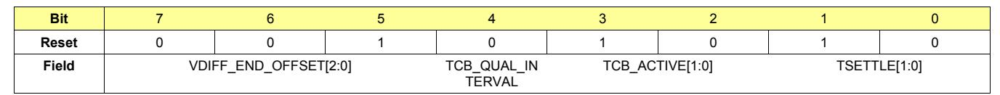

### **Table 48. REG28 Register Field Descriptions**

| Bit | Field                   | Type | Reset by REG_RST | Reset by WATCHDOG | Description                                                                                                                                                                                      |  |  |  |
|-----|-------------------------|------|---------------------|----------------------|--------------------------------------------------------------------------------------------------------------------------------------------------------------------------------------------------|--|--|--|
| 7   | VDIFF_END_OFFSET[ 2] | R/W  | Yes                 | No                   | Cell balancing exit threshold is programmed as an offset from the VDIFF_START. Range is 30 mV to 100 mV with 10-mV resolution. Note that                                                      |  |  |  |
| 6   | VDIFF_END_OFFSET[ 1] | R/W  | Yes                 | No                   | VDIFF_END_OFFSET should be less than the selected VDIFF_START. VDIFF_END = VDIFF_START – VDIFF_END_OFFSET. If VDIFF_END is less                                                               |  |  |  |
| 5   | VDIFF_END_OFFSET[ 0] | R/W  | Yes                 | No                   | than 10 mV, then the charger should clamp VDIFF_END to 10 mV. 000 – 30 mV 001 – 40 mV (Default) 010 – 50 mV 011 – 60 mV 100 – 70 mV 101 – 80 mV 110 – 90 mV 111 – 100 mV |  |  |  |
| 4   | TCB_QUAL_INTERVAL       | R/W  | Yes                 | No                   | Options for the interval between taking measurements to enter cell balancing mode: 0 – 2 min (default) 1 – 4 min                                                                        |  |  |  |
| 3   | TCB_ACTIVE[1]           | R/W  | Yes                 | No                   | Register to select time interval to stop charging and cell balancing discharging for                                                                                                             |  |  |  |
| 2   | TCB_ACTIVE[0]           | R/W  | Yes                 | No                   | cell voltage measurements 00 – 4 s 01 – 32 s 10 – 2 min (default) 11 – 4 min                                                                                                         |  |  |  |
| 1   | TSETTLE[1]              | R/W  | Yes                 | No                   | Register to set delay between charge disable and voltage measurement.                                                                                                                            |  |  |  |
| 0   | TSETTLE[0]              | R/W  | Yes                 | No                   | 00 – 10 ms 01 – 100 ms 10 – 1 s (default) 11 – 2 s                                                                                                                                      |  |  |  |

#### **8.5.42 Cell Balancing Control 2 Register (Address = 29h) [reset = F4h]**

REG29 is shown in [Figure](#page-65-1) 65 and described in [Table](#page-65-2) 49.

Return to [Summary](#page-30-1) Table.

#### **Figure 65. REG29 Register**

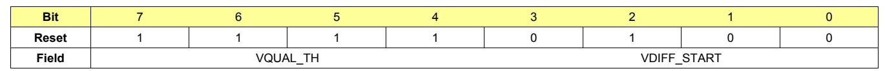

### **Table 49. REG29 Register Field Descriptions**

| Bit | Field           | Type | Reset by REG_RST | Reset by WATCHDOG | Description |                                                                                                                                                                                                                                                                                                    |  |  |  |  |  |  |
|-----|-----------------|------|---------------------|----------------------|-------------|----------------------------------------------------------------------------------------------------------------------------------------------------------------------------------------------------------------------------------------------------------------------------------------------------|--|--|--|--|--|--|
| 7   | VQUAL_TH [3]    | R/W  | Yes                 | No                   | 80 mV       | The threshold from cell balancing pre-qualification mode to cell                                                                                                                                                                                                                                   |  |  |  |  |  |  |
| 6   | VQUAL_TH [2]    | R/W  | Yes                 | No                   | 40 mV       | balancing qualification mode. This is the differential threshold between the two cells when charging is enabled. Offset is 40mV. Range from                                                                                                                                                     |  |  |  |  |  |  |
| 5   | VQUAL_TH [1]    | R/W  | Yes                 | No                   | 20 mV       | 40mV to 180mV with 10mV step.                                                                                                                                                                                                                                                                      |  |  |  |  |  |  |
| 4   | VQUAL_TH [0]    | R/W  | Yes                 | No                   | 10 mV       | 0000 – 40 mV 0001 – 50 mV 0010 – 60 mV 0011 – 70 mV 0100 – 80 mV 0101 – 90 mV 0110 – 100 mV 0111 – 110 mV 1000 – 120 mV 1001 – 130 mV 1010 – 140 mV 1011 – 150 mV 1100: 160 mV 1101 – 170 mV 1110 – 180 mV 1111 – Disable pre-qualification (Default) |  |  |  |  |  |  |
| 3   | VDIFF_START [3] | R/W  | Yes                 | No                   | 80 mV       | The threshold from cell balancing qualification mode to cell balancing                                                                                                                                                                                                                             |  |  |  |  |  |  |
| 2   | VDIFF_START [2] | R/W  | Yes                 | No                   | 40 mV       | active mode. This is the differential threshold between the two cells when charging is enabled. Offset is 40mV. Range from 40 mV to 190                                                                                                                                                         |  |  |  |  |  |  |
| 1   | VDIFF_START [0] | R/W  | Yes                 | No                   | 20 mV       | mV with 10-mV step. Default VDIFF_START is 0100 (80 mV)                                                                                                                                                                                                                                            |  |  |  |  |  |  |
| 0   | VDIFF_START [1] | R/W  | Yes                 | No                   | 10 mV       | 0000 – 40 mV 0001 – 50 mV 0010 – 60 mV 0011 – 70 mV 0100 – 80 mV (Default) 0101 – 90 mV 0110 – 100 mV 0111 – 110 mV 1000 – 120 mV 1001 – 130 mV 1010 – 140 mV 1011 – 150 mV 1100 – 160 mV 1101 – 170 mV 1110 – 180 mV 1111 – 190 mV                   |  |  |  |  |  |  |

### **8.5.43 Cell Balancing Status and Control Register (Address = 2Ah) [reset = 81h]**

REG29 is shown in [Figure](#page-66-1) 66 and described in [Table](#page-66-2) 50.

Return to [Summary](#page-30-1) Table.

#### **Figure 66. REG2A Register**

| Bit   | 7          | 6         | 5       | 4          | 3          | 2          | 1          | 0          |
|-------|------------|-----------|---------|------------|------------|------------|------------|------------|
| Reset | 1          | 1         | 0       | 0          | 0          | 0          | 0          | 0          |
| Field | CB_CHG_DIS | CBAUTO_EN | CB_STAT | HS_CV_STAT | LS_CV_STAT | HS_OV_STAT | LS_OV_STAT | CB_OC_STAT |

### **Table 50. REG2A Register Field Descriptions**

| Bit | Field      | Type | Reset by REG_RST | Reset by WATCHDOG | Description                                                                                                                                                                                                                                                                           |  |  |  |
|-----|------------|------|---------------------|----------------------|---------------------------------------------------------------------------------------------------------------------------------------------------------------------------------------------------------------------------------------------------------------------------------------|--|--|--|
| 7   | CB_CHG_DIS | R/W  | Yes                 | No                   | Bit to disable charge for accurate cell balancing measurement. CB discharge will still be disabled for measurement. 0 – Charge is continuous during cell balancing cell voltage measurement 1 – Charge is disabled during cell balancing cell voltage measurement. (Default) |  |  |  |
| 6   | CB_AUTO_EN | R/W  | Yes                 | No                   | Bit to enable automatic cell balancing mode. This bit must be low to allow the manual cell discharge function. 0 – Disable auto cell balancing 1 – Enable auto cell balancing (Default)                                                                                      |  |  |  |
| 5   | CB_STAT    | R    | Yes                 | No                   | Anytime cell balance is active, the is bit is set to high. Once cell balance is exit, this bit returns to low. 0 – Cell balance not active or cell balance is exit. 1 – Cell balance active mode.                                                                            |  |  |  |
| 4   | HS_CV_STAT | R    | Yes                 | No                   | If this bit is set, the high side cell is in CV mode                                                                                                                                                                                                                                  |  |  |  |
| 3   | LS_CV_STAT | R    | Yes                 | No                   | If this bit is set, the low side cell is in CV mode                                                                                                                                                                                                                                   |  |  |  |
| 2   | HS_OV_STAT | R    | Yes                 | No                   | If this bit is set, the high side cell is in over-voltage                                                                                                                                                                                                                             |  |  |  |
| 1   | LS_OV_STAT | R    | Yes                 | No                   | If this bit is set, the low side cell is in over-voltage                                                                                                                                                                                                                              |  |  |  |
| 0   | CB_OC_STAT | R    | Yes                 | No                   | If this bit is set, the Cell Balance Over-Current Protection is active                                                                                                                                                                                                                |  |  |  |

#### **8.5.44 Cell Balancing Flag Register (Address = 2Bh) [reset = 00h]**

REG2A is shown in [Figure](#page-67-2) 67 and described in [Table](#page-67-3) 51.

Return to [Summary](#page-30-1) Table.

#### **Figure 67. REG2B Register**

| Bit   | 7       | 6       | 5       | 4          | 3          | 2          | 1          | 0          |
|-------|---------|---------|---------|------------|------------|------------|------------|------------|
| Reset | 0       | 0       | 0       | 0          | 0          | 0          | 0          | 0          |
| Field | QCBH_EN | QCBL_EN | CB_FLAG | HS_CV_FLAG | LS_CV_FLAG | HS_OV_FLAG | LS_OV_FLAG | CB_OC_FLAG |

### **Table 51. REG2B Register Field Descriptions**

| Bit | Field      | Type | Reset by REG_RST | Reset by WATCHDOG | Description                                                                                                                   |  |  |  |
|-----|------------|------|---------------------|----------------------|-------------------------------------------------------------------------------------------------------------------------------|--|--|--|
| 7   | QCBH_EN    | R/W  | Yes                 | No                   | Bit to turn on QCBH to discharge the top cell. 0 – Turn off QCBH (Default) 1 – Turn on QCBH                             |  |  |  |
| 6   | QCBL_EN    | R/W  | Yes                 | No                   | Bit to turn on QCBL to discharge the bottom cell. 0 – Turn off QCBL (Default) 1 – Turn on QCBL                          |  |  |  |
| 5   | CB_FLAG    | R    | Yes                 | No                   | Cell balancing status INT Flag 0 – Normal 1 – Entered or exited cell balancing                                          |  |  |  |
| 4   | HS_CV_FLAG | R    | Yes                 | No                   | If this bit is set, the high side cell balancing FET is in CV mode, or has been in CV mode. This bit is cleared upon read. |  |  |  |
| 3   | LS_CV_FLAG | R    | Yes                 | No                   | If this bit is set, the low side cell balancing FET is in CV mode, or has been in CV mode. This bit is cleared upon read.  |  |  |  |
| 2   | HS_OV_FLAG | R    | Yes                 | No                   | If this bit is set, the high side cell is in over-voltage, or has been in over-voltage. This bit is cleared upon read.     |  |  |  |
| 1   | LS_OV_FLAG | R    | Yes                 | No                   | If this bit is set, the low side cell is in over-voltage, or has been in over-voltage. This bit is cleared upon read.      |  |  |  |
| 0   | CB_OC_FLAG | R    | Yes                 | No                   | If this bit is set, the Cell Balance Over-Current Protection is active, or has been active. This bit is cleared upon read. |  |  |  |

### **8.5.45 Cell Balancing Mask Register (Address = 2Ch) [reset = 00h]**

REG2B is shown in [Figure](#page-67-4) 68 and described in [Table](#page-67-5) 52.

Return to [Summary](#page-30-1) Table.

#### **Figure 68. REG2C Register**

| Bit   | 7        | 6        | 5       | 4          | 3          | 2          | 1          | 0          |
|-------|----------|----------|---------|------------|------------|------------|------------|------------|
| Reset | 0        | 0        | 0       | 0          | 0          | 0          | 0          | 0          |
| Field | Reserved | Reserved | CB_MASK | HS_CV_MASK | LS_CV_MASK | HS_OV_MASK | LS_OV_MASK | CB_OC_MASK |

#### **Table 52. REG2C Register Field Descriptions**

| Bit | Field      | Type | Reset by REG_RST | Reset by WATCHDOG | Description                                                                                                                 |
|-----|------------|------|---------------------|----------------------|-----------------------------------------------------------------------------------------------------------------------------|
| 7   | Reserved   | R    | Yes                 | No                   | Reserved bit always reads 0h                                                                                                |
| 6   | Reserved   | R    | Yes                 | No                   | Reserved bit always reads 0h                                                                                                |
| 5   | CB_MASK    | R/W  | Yes                 | No                   | When set, the device will not send an interrupt on the INT pin when the device enters or exits cell balance mode.        |
| 4   | HS_CV_MASK | R/W  | Yes                 | No                   | When set, the device will not send an interrupt on the INT pin when the high side cell balancing FET is in CV mode.      |
| 3   | LS_CV_MASK | R/W  | Yes                 | No                   | When set, the device will not send an interrupt on the INT pin when the low side cell balancing FET is in CV mode.       |
| 2   | HS_OV_MASK | R/W  | Yes                 | No                   | When set, the device will not send an interrupt on the INT pin when the high side cell is in over-voltage.               |
| 1   | LS_OV_MASK | R/W  | Yes                 | No                   | When set, the device will not send an interrupt on the INT pin when the low side cell is in over-voltage.                |
| 0   | CB_OC_MASK | R/W  | Yes                 | No                   | When set, the device will not send an interrupt on the INT pin when the Cell Balance Over-Current Protections is active. |

# **9 Application and Implementation**

### **NOTE**

Information in the following applications sections is not part of the TI component specification, and TI does not warrant its accuracy or completeness. TI's customers are responsible for determining suitability of components for their purposes. Customers should validate and test their design implementation to confirm system functionality.

### **9.1 Application Information**

A typical application consists of the BQ25887 configured as an I 2C controlled device and a 2s battery charger with cell balancing for Li-Ion and Li-polymer batteries used in a wide range of E-cig and other portable devices. It integrates an input blocking FET (QBLK, Q1), high-side switching FET (QHS, Q2), and low-side switching FET (QLS, Q3). The device also integrates a bootstrap diode for the high-side gate drive.

### **9.2 Typical Application**

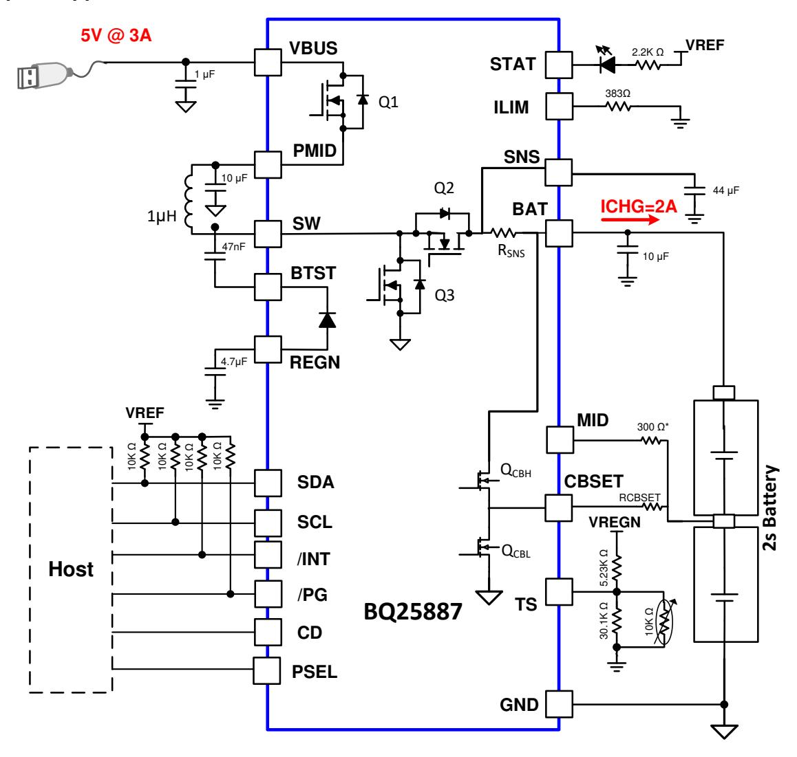

\*Note: 300Q åê]êö}å }vD/â]v ]ê µê ö} o]u]ö öZ µååvö ]v öZ ê £Zå öZ }öö}u oo ]ê âoµPP ]v å¿åêo«

**Figure 69. BQ25887 (Cell Balancing and I 2C) Typical Application Diagram**

### **Typical Application (continued)**

#### 9.2.1 Design Requirements

For this design example, use the parameters shown in Table 53 below.

#### Table 53. Design Parameters

| PARAMETER                                  | VALUE          |
|--------------------------------------------|----------------|
| VBUS voltage range                         | 3.9 V to 6.2 V |
| Input current limit (IINDPM[4:0])          | 2.4 A          |
| Fast charge current limit (ICHG[5:0])      | 1.5 A          |
| Battery Regulation Voltage (VCELLREG[7:0]) | 4.2 V          |

#### 9.2.2 Detailed Design Procedure

#### 9.2.2.1 Inductor Selection

The device has 1.5-MHz switching frequency to allow the use of small inductor and capacitor values. The inductor saturation current should be higher than the input current ( $I_{IN}$ ) plus half the ripple current ( $I_{RIPPLE}$ ):

$$I_{SAT} \ge I_{IN} + \frac{I_{RIPPLE}}{2} \tag{5}$$

The inductor ripple current ( $I_{RIPPLE}$ ) depends on input voltage ( $V_{VBUS}$ ), duty cycle (D =  $V_{BAT}/V_{BUS}$ ), switching frequency ( $f_{SW}$ ) and inductance (L):

$$I_{RIPPLE} = \frac{V_{BUS} \times (V_{SYS} - V_{BUS})}{V_{SYS} \times f_{SW} \times L}$$
(6)

The maximum inductor ripple current happens in the vicinity of D = 0.5. Usually inductor ripple is designed in the range of (20 - 40%) maximum charging current as a trade-off between inductor size and efficiency for a practical design.

#### 9.2.2.2 Input (VBUS / PMID) Capacitor

The input capacitor should have enough ripple current rating to absorb input switching ripple current. The worst case RMS ripple current occurs when duty cycle is 0.5. If the converter does not operate at 50% duty cycle, then the worst case capacitor RMS current IPMID occurs where the duty cycle is closest to 50% and can be estimated by

$$I_{PMID} = \frac{I_{RIPPLE}}{2 \times \sqrt{3}} \approx 0.29 \times I_{RIPPLE} \tag{7}$$

A low ESR ceramic capacitor such as X7R or X5R is preferred for input decoupling capacitor and should be placed close to the PMID and GND pins of the IC. Voltage rating of the capacitor must be higher than normal input voltage level. 25-V rating or higher capacitor is preferred for up to 5-V input voltage. A minimum  $10-\mu F$  capacitor is suggested for up to 3.3-A input current. Keep in mind, long impedance cable would cause significant voltage drop with higher inrush current. For optimal performance, 44-uF cap on PMID is recommended. In addition, a minimum  $1-\mu F$  capacitor is suggested at VBUS pin.

#### 9.2.2.3 Output (VSNS) Capacitor

The SYS capacitor is the boost converter output capacitor and should also have enough ripple current rating to absorb output switching ripple current. The output capacitor RMS current  $I_{COUT}$  is given:

$$I_{CSYS, rms} = I_{OUT} \times \sqrt{\frac{D}{1 - D}}$$
(8)

The output capacitor voltage ripple is a function of the boost output current (IOUT), and can be calculated as follows:

$$\Delta V_{SYS} = \frac{I_{OUT} \times D}{f_{SW} \times C_{SYS}} \tag{9}$$

A low ESR ceramic capacitor such as X7R or X5R is preferred for SNS decoupling capacitor and should be placed close to the SNS and GND pins of the IC. Voltage rating of the capacitor must be higher than normal output voltage level. 16-V rating or higher capacitor is preferred. Minimum 44- $\mu$ F capacitor is suggested for up to 2.2-A boost converter output current.

### **9.2.3 Application Curves**

CVBUS = 1 µF, CPMID= 10 µF, CBAT = 10 µF, CSNS = 44 µF, L = DFE252012F-1R0 (1 µH) (unless otherwise specified)

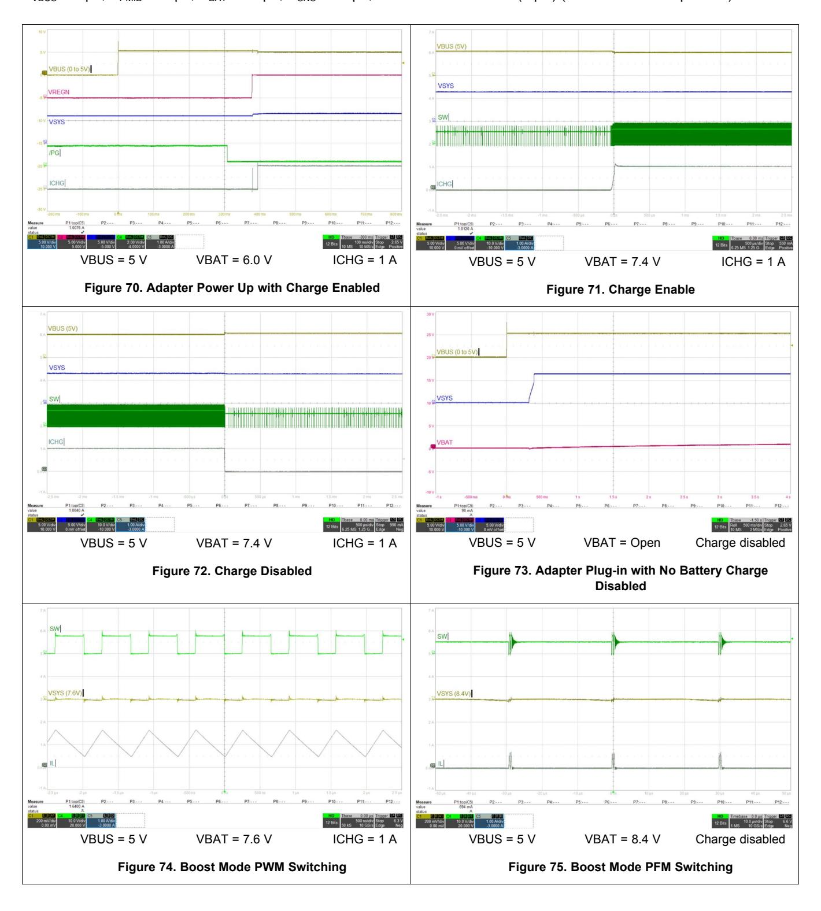

CVBUS = 1 µF, CPMID= 10 µF, CBAT = 10 µF, CSNS = 44 µF, L = DFE252012F-1R0 (1 µH) (unless otherwise specified) VBUS = 5 V VBAT = 8.4 V Charge disabled **Figure 76. System Load Transient Response** DCP Adapter VBAT = 8.0 V Charge enabled **Figure 77. VINDPM Transient Response** DCP Adapter VBAT = 8.0 V Charge enabled **Figure 78. IINDPM Transient Response Figure 79. Charge Cycle with the Bottom Cell Voltage Higher Than the Top Cell Voltage Figure 80. Charge Cycle with the Top Cell Voltage Higher Than the Bottom Cell Voltage**

# **10 Power Supply Recommendations**

In order to provide an output voltage, the device requires a power supply between 3.9-V and 6.2-V input with at least 500-mA current rating connected to VBUS or a 2-cell Li-Ion battery with voltage > VBAT\_UVLO connected to BAT..

### **11 Layout**

### **11.1 Layout Guidelines**

The switching node rise and fall times should be minimized for minimum switching loss. Proper layout of the components to minimize high frequency current path loops is important to prevent electrical and magnetic field radiation and high frequency resonant problems. Here is a PCB layout priority list for proper layout. Layout PCB according to this specific order is essential.

- 1. Put SNS output capacitor as close to SNS and GND pins as possible. Ground connections need to be tied to the IC ground with a short copper trace connection or GND plane.
- 2. Place PMID input capacitor as close as possible to PMID pins and PGND pins and use shortest copper trace connection or GND plane.
- 3. Place inductor input terminal to SW pins as close as possible. Minimize the copper area of this trace to lower electrical and magnetic field radiation but make the trace wide enough to carry the input current. Minimize parasitic capacitance from this area to any other trace or plane.
- 4. Decoupling capacitors should be placed on the same side of and next to the IC and make trace connection as short as possible.
- 5. Route analog ground separately from power ground. Connect analog ground and connect power ground separately. Connect analog ground and power ground together using thermal pad as the single ground connection point. Or using a 0-Ω resistor to tie analog ground to power ground.
- 6. It is critical that the exposed thermal pad on the backside of the device package be soldered to the PCB ground. Ensure that there are sufficient thermal vias directly under the IC, connecting to the ground plane on the other layers.
- 7. Via size and number should be enough for a given current path.
- 8. Route MID as sensing trace away from switching nodes such as SW.

Refer to the EVM design and the Layout [Example](#page-74-0) below for the recommended component placement with trace and via locations.

### **11.2 Layout Example**

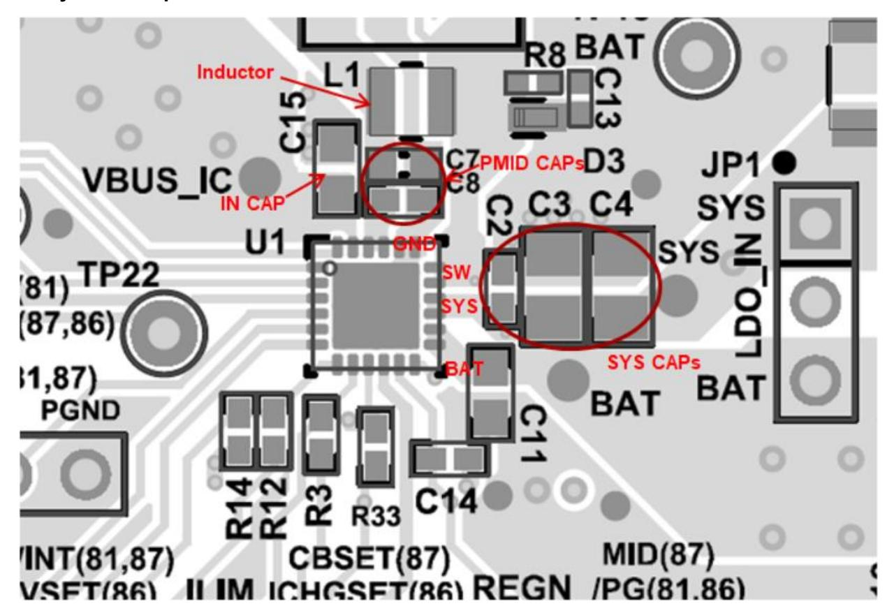

**Figure 81. PCB Layout Example**

# **12 Device and Documentation Support**

### **12.1 Device Support**

### **12.1.1 Third-Party Products Disclaimer**

TI'S PUBLICATION OF INFORMATION REGARDING THIRD-PARTY PRODUCTS OR SERVICES DOES NOT CONSTITUTE AN ENDORSEMENT REGARDING THE SUITABILITY OF SUCH PRODUCTS OR SERVICES OR A WARRANTY, REPRESENTATION OR ENDORSEMENT OF SUCH PRODUCTS OR SERVICES, EITHER ALONE OR IN COMBINATION WITH ANY TI PRODUCT OR SERVICE.

### **12.2 Documentation Support**

### **12.2.1 Related Documentation**

For related documentation see the following:

• *BQ2588x Boosting Battery Chargers [Evaluation](http://www.ti.com/lit/pdf/SLUUBP2) Module User's Guide*

### **12.3 Receiving Notification of Documentation Updates**

To receive notification of documentation updates, navigate to the device product folder on ti.com. In the upper right corner, click on *Alert me* to register and receive a weekly digest of any product information that has changed. For change details, review the revision history included in any revised document.

### **12.4 Support Resources**

TI E2E™ [support](http://e2e.ti.com) forums are an engineer's go-to source for fast, verified answers and design help — straight from the experts. Search existing answers or ask your own question to get the quick design help you need.

Linked content is provided "AS IS" by the respective contributors. They do not constitute TI specifications and do not necessarily reflect TI's views; see TI's [Terms](http://www.ti.com/corp/docs/legal/termsofuse.shtml) of Use.

### **12.5 Trademarks**

E2E is a trademark of Texas Instruments.

All other trademarks are the property of their respective owners.

### **12.6 Electrostatic Discharge Caution**

This integrated circuit can be damaged by ESD. Texas Instruments recommends that all integrated circuits be handled with appropriate precautions. Failure to observe proper handling and installation procedures can cause damage.

ESD damage can range from subtle performance degradation to complete device failure. Precision integrated circuits may be more susceptible to damage because very small parametric changes could cause the device not to meet its published specifications.

### **12.7 Glossary**

[SLYZ022](http://www.ti.com/lit/pdf/SLYZ022) — *TI Glossary*.

This glossary lists and explains terms, acronyms, and definitions.

# **13 Mechanical, Packaging, and Orderable Information**

The following pages include mechanical, packaging, and orderable information. This information is the most current data available for the designated devices. This data is subject to change without notice and revision of this document. For browser-based versions of this data sheet, refer to the left-hand navigation.

www.ti.com 28-Sep-2021

### **PACKAGING INFORMATION**

| Orderable Device | Status (1) | Package Type | Package Drawing | Pins | Package Qty | Eco Plan (2) | Lead finish/ Ball material (6) | MSL Peak Temp (3) | Op Temp (°C) | Device Marking (4/5) | Samples |
|------------------|---------------|--------------|--------------------|------|----------------|-----------------|--------------------------------------|----------------------|--------------|-------------------------|---------|
| BQ25887RGER      | ACTIVE        | VQFN         | RGE                | 24   | 3000           | RoHS & Green    | NIPDAU                               | Level-1-260C-UNLIM   | -40 to 85    | BQ25887                 |         |
| BQ25887RGET      | ACTIVE        | VQFN         | RGE                | 24   | 250            | RoHS & Green    | NIPDAU                               | Level-1-260C-UNLIM   | -40 to 85    | BQ25887                 |         |

**(1)** The marketing status values are defined as follows:

**ACTIVE:** Product device recommended for new designs.

**LIFEBUY:** TI has announced that the device will be discontinued, and a lifetime-buy period is in effect.

**NRND:** Not recommended for new designs. Device is in production to support existing customers, but TI does not recommend using this part in a new design.

**PREVIEW:** Device has been announced but is not in production. Samples may or may not be available.

**OBSOLETE:** TI has discontinued the production of the device.

**(2) RoHS:** TI defines "RoHS" to mean semiconductor products that are compliant with the current EU RoHS requirements for all 10 RoHS substances, including the requirement that RoHS substance do not exceed 0.1% by weight in homogeneous materials. Where designed to be soldered at high temperatures, "RoHS" products are suitable for use in specified lead-free processes. TI may reference these types of products as "Pb-Free".

**RoHS Exempt:** TI defines "RoHS Exempt" to mean products that contain lead but are compliant with EU RoHS pursuant to a specific EU RoHS exemption.

**Green:** TI defines "Green" to mean the content of Chlorine (Cl) and Bromine (Br) based flame retardants meet JS709B low halogen requirements of <=1000ppm threshold. Antimony trioxide based flame retardants must also meet the <=1000ppm threshold requirement.

- **(3)** MSL, Peak Temp. The Moisture Sensitivity Level rating according to the JEDEC industry standard classifications, and peak solder temperature.
- **(4)** There may be additional marking, which relates to the logo, the lot trace code information, or the environmental category on the device.
- **(5)** Multiple Device Markings will be inside parentheses. Only one Device Marking contained in parentheses and separated by a "~" will appear on a device. If a line is indented then it is a continuation of the previous line and the two combined represent the entire Device Marking for that device.
- **(6)** Lead finish/Ball material Orderable Devices may have multiple material finish options. Finish options are separated by a vertical ruled line. Lead finish/Ball material values may wrap to two lines if the finish value exceeds the maximum column width.

**Important Information and Disclaimer:**The information provided on this page represents TI's knowledge and belief as of the date that it is provided. TI bases its knowledge and belief on information provided by third parties, and makes no representation or warranty as to the accuracy of such information. Efforts are underway to better integrate information from third parties. TI has taken and continues to take reasonable steps to provide representative and accurate information but may not have conducted destructive testing or chemical analysis on incoming materials and chemicals. TI and TI suppliers consider certain information to be proprietary, and thus CAS numbers and other limited information may not be available for release.

In no event shall TI's liability arising out of such information exceed the total purchase price of the TI part(s) at issue in this document sold by TI to Customer on an annual basis.

# **PACKAGE OPTION ADDENDUM**

www.ti.com 28-Sep-2021

# **PACKAGE MATERIALS INFORMATION**

www.ti.com 4-Nov-2019

### **TAPE AND REEL INFORMATION**

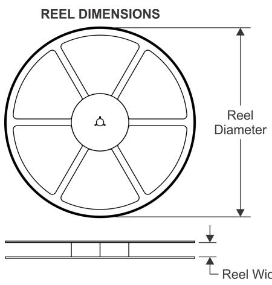

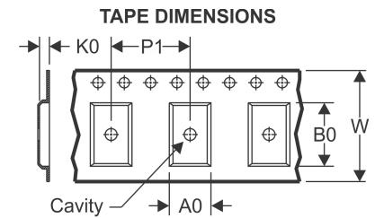

|    | Dimension designed to accommodate the component width     |
|----|-----------------------------------------------------------|
|    | Dimension designed to accommodate the component length    |
|    | Dimension designed to accommodate the component thickness |
| W  | Overall width of the carrier tape                         |
| P1 | Pitch between successive cavity centers                   |

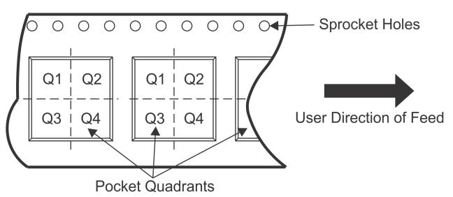

#### \*All dimensions are nominal

| Device      | Package Type | Package Drawing | Pins | SPQ  | Reel Diameter (mm) | Reel Width W1 (mm) | A0 (mm) | B0 (mm) | K0 (mm) | P1 (mm) | W (mm) | Pin1 Quadrant |
|-------------|-----------------|--------------------|------|------|--------------------------|--------------------------|------------|------------|------------|------------|-----------|------------------|
| BQ25887RGER | VQFN            | RGE                | 24   | 3000 | 330.0                    | 12.4                     | 4.25       | 4.25       | 1.15       | 8.0        | 12.0      | Q2               |
| BQ25887RGET | VQFN            | RGE                | 24   | 250  | 180.0                    | 12.4                     | 4.25       | 4.25       | 1.15       | 8.0        | 12.0      | Q2               |

www.ti.com 4-Nov-2019

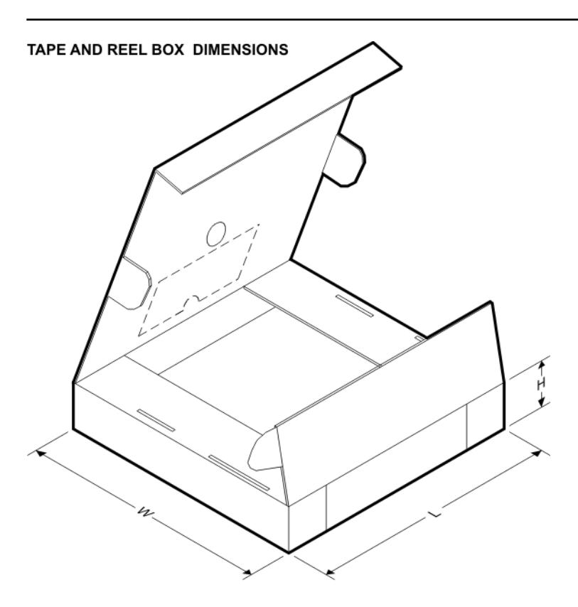

#### \*All dimensions are nominal

| Device      | Package Type | Package Drawing | Pins | SPQ  | Length (mm) | Width (mm) | Height (mm) |  |
|-------------|--------------|-----------------|------|------|-------------|------------|-------------|--|
| BQ25887RGER | VQFN         | RGE             | 24   | 3000 | 367.0       | 367.0      | 35.0        |  |
| BQ25887RGET | VQFN         | RGE             | 24   | 250  | 210.0       | 185.0      | 35.0        |  |

PLASTIC QUAD FLATPACK - NO LEAD

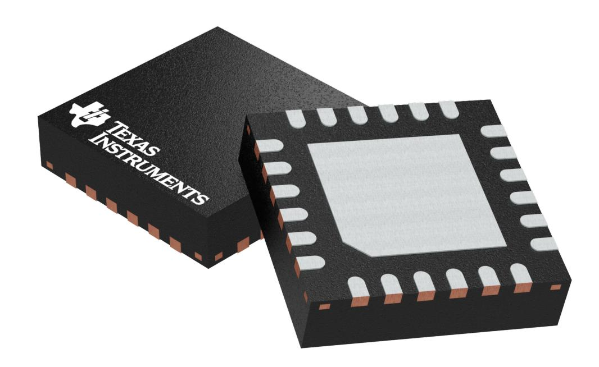

Images above are just a representation of the package family, actual package may vary. Refer to the product data sheet for package details.

4204104/H

PLASTIC QUAD FLATPACK- NO LEAD

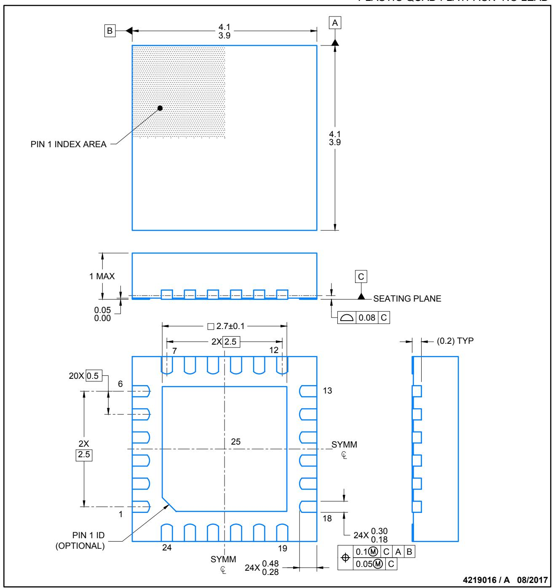

NOTES:

- All linear dimensions are in millimeters. Any dimensions in parenthesis are for reference only. Dimensioning and tolerancing per ASME Y14.5M.
- 2. This drawing is subject to change without notice.
- 3. The package thermal pad must be soldered to the printed circuit board for thermal and mechanical performance.

PLASTIC QUAD FLATPACK- NO LEAD

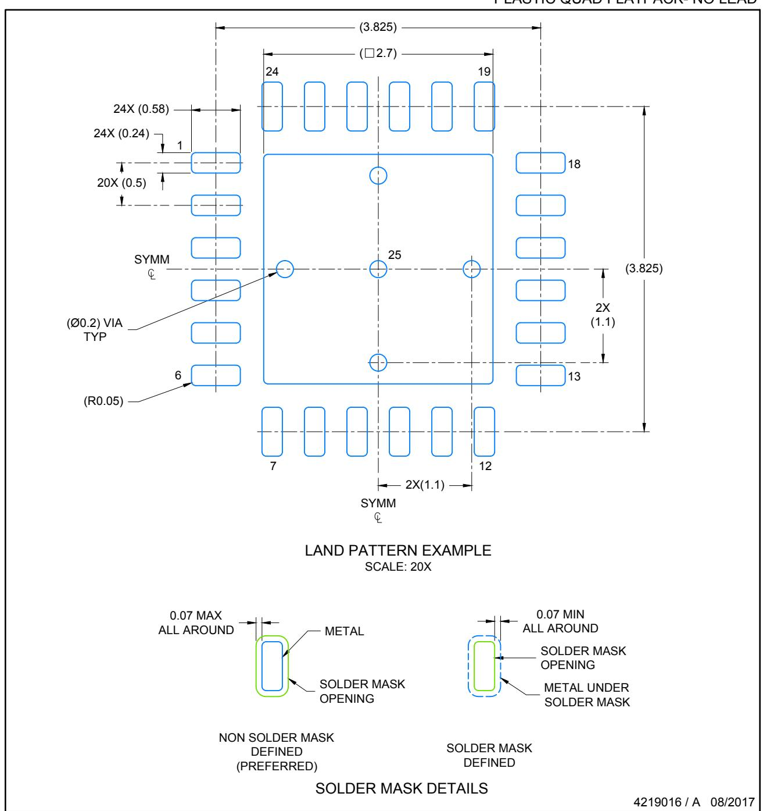

NOTES: (continued)

- 4. This package is designed to be soldered to a thermal pad on the board. For more information, see Texas Instruments literature number SLUA271 (www.ti.com/lit/slua271).
- 5. Solder mask tolerances between and around signal pads can vary based on board fabrication site.

PLASTIC QUAD FLATPACK- NO LEAD

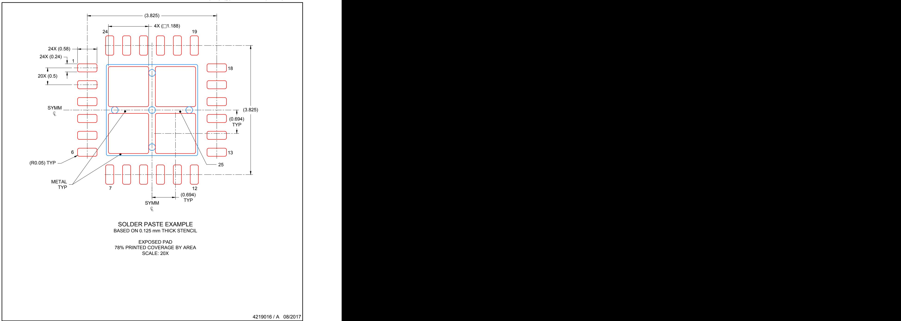

NOTES: (continued)

6. Laser cutting apertures with trapezoidal walls and rounded corners may offer better paste release. IPC-7525 may have alternate design recommendations..

## **IMPORTANT NOTICE AND DISCLAIMER**

TI PROVIDES TECHNICAL AND RELIABILITY DATA (INCLUDING DATASHEETS), DESIGN RESOURCES (INCLUDING REFERENCE DESIGNS), APPLICATION OR OTHER DESIGN ADVICE, WEB TOOLS, SAFETY INFORMATION, AND OTHER RESOURCES "AS IS" AND WITH ALL FAULTS, AND DISCLAIMS ALL WARRANTIES, EXPRESS AND IMPLIED, INCLUDING WITHOUT LIMITATION ANY IMPLIED WARRANTIES OF MERCHANTABILITY, FITNESS FOR A PARTICULAR PURPOSE OR NON-INFRINGEMENT OF THIRD PARTY INTELLECTUAL PROPERTY RIGHTS.

These resources are intended for skilled developers designing with TI products. You are solely responsible for (1) selecting the appropriate TI products for your application, (2) designing, validating and testing your application, and (3) ensuring your application meets applicable standards, and any other safety, security, or other requirements. These resources are subject to change without notice. TI grants you permission to use these resources only for development of an application that uses the TI products described in the resource. Other reproduction and display of these resources is prohibited. No license is granted to any other TI intellectual property right or to any third party intellectual property right. TI disclaims responsibility for, and you will fully indemnify TI and its representatives against, any claims, damages, costs, losses, and liabilities arising out of your use of these resources.

TI's products are provided subject to TI's Terms of Sale [\(https:www.ti.com/legal/termsofsale.html\)](https://www.ti.com/legal/termsofsale.html) or other applicable terms available either on [ti.com](https://www.ti.com) or provided in conjunction with such TI products. TI's provision of these resources does not expand or otherwise alter TI's applicable warranties or warranty disclaimers for TI products.IMPORTANT NOTICE

> Mailing Address: Texas Instruments, Post Office Box 655303, Dallas, Texas 75265 Copyright © 2021, Texas Instruments Incorporated